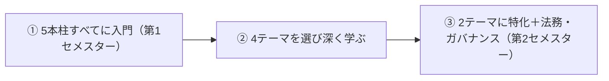

# プログラム構成

> 対応: プログラム全体 ｜ 層: 地図 (Layer 0)

**この1ページで分かること**

- コース全体の単位配分（何が必修で、何を選ぶのか）
- 「広く入門 → 4テーマ → 2テーマ特化」という段階設計
- 予習で目指すべき状態（どの領域を深掘りするか判断できること）

サイバーセキュリティ修士コースの「時間割の骨格」。予習の順番は、この骨格から逆算して決める。

## 最小の例：暗号を深掘りしたい人の 60 ECTS

```
必修 25（うち修士論文 15） + 必須選択 3 + 専門選択 32 = 60
専門選択 32 のうち暗号 4 科目を全部取っても、残りは他の柱から取る
→ 「1 本柱だけ」では卒業できない設計。だから予習は 5 本柱を広く
```

## 一言で

暗号・プライバシー・ハードウェア・ソフトウェア・システムの**5本柱**を技術的に深く学び、
法務・ビジネス・運用の視点を統合する 1 年制の修士コース。

## 単位配分

ECTS（欧州共通の単位。1 ECTS ≈ 25〜30 時間の学習量）で数える。

| 区分 | 単位 |
|---|---|
| 必修コア科目 | 25 ECTS |
| 必須選択（マネジメント/ガバナンスから1科目） | 3 ECTS |
| 専門選択科目（5領域から選択） | 32 ECTS |
| **合計** | **60 ECTS** |

修士論文（技術プロジェクト型研究、15 ECTS）が全体の 1/4。ここが課程の核。

## 段階設計（履修の流れ）



> 予習の含意: まず 5 本柱を学部基礎レベルで広く押さえ、「どの 4 領域を深掘りするか」を判断できる状態を作る。

## 必修コア科目（全員 / 25 ECTS）

| 科目 | 単位 | セメスター |
|---|---|---|
| 基礎ワークショップ（1週間集中の導入） | 3 | 1 |
| 法的側面 | 3 | 2 |
| セミナー科目（出席90%必須） | 4 | 通年 |
| 修士論文（技術プロジェクト型研究） | 15 | 2 |

## 必須選択（1科目 / 3 ECTS）

| 科目 | 学期 |
|---|---|
| マネジメント/ガバナンス：リスクとビジネス | 1 |
| マネジメント/ガバナンス：オペレーション | 2 |

## 専門選択（5領域から計32 ECTS）

| 領域 | 科目数 | 地図 |
|---|---|---|
| 暗号 | 4 | [02](../02_cryptography/index.md) |
| プライバシー | 3 | [03](../03_privacy/index.md) |
| HWセキュリティ | 3 | [04](../04_hardware-security/index.md) |
| セキュアソフトウェア | 3 | [05](../05_software-security/index.md) |
| システムセキュリティ | 2 | [06](../06_systems-security/index.md) |

## つまずき / 深掘り候補

- [ ] 自分の学歴（EE/CS/数学のどれに近いか）と各領域前提の対応 → `index.md` の深掘りキューへ

## 参考

- カリキュラム詳細は所属先の公式プログラム案内を参照（手元の詳細メモはリポジトリ外で管理）。
