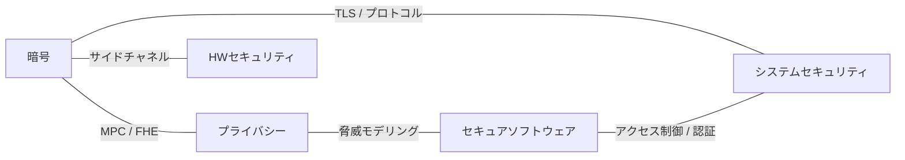

# 5本柱の関係マップ

> 対応: プログラム全体 ｜ 層: 地図 (Layer 0)

**この1ページで分かること**

- 5本柱それぞれが「何を守るか」と代表トピック
- 柱同士がどのトピックで交わるか（横断トピックの一覧と本体の置き場ルール）
- 自分の前提知識がどの柱に効くか

## 一言で

5本柱は独立ではなく、互いに前提・応用で繋がる。本ファイルは「どこで何が交わるか」の地図。

## 5本柱の役割

| 柱 | 守る対象 / 問い | 代表トピック |
|---|---|---|
| 暗号 | 情報そのもの（機密性・完全性・認証） | 対称/公開鍵・署名・ハッシュ・プロトコル |
| プライバシー | 個人と関係性（誰が誰と何を） | 匿名化・差分プライバシー・匿名通信・GDPR |
| HWセキュリティ | 信頼の起点（root of trust） | TPM・PUF・サイドチャネル・暗号実装 |
| セキュアソフトウェア | 作り方（ライフサイクル） | 脅威モデリング・設計パターン・テスト・SecDevOps |
| システムセキュリティ | 動かし方（実システム） | 脆弱性・認証認可・分散/クラウド・インフラ |

用語メモ: TPM＝PC等に組み込むセキュリティチップ、PUF＝製造ばらつきを個体の指紋として使う回路、
サイドチャネル＝消費電力や処理時間など「副次的な漏れ」から秘密を推定する攻撃、
MPC / FHE＝データを秘匿したまま計算する暗号技術（秘密計算・完全準同型暗号）。

## 領域間のつながり（横断トピック）

| 横断トピック | 何と何が交わるか | 繋がる柱 |
|---|---|---|
| サイドチャネル | 暗号アルゴリズムの安全性 × ハードウェア実装 | 暗号 ⇄ HW |
| GDPR / データ保護法 | プライバシー技術 × 法的義務 | プライバシー ⇄ 法務 |
| 脅威モデリング (STRIDE/LINDDUN) | 設計時のセキュリティ × プライバシー | SW ⇄ プライバシー |
| TLS / ネットワークプロトコル | 暗号プリミティブ × 実システム | 暗号 ⇄ システム |
| MPC / FHE | 暗号の高度構成 × プライバシー保護計算 | 暗号 ⇄ プライバシー |
| アクセス制御 / 認証 | 理論モデル × 実装 | システム ⇄ ソフトウェア |

※ 法務は5本柱の外にあるため図には含めない（GDPR ⇄ 法務は表を参照）

> 重複トピックは片方に本体、もう片方からリンク（DRY）。本体の置き場は各領域 `index.md` で管理。

## 前提知識との対応

| 前提 | 主に効く柱 |
|---|---|
| 暗号数学（有限体・数論） | 暗号、プライバシー（暗号系PPT） |
| 低レベル・C・OS | システム、ソフトウェア、HW |
| ディジタル論理・HW | HWセキュリティ |
| ネットワーク・確率統計 | 暗号（プロトコル）、プライバシー、システム |

## つまずき / 深掘り候補

- [ ] 「どの2領域に特化するか」の自分の仮説 → 各領域を読んだ後にここへメモ

## 参考

- [01_program-structure.md](01_program-structure.md)
