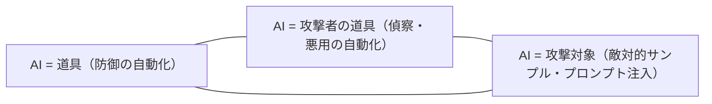

# AI とサイバーセキュリティ（攻防バランスの変化）

> 対応: プログラム全体 ｜ 層: 地図 (Layer 0)

**この1ページで分かること**

- 防御側の AI は新しくない。変わったのは攻撃側（発見から悪用までの自動化）
- AI を防御に組み込むと、その AI 自体が攻撃対象になる
- ガードレールとアクセス統制のジレンマ（安全のための統制が監視基盤になる）

AI は**道具**であり**攻撃対象**であり**攻撃者の道具**でもある。3 つを混同すると議論が噛み合わない。

## 最小の例：1 通の標的型メール

```
従来: 攻撃者が手作業で標的を調べ文面を書く  → 1 通あたり数時間。数十人が限度
今:   漏洩済みデータ + 公開プロフィール → 生成モデルが個人向け文面を自動作成
      → 1 通あたり数秒。数万人に「あなた専用」の詐欺メールが届く
```

手法は同じ「なりすまし」。変わったのは**規模と精度**だけ。この 1 例が本ページの主題を全部含む。



## 防御側の AI は新しくない

| 用途 | いつから |
|---|---|
| アンチウイルスのヒューリスティック検知 | 1990年代 |
| 通信事業者・カード決済の不正検知 | 1990年代 |
| 侵入検知 (IDS: 通信やログから攻撃の兆候を見つける仕組み) | 2000年代 |

「統計」「機械学習」が「AI」と呼び直された面が大きい。**新規性は攻撃側にある。**

## 変わったこと：発見から悪用までの自動化

```
偵察 → 初期アクセス → 権限昇格 → 横展開 → 目的の実行   （MITRE ATT&CK が体系化した工程）
```

脆弱性の**発見**は以前から部分的に自動化されていた（ファジング＝大量のランダム入力で異常を探す）。変わったのは**悪用コードを書く**工程まで機械が担い始めたこと。

| これまでの前提 | 前提が崩れると |
|---|---|
| 脆弱性は大量に出るが、悪用可能なものは一部 | 「悪用は難しいだろう」という先送りが成立しない |
| 悪用コードを書くコストが高いので優先順位を付けられた | 全件に対処する体力が要る |

[`../08_management-governance/01_risk-management.md`](../08_management-governance/01_risk-management.md) のリスク評価と [`../06_systems-security/02_software-vulnerabilities.md`](../06_systems-security/02_software-vulnerabilities.md) のパッチ優先度、両方の前提に影響する。

## 誇張と実測を切り分ける

| 加速していると読める材料 | そこまでではないと読める材料 |
|---|---|
| モデル提供者のベンチマーク報告 | インシデント対応の現場感覚 |
| 脆弱性の発見件数の増加 | 実際に悪用された件数の実測 |

実態は中間。**モデル提供者の発表は自社製品の宣伝でもある**（利益相反）。[04](04_threat-landscape.md) の「損害額の検算」と同じ構造。

## 攻撃側の実像

| 変化 | 内容 |
|---|---|
| 標的型メールの精度 | 漏洩データと公開プロフィールから個人向け文面を自動生成 |
| 偵察の自動化 | 組織の人員・取引関係の収集を機械が行う |
| なりすましの質 | 音声・映像の生成で、電話や会議を装った送金詐欺が成立 |
| ガードレール（モデルの出力制限）の回避 | 「私は担当者で安全性を高めたい」等の文脈付与で建前を通す |

共通するのは**「人間の判断を騙す」部分が安くなった**こと。技術対策だけでは足りず、プロセス設計（送金の二重承認など）に戻る。

## AI 自体が脆弱である

| 問題 | 中身 | セキュリティ上の帰結 |
|---|---|---|
| 意図とモデルのギャップ | 「検知してほしいこと」とデータで表現できることに必ず差がある。その境界を狙った入力が**敵対的サンプル** | 実装バグではなく統計的学習に内在する性質 |
| 賢いハンス問題 | 計算できると思われた馬は観衆の反応を読んでいた。モデルも**たまたま相関した別の特徴**を学ぶ | 訓練データの偏りが盲点になる。結果を評価できる人間が必須 |
| プロンプト経由の入力 | LLM（大規模言語モデル）は外部文書やツール出力を命令として解釈しうる | [`../05_software-security/03_security-patterns.md`](../05_software-security/03_security-patterns.md) の「データとコードの境界」と同型 |
| 経験的防御 | 既知の攻撃に耐えることを実験で示すだけ。未知への汎化保証がない | 「防御を入れたので安全」と言えない |

暗号は**安全性の定義を置いて証明する**道を選んだ（[`../02_cryptography/01_goals-and-primitives.md`](../02_cryptography/01_goals-and-primitives.md)）。AI セキュリティにはまだ相当する枠組みがない。

## AI 対 AI とその含意

攻防が双方自動化されると、更新速度は人間が観察できる速度を超えうる。人間が中間で判断する余地が減るほど**事前の設計で決まる部分が増える**。検証可能な小さい TCB（信頼せざるを得ない最小限の部品）と、失敗しても被害が限定される構造の価値が上がる（Saltzer & Schroeder「機構の経済性」→ [`../06_systems-security/01_security-fundamentals.md`](../06_systems-security/01_security-fundamentals.md)）。

## ガードレールとアクセス統制のジレンマ

```
能力を制限する（ガードレール）   → 文脈を付与すれば回避されうる
利用者を絞る（アクセス統制）     → 本人確認基盤が要る → 匿名で使う選択肢が消える
```

後者は [`../03_privacy/`](../03_privacy/index.md) の匿名性と [`../07_legal/`](../07_legal/index.md) の身元確認義務と正面から衝突する。安全のための統制が監視の基盤をもたらす。

## 技術者の職能と倫理

- トリアージ（優先順位づけ）とパッチ運用は件数に押される。コードは**書く**より**生成物をレビューする**能力の価値が上がる
- 「モデルがそう言った」は理由にならない。**判断の責任は人間に残る**
- 能力が上がるほど「やらない」判断の重みが増す。何を集め・推定し・自動で決めるかは設計者の選択

| 原則 | 実装上の意味 |
|---|---|
| 公正性 (fairness) | 特定集団に系統的な不利益が出ない |
| 説明責任 (accountability) | 誰が責任を負うかが決まっている |
| 透明性 (transparency) | 何を根拠に判断したかを示せる |
| データ最小化 | 必要以上に集めない |

後ろ 2 つは GDPR の原則でもある（→ [`../03_privacy/06_law-and-dpia.md`](../03_privacy/06_law-and-dpia.md)、AI Act は [`../07_legal/03_regulatory-tsunami.md`](../07_legal/03_regulatory-tsunami.md)）。

## 各柱への出口

| 論点 | 深掘り先 |
|---|---|
| AI Act 等の**法的義務** | [`../07_legal/03_regulatory-tsunami.md`](../07_legal/03_regulatory-tsunami.md)（**本体**） |
| 脅威環境の縮尺 | [`04_threat-landscape.md`](04_threat-landscape.md) |
| リスク評価の前提 | [`../08_management-governance/01_risk-management.md`](../08_management-governance/01_risk-management.md) |
| 入力を信用しない設計 | [`../05_software-security/03_security-patterns.md`](../05_software-security/03_security-patterns.md) |
| 匿名性との衝突 | [`../03_privacy/index.md`](../03_privacy/index.md) |
| 小さな TCB | [`../06_systems-security/01_security-fundamentals.md`](../06_systems-security/01_security-fundamentals.md) |

## つまずき / 深掘り候補

- [ ] 敵対的サンプルの生成手法と、なぜ転移するのか
- [ ] プロンプトインジェクションの分類と現実的な緩和策（OWASP の LLM 向けリスト）
- [ ] AI の能力評価ベンチマークの設計（何を測っていないか）

## 参考

- Lapuschkin, S. et al. (2019). *Unmasking Clever Hans predictors*. Nature Communications 10, 1096: https://www.nature.com/articles/s41467-019-08987-4
- OWASP Top 10 for LLM Applications: https://owasp.org/www-project-top-10-for-large-language-model-applications/
- MITRE ATT&CK: https://attack.mitre.org/
- 構成は COSIC Course 2026 の 2 セッション（Bart Preneel / Lieven Desmet・Vera Rimmer、2026年6月）の整理に基づく。一次資料で確認できた数値以外は記載しない。
