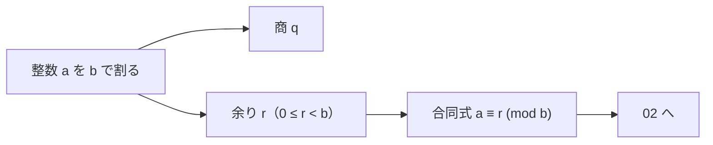

# 01. 余り付き割り算（整数除法・負の数への拡張）

> 親: [README](./README.md) ｜ 次: [02 合同式の定義](./02_congruence-definition.md) ｜ 層: 基礎(Layer 1)

**この1ページで分かること**

- 余り付き割り算 `a = b·q + r`（`0 ≤ r < b`）の定義と、商・余りが一意に決まること
- 負の数を割っても余りは 0 以上に取る、というルールとそのコツ
- プログラミングの `%` は言語によって負の余りを返すこと（暗号実装での注意点）

時計の針は 12 を過ぎると 1 に戻る——「割った**余り**」だけを見る計算の原型。
合同式の土台はこの余りで、特に**負の数を割ったときの余り**が後で効く。



---

## まず一番小さな例

```
7 ÷ 2  →  7 = 2·3 + 1     商 3、余り 1
```

「7 は 2 を 3 回使って、あと 1 残る」。この**商と余り**の 2 つが答え。負の数でも同じ形にする（下で）。

---

## なぜ割り算だけ特別か

足し算・引き算・掛け算は整数同士なら答えも整数（**閉じている**＝結果が同じ集合に留まる）。
割り算だけは閉じていない。`5 ÷ 2` は整数にならない。

- 分数で答える（`5/2`）… 整数の世界をはみ出す
- **余り付きで答える**（`2 あまり 1`）… 整数の世界に留まれる ← こちらを使う

合同算術は「整数の世界の中で割り算をどう扱うか」の話。だから商と余りが出発点になる。

---

## 定義（除法の原理）

整数 `a`（被除数）を **自然数** `b`（除数, `b ≥ 1`）で割るとは、

```
a = b·q + r   ただし  0 ≤ r < b
```

を満たす整数 `q`（商, quotient）と `r`（余り, remainder）を見つけること。
このとき `r = a mod b` と書く。**この `q, r` は一意に決まる。**

> この講義では割られる数 `a` を負まで拡張し、割る数 `b` は自然数のままにする。

### 余りのルール（最重要）

- 余りは必ず **`0 ≤ r < b`**（0 以上・割る数 b 未満）。
- **負の数を割っても、余りは負にしない。** 余りは常に 0 以上。

この「余りは 0 以上」を破る誤答が一番多い。負の数で必ずやり直して確認すること。

---

## 「a は b に何を掛けて何を足したらできる数か」

余り付き割り算の正体はこの問いに答えること。

`5 ÷ 2` → 「5 は 2 に **2** を掛けて **1** を足すとできる」→ 商 2, 余り 1。

ここで余りの制約を破った答えはダメ:

- `5 = 2·1 + 3` → 余り 3 は `b=2` 以上なのでダメ。

---

## 負の数の例（ここが肝）

### 例 1: `-27 ÷ 6`

「`-27` は 6 に何を掛けて、0〜5 の何を足すとできるか」

```
-27 = 6·(-5) + 3      → 商 -5, 余り 3   ✓（0 ≤ 3 < 6）
```

よくある誤答:

- `-27 = 6·(-6) + 9` → 余り 9 が `b=6` 以上。**ダメ**。
- `-27 = 6·(-4) + (-3)` → 余り -3 が負。**ダメ**。

### 例 2: `-5 ÷ 2`

```
-5 = 2·(-3) + 1       → 商 -3, 余り 1   ✓
```

`-5 = 2·(-2) + (-1)`（余り -1）としたくなるが、余りは 0 以上なので不可。
**商を 1 つ小さく（より負に）して、余りを 0 以上に持ち上げる**のがコツ。

---

## 演習（解答つき）

次を「商 q・余り r（0 ≤ r < b）」の形で求めよ。

1. `-19 ÷ 7`
2. `-23 ÷ 4`
3. `-30 ÷ 7`
4. `-1 ÷ 5`

<details><summary>解答</summary>

1. `-19 = 7·(-3) + 2` → 商 **-3**, 余り **2**
2. `-23 = 4·(-6) + 1` → 商 **-6**, 余り **1**
3. `-30 = 7·(-5) + 5` → 商 **-5**, 余り **5**
4. `-1 = 5·(-1) + 4` → 商 **-1**, 余り **4**

検算は「`b·q + r` が元の `a` に戻るか」と「`0 ≤ r < b` か」の 2 点。

</details>

---

## 実践メモ：プログラミングの `%` に注意

数学の余り（ここで定義した「常に 0 以上」）は **ユークリッド剰余**。
一方プログラミング言語の `%` 演算子は言語ごとに符号が違う。

- Python の `%` は割る数の符号に合わせる → `-19 % 7 == 2`（数学と一致）
- C / Java / JavaScript の `%` は被除数の符号に合わせる → `-19 % 7 == -5`（負になる！）

暗号の実装では「余りは 0 以上」が前提なので、C 系では
`((a % b) + b) % b` のように 0 以上へ補正するのが定石。
この食い違いはバグの温床なので、言語の仕様を必ず確認する。

---

## 次への接続

ここで定義した「`a` を `n` で割った余り」が等しい整数同士を `≡` で結ぶのが**合同式**。
→ [02 合同式の定義](./02_congruence-definition.md)

## 動かして確認する

負の数を割ったときに商・余りがどう決まるか、値を変えて確認できます。

<div class="algo-widget" data-algo="division-with-remainder" data-inputs="a:-27,b:6"></div>
