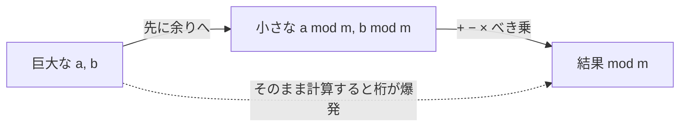

# 03. 合同式の演算規則

> 親: [README](./README.md) ｜ 前: [02 合同式の定義](./02_congruence-definition.md) ｜ 次: [04 gcd・ユークリッド互除法](./04_gcd-euclidean.md) ｜ 層: 基礎(Layer 1)

**この1ページで分かること**

- 合同式では足し算・引き算・掛け算・べき乗が「余りへの置き換え」でそのまま計算できること
- 割り算だけは特別扱い（逆元が必要）である理由
- 巨大な数の計算を小さな余り同士の計算に落とすテクニック

「1000 円の買い物の一の位は各商品の一の位だけ足せば分かる」——余りだけで計算できる感覚がこれ。
**余りが等しい数はいつでも置き換えてよい**ので、巨大数の計算が小さな余りの計算に落ちる。RSA（素因数分解の困難さを使う公開鍵暗号）の高速化の根。



---

## まず一番小さな例

```
9 + 5 = 14 ≡ 2 (mod 12)      9 時の 5 時間後は 2 時
```

`14` を経由せず、答えの余り `2` だけ知りたい——これが合同式の計算。

---

## 演算規則

整数 `a, b, c, d`、自然数 `m ≥ 2` について、
`a ≡ c (mod m)` かつ `b ≡ d (mod m)` ならば次が成り立つ。

```
加法:   a + b ≡ c + d   (mod m)
減法:   a − b ≡ c − d   (mod m)
乗法:   a · b ≡ c · d   (mod m)
べき乗: aⁿ   ≡ cⁿ        (mod m)   （n は正の整数）
```

> **割り算は一般に成り立たない。** これだけは別扱い。
> 整数の世界で割り算が閉じていない（[01](./01_division-with-remainder.md)）のと同じ理由。
> 合同式で「割る」には逆元が要る → [06 逆元](./06_modular-inverse.md)。

一言で「**置き換え**」。計算前に `a` を余り `c` に、`b` を `d` に取り替えても、結果の余りは変わらない。

---

## なぜ成り立つか（証明スケッチ）

`a ≡ c`, `b ≡ d` を「差が倍数」の形（[02](./02_congruence-definition.md)）で書く:
`a − c = m·k`, `b − d = m·l`（k, l は整数）。

**加法**: `(a + b) − (c + d) = (a−c) + (b−d) = m(k + l)` → m の倍数 → 合同。✓

**乗法**（`cb` を足して引くテクニック）:
```
a·b − c·d = a·b − c·b + c·b − c·d
          = b·(a − c) + c·(b − d)
          = b·(m·k) + c·(m·l) = m·(b·k + c·l)
```
→ m の倍数 → 合同。✓

**べき乗**（因数分解 `xⁿ − yⁿ`）:
```
aⁿ − cⁿ = (a − c)(aⁿ⁻¹ + aⁿ⁻²·c + … + cⁿ⁻¹)
```
右辺は `(a − c) = m·k` を因数に持つ → m の倍数 → 合同。✓
（乗法を n 回繰り返したものと見てもよい。）

---

## 応用 1：一の位（mod 10）

`429 × 243` の一の位は、各数を「10 で割った余り」に置き換えて

```
429 ≡ 9,  243 ≡ 3  (mod 10)
429 × 243 ≡ 9 × 3 = 27 ≡ 7  (mod 10)   → 一の位は 7
```

上の位を計算する必要がない理由が、乗法の置き換え規則そのもの。

---

## 応用 2：余りを先に取って計算する

法 11 や 13 でも全く同じ。**「先に余りにしてから足す・掛ける」** と桁数が爆発しない。

```
114 + 998 を 11 で割った余り
114 ≡ 4,  998 ≡ 8  (mod 11)
114 + 998 ≡ 4 + 8 = 12 ≡ 1  (mod 11)   → 余り 1
```

巨大数のべき乗でも同じ。`mod` の世界で計算すれば値が小さく保たれる（さらに効率化＝「べき乗の高速計算」→ deep 候補）。

---

## 演習（解答つき）

1. `114 + 998` を **11** で割った余り。
2. `1394²` を **13** で割った余り。
3. `7¹⁰⁰` の **一の位**（＝ mod 10）。

<details><summary>解答</summary>

1. `114 ≡ 4`, `998 ≡ 8 (mod 11)` → `4 + 8 = 12 ≡ 1` → 余り **1**。
2. `1394 ≡ 3 (mod 13)`（13·107 = 1391）→ `3² = 9` → 余り **9**。
3. 7 の累乗の一の位は周期的:
   `7¹≡7, 7²≡9, 7³≡3, 7⁴≡1 (mod 10)` で **周期 4**。
   `100 = 4·25` なので `7¹⁰⁰ ≡ (7⁴)²⁵ ≡ 1²⁵ = 1` → 一の位 **1**。

</details>

---

## つまずきポイント

- **割り算をうっかり使う**。`6 ≡ 0 (mod 6)` だが `6/2 = 3` と `0/2 = 0` は合同でない。
  割れるのは逆元が存在するとき（gcd と互いに素の話 → [04](./04_gcd-euclidean.md)）に限る。
- **法 m を途中で変えない**。一連の `≡` は同じ `(mod m)` で繋がっている（末尾に 1 回書けば全体に効く）。

---

## 次への接続

「割り算（逆元）」を扱うには、まず `gcd` と「互いに素」が必要。
→ [04 最大公約数とユークリッドの互除法](./04_gcd-euclidean.md)

## 動かして確認する

「応用2」の計算をウィジェットで再現します。大きい数でも先に余りへ置き換えれば
値が小さいまま計算できることを確認してください。

<div class="algo-widget" data-algo="congruence-mod-add" data-inputs="a:114,b:998,m:11"></div>
