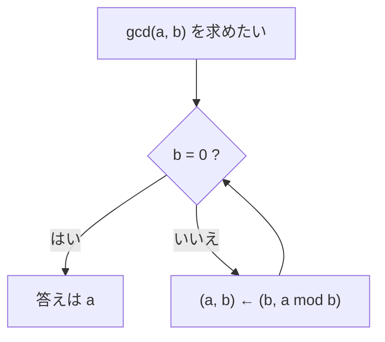

# 04. 最大公約数とユークリッドの互除法

> 親: [README](./README.md) ｜ 前: [03 演算規則](./03_congruence-arithmetic.md) ｜ 次: [05 拡張ユークリッド](./05_extended-euclidean.md) ｜ 層: 基礎(Layer 1)

**この1ページで分かること**

- gcd（最大公約数）と「互いに素」の定義、lcm との関係
- ユークリッドの互除法の仕組み・正しさ・計算量 O(log min(a, b))
- 減算版の互除法と、それが定数時間 GCD（サイドチャネル対策）へ繋がる理由

「48 と 18 を同じ大きさのタイルで敷き詰める最大のタイル」が gcd。合同式で割り算（逆元）ができるかは **gcd = 1（互いに素）** で決まる。
gcd を高速に求めるのが**ユークリッドの互除法**。逆元・RSA 鍵生成の前提。



---

## まず一番小さな例

```
gcd(12, 8) = 4      12 も 8 も割り切る最大の数
```

12×8 の長方形を正方形タイルで隙間なく敷くなら、最大のタイルは 4×4。

---

## 最大公約数 gcd

`gcd(a, b)` … `a` と `b` の両方を割り切る正の整数のうち最大のもの。
「**約数**（割り切る数）→ **公約数**（共通の約数）→ その**最大**」。

| 例 | 約数 | 公約数 | gcd |
|---|---|---|---|
| 15, 10 | `1,3,5,15` / `1,2,5,10` | `1, 5` | **5** |
| 12, 18 | `1,2,3,4,6,12` / `1,2,3,6,9,18` | `1,2,3,6` | **6** |
| a, 0 | — | — | `a`（0 は任意の数の倍数） |

**互いに素（coprime）**: `gcd(a, b) = 1`。共通の素因数を持たない状態。
逆元の存在条件（[06](./06_modular-inverse.md)）であり、RSA で `e` と `φ(n)` に課す条件でもある。

### 最小公倍数 lcm との関係

gcd の相棒が **最小公倍数 lcm**（両方の倍数のうち最小）。両者は次で結ばれる:

```
lcm(a, b) = (a · b) / gcd(a, b)
```

例: `lcm(4, 6) = 4·6 / gcd(4,6) = 24 / 2 = 12`。

**RSA での出番**: 秘密指数 `d` の法に `φ(n)` の代わりに `λ(n) = lcm(p−1, q−1)`（カーマイケル関数、FIPS 186）を使う実装が多い。`λ(n) | φ(n)` なので指数が小さくなる（証明は `../../../02_cryptography/` の RSA 本体）。

---

## ユークリッドの互除法

素因数分解せずに gcd を求めるアルゴリズム。核心は次の等式:

```
gcd(a, b) = gcd(b, a mod b)        （b > 0）
gcd(a, 0) = a                       （停止条件）
```

「割って、余りで置き換える」を余りが 0 になるまで繰り返す。**0 になる直前の割る数が gcd。**

### なぜ成り立つか

`a = b·q + r`（`r = a mod b`）と書くと、

- `a, b` の公約数は `r = a − b·q` も割り切る → `(b, r)` の公約数でもある。
- 逆に `b, r` の公約数は `a = b·q + r` も割り切る → `(a, b)` の公約数でもある。

`(a, b)` と `(b, r)` の公約数の集合が一致するので、最大公約数も等しい。∎

```text
# 除算版（再帰）— 実装で最も一般的。停止条件は b == 0
gcd(a, b):
    if b == 0: return a
    return gcd(b, a mod b)
```

---

## 計算例

### `gcd(48, 18)`

```
48 = 18·2 + 12     gcd(48,18) = gcd(18,12)
18 = 12·1 +  6     gcd(18,12) = gcd(12, 6)
12 =  6·2 +  0     gcd(12, 6) = gcd( 6, 0) = 6
```
→ **gcd(48, 18) = 6**

余りの列 `12 → 6 → 0`。0 になる直前の `6` が答え。

### `gcd(629, 481)` — 約数が見えない数でも一発

```
629 = 481·1 + 148     gcd(629,481) = gcd(481,148)
481 = 148·3 +  37     gcd(481,148) = gcd(148, 37)
148 =  37·4 +   0     gcd(148, 37) = gcd( 37, 0) = 37
```
→ **gcd(629, 481) = 37**（素因数分解では見えない例でも 3 ステップ）

---

## 計算量

2 ステップごとに余りは半分以下になるので **O(log min(a, b))**（計算量＝入力の桁数に対する手数の目安）。最悪は連続するフィボナッチ数（ラメの定理）。数千桁でも一瞬。

---

## 減算版の互除法（除算 ＝ 反復減算）

割り算の代わりに **引き算** でも gcd は求まる。

```
gcd(a, b) = gcd(b, a − b)     （a > b）
```

大きい方から小さい方を引き続け、等しくなった値が gcd。除算は「引き算をまとめて 1 回で」やっているだけ（商＝引けた回数、余り＝残り）。

| `gcd(25, 10)` | 手順 | ステップ |
|---|---|---|
| 除算版 | `25 = 10·2 + 5` → `10 = 5·2 + 0` | 2 |
| 減算版 | `25−10=15`, `15−10=5`, `10−5=5`, `5−5=0` | 4 |

```text
# 減算版（反復）— 除算命令を使わない。正の整数を仮定
gcd_sub(a, b):
    while a != b:
        if a > b: a = a - b
        else:     b = b - a
    return a
```

### なぜ実装セキュリティで効くか（暗号実装・サイドチャネル）

- **二進 GCD（Stein）**: 減算と右シフト（2 で割る）だけで計算し、高コストな多倍長除算を避ける。
- **定数時間 GCD**: 通常の互除法は手数が入力に依存し、秘密値（RSA 鍵、ECDSA の nonce＝署名ごとの使い捨て乱数）に使うと**タイミング・サイドチャネル**（実行時間の差から秘密が漏れる経路）になる。Bernstein–Yang の *safegcd* などで防ぐ。→ `deep/constant-time-gcd/`

---

## 演習（解答つき）

ユークリッドの互除法で求めよ。

1. `gcd(252, 105)`
2. `gcd(1071, 462)`
3. `35` と `12` は互いに素か。

<details><summary>解答</summary>

1. `252 = 105·2 + 42` → `105 = 42·2 + 21` → `42 = 21·2 + 0` → **gcd = 21**
2. `1071 = 462·2 + 147` → `462 = 147·3 + 21` → `147 = 21·7 + 0` → **gcd = 21**
3. `35 = 12·2 + 11` → `12 = 11·1 + 1` → `11 = 1·11 + 0` → gcd = 1 → **互いに素**

</details>

---

## 暗号での出口

- **逆元の存在**: `a` が `mod n` で逆元を持つ ⟺ `gcd(a, n) = 1`（[06](./06_modular-inverse.md)）。
- **RSA 鍵生成**: 公開指数 `e` は `gcd(e, φ(n)) = 1` を満たすよう選ぶ。
- 互除法を「係数つき」に拡張すると、gcd だけでなく逆元そのものが求まる → 次。

---

## 次への接続

互除法を逆にたどると `a·x + b·y = gcd(a, b)` の整数解が得られる（ベズーの等式）。
これが逆元計算の正体。
→ [05 拡張ユークリッドの互除法](./05_extended-euclidean.md)

## 動かして確認する

<div class="algo-widget" data-algo="gcd-euclidean" data-inputs="a:48,b:18"></div>
