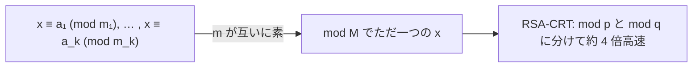

# 07. 中国剰余定理（入口）

> 親: [README](./README.md) ｜ 前: [06 逆元](./06_modular-inverse.md) ｜ 層: 基礎(Layer 1)
> 証明・一般化の詳細は [`../03_number-theory/04_crt.md`](../03_number-theory/04_crt.md)（本体）／`deep/crt-proof/`。

**この1ページで分かること**

- 互いに素な法の連立合同式は、法の積 `M` を法として解がただ一つ存在すること
- 逆元を使った構成的な解き方（孫子の問題で手順を確認）
- CRT-RSA: RSA 復号を `mod p` / `mod q` に分けて約4倍高速化する応用

「3 で割ると 2 余り、5 で割ると 3 余る数は？」——複数の余りの条件を同時に満たす数を見つける定理。
RSA 復号の高速化に直結。ここでは主張と解き方を例で押さえ、証明は整数論に譲る。



---

## まず一番小さな例

```
x ≡ 1 (mod 2),  x ≡ 2 (mod 3)   →  x = 5（mod 6 でただ一つ）
```

候補 `2, 5, 8, …`（3 で割って 2 余る）のうち奇数は `5`。法の積 `6` ごとに繰り返す。

---

## 主張

`m₁, m₂, …, m_k` が **どの 2 つも互いに素**（pairwise coprime）のとき、連立合同式

```
x ≡ a₁ (mod m₁)
x ≡ a₂ (mod m₂)
   ⋮
x ≡ a_k (mod m_k)
```

の解は、`M = m₁·m₂·⋯·m_k` を法として **ただ一つ存在する**（`0 ≤ x < M` に一意）。

> 直感: 法が互いに素なら各余りの情報が重ならず、`M` 未満の整数を余りの組で一意に指定できる。

---

## 構成的な解き方

1. `M = m₁·⋯·m_k`、各 `i` について `Mᵢ = M / mᵢ`。
2. `yᵢ ≡ Mᵢ⁻¹ (mod mᵢ)` を逆元（[06](./06_modular-inverse.md)）で求める
   （`gcd(Mᵢ, mᵢ) = 1` なので必ず存在）。
3. 解は
   ```
   x ≡ a₁·M₁·y₁ + a₂·M₂·y₂ + … + a_k·M_k·y_k   (mod M)
   ```

各項 `aᵢ·Mᵢ·yᵢ` は「`mod mᵢ` では `aᵢ`、他の法では `0`」になるよう作られている。

---

## 例（孫子の問題）

```
x ≡ 2 (mod 3),   x ≡ 3 (mod 5),   x ≡ 2 (mod 7)
```

`M = 3·5·7 = 105`、`M₁=35, M₂=21, M₃=15`。

```
y₁ = 35⁻¹ mod 3：35 ≡ 2 (mod 3), 2⁻¹ ≡ 2  → y₁ = 2
y₂ = 21⁻¹ mod 5：21 ≡ 1 (mod 5)            → y₂ = 1
y₃ = 15⁻¹ mod 7：15 ≡ 1 (mod 7)            → y₃ = 1
```
```
x ≡ 2·35·2 + 3·21·1 + 2·15·1 = 140 + 63 + 30 = 233 ≡ 23  (mod 105)
```

検算: `23 mod 3 = 2`, `23 mod 5 = 3`, `23 mod 7 = 2`。✓ → **x = 23**

---

## 演習（解答つき）

`x ≡ 1 (mod 4)`, `x ≡ 2 (mod 5)` を満たす最小の正の整数。

<details><summary>解答</summary>

`M = 20`。`x ≡ 2 (mod 5)` の候補 `2, 7, 12, 17, …` のうち `mod 4 = 1` は **17**。
（`17 mod 4 = 1`, `17 mod 5 = 2` ✓。一般解は `x ≡ 17 (mod 20)`。）

</details>

---

## 暗号での出口：CRT-RSA

RSA 復号 `C^d mod n`（`n = p·q`）は、`mod p` と `mod q` に分けて計算してから
CRT で合成すると、扱う数が約半分の桁になり **およそ 4 倍高速** になる。
多くの実装（OpenSSL 等）が採用する標準テクニック。

> 定理の証明、一般の法（互いに素でない場合）、環同型 `Z_{mn} ≅ Z_m × Z_n` としての見方は
> [`../03_number-theory/04_crt.md`](../03_number-theory/04_crt.md) で扱う。

---

## この章のまとめ

余り（[01](./01_division-with-remainder.md)）→ 合同式（[02](./02_congruence-definition.md)）→ 演算規則（[03](./03_congruence-arithmetic.md)）
→ gcd（[04](./04_gcd-euclidean.md)）→ 拡張ユークリッド（[05](./05_extended-euclidean.md)）→ 逆元（[06](./06_modular-inverse.md)）→ CRT（本章）
と繋がり、これらが揃うと **RSA の鍵生成・暗号化・復号・高速化** がすべて道具として説明できる。
RSA 本体は [`../../../02_cryptography/`](../../../02_cryptography/index.md) へ。

## 動かして確認する

孫子の問題（`x≡2(mod3), x≡3(mod5), x≡2(mod7)`）をそのまま実行できます。

<div class="algo-widget" data-algo="crt" data-inputs="remainders:[2,3,2],moduli:[3,5,7]"></div>
