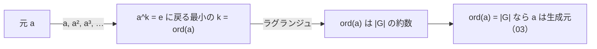

# 02. 群の位数とラグランジュの定理

> 親: [README](./README.md) ｜ 前: [01 二項演算と群の公理](./01_binary-ops-and-groups.md) ｜ 次: [03 巡回群と生成元](./03_cyclic-groups-generators.md) ｜ 層: 基礎(Layer 1)

**この1ページで分かること**

- 群の位数 `|G|`（元の個数）と元の位数 `ord(a)`（単位元に戻る周期）の違い
- ラグランジュの定理: `ord(a)` は必ず `|G|` を割り切る
- `Z_7^*` の全元の位数を計算して定理を体感する

時計の針を 3 時間ずつ進めると 4 回で一周（12 時間）——「何回で戻るか」は必ず一周の長さを割り切る。
群でも同じで、**元の位数**は**群の位数**を割り切る（**ラグランジュの定理**）。DH・RSA で「なぜその指数か」を支える。

---

## まず一番小さな例

```
Z_7^* で 2 を掛け続ける:  2 → 4 → 8≡1     3 回で 1 に戻る → ord(2) = 3
群の大きさ |Z_7^*| = 6、  3 は 6 を割り切る ✓
```



---

## 定義

```
群の位数 |G|:       G の元の個数

元 a の位数 ord(a):  a^k = e となる最小の正整数 k
                     （e は単位元。乗法的に書いたが加法群では k・a = e）

ラグランジュの定理:  H が G の部分群 (H ≤ G, G の部分集合で同じ演算のもと
                     それ自体が群になるもの) ならば |H| は |G| を割り切る
系:                 ord(a) は常に |G| を割り切る
                     （<a> = {a^0, a^1, ..., a^{ord(a)-1}} が G の部分群になるため）
```

---

## なぜ成り立つか（軽いスケッチ）

`<a> = {a^0, …, a^{ord(a)-1}}` は `a` が生成する部分群で位数はちょうど `ord(a)`。ラグランジュを `H = <a>` に適用すると系が出る。定理の証明（剰余類による分割）は `deep/lagrange-theorem/`。

---

## 計算例：Z_7^* の全元の位数

`Z_7^* = {1,2,3,4,5,6}`、`|Z_7^*| = 6`。各元 `a` について `a^k mod 7` を
`1` に戻るまで計算する。

| a | 累乗列（a¹, a², …, 1 まで） | ord(a) |
|---|---|---|
| 1 | 1 | 1 |
| 2 | 2, 4, **1** | 3 |
| 3 | 3, 2, 6, 4, 5, **1** | 6 |
| 4 | 4, 2, **1** | 3 |
| 5 | 5, 4, 6, 2, 3, **1** | 6 |
| 6 | 6, **1** | 2 |

出てくる位数は `{1, 2, 3, 6}` — すべて `|Z_7^*| = 6` の約数（`1,2,3,6` はいずれも
`6` を割り切る）。ラグランジュの定理どおり、`ord(a) = 4` や `5` のような
「6を割り切らない位数」は一つも現れない。

---

## 演習（解答つき）

1. `Z_7^*` に位数 `4` の元は存在しうるか。理由とともに答えよ。
2. `Z_13^*`（`|Z_13^*| = 12`）で `5` の位数を計算せよ。
3. `Z_11^*`（`|Z_11^*| = 10`）で `3` の位数を計算せよ。

<details><summary>解答</summary>

1. 存在しない。ラグランジュの定理より `ord(a)` は `|Z_7^*|=6` を割り切る必要があるが、
   `4` は `6` を割り切らない。
2. `5¹=5, 5²=25≡12, 5³=60≡8, 5⁴=40≡1 (mod 13)` → **ord(5) = 4**（`4 | 12` ✓）。
3. `3¹=3, 3²=9, 3³=27≡5, 3⁴=15≡4, 3⁵=12≡1 (mod 11)` → **ord(3) = 5**（`5 | 10` ✓）。

</details>

---

## 次への接続

`Z_7^*` の表で `3` と `5` だけが位数 `6 = |Z_7^*|` を持っていた。
つまりこの2元は「べき乗だけで群全体を作り出せる」特別な元 —— **生成元**。
→ [03 巡回群と生成元](./03_cyclic-groups-generators.md)

## 動かして確認する

`a` が単位元 `1` に戻るまでの累乗ステップを追えます。表の他の行（例: p=13, a=5）も試してください。

<div class="algo-widget" data-algo="order-and-lagrange" data-inputs="a:3,p:7"></div>
