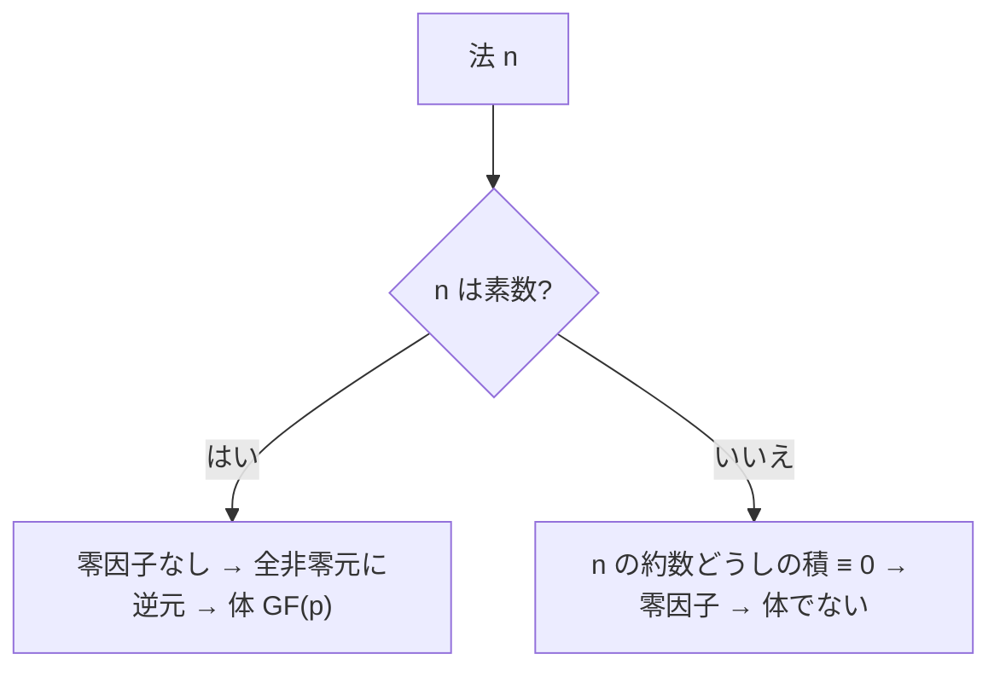

# 04. 環と零因子

> 親: [README](./README.md) ｜ 前: [03 巡回群と生成元](./03_cyclic-groups-generators.md) ｜ 次: [05 体と有限体GF(p)](./05_fields-and-gfp.md) ｜ 層: 基礎(Layer 1)

**この1ページで分かること**

- 環＝「加法群＋乗法（逆元は保証されない）」という2演算の構造
- 零因子（非零×非零＝0）が、法 n が合成数のとき必ず現れる理由
- 零因子があると体になれないことの短い証明

「2 時間の 3 倍は 6 時間、でも 6 時間時計なら 0 に戻る」——0 でない数を掛けて 0 になる現象が**零因子**。
足し算と掛け算の 2 演算を持つ構造が**環**で、零因子の有無が `Z_n` が体になれるかの分かれ目。

---

## まず一番小さな例

```
Z_6 で  2 × 3 = 6 ≡ 0      2 も 3 も 0 でないのに積が 0 → 零因子
Z_5 で  2 × 3 = 6 ≡ 1      素数の法では起きない
```



---

## 定義

```
環 (R, +, ×):
  (R, +)  は可換群（単位元 0）
  ×       は結合律・分配律を満たす:
             a·(b+c) = a·b + a·c,   (a+b)·c = a·c + b·c
  × は必ずしも可換でなくてよく、逆元も必ずしも存在しなくてよい

零因子（zero divisor）:
  a ≠ 0 かつ b ≠ 0 だが a·b = 0 となる元 a, b
```

例: `Z`（整数全体）、多項式環 `Z[x]`（整数係数の多項式の全体）、`Z_n`（mod n の加減乗）はすべて環。

---

## 計算例：Z_6 の乗算表で零因子を可視化する

`Z_6 = {0,1,2,3,4,5}`、mod 6 の乗算表:

| × | 0 | 1 | 2 | 3 | 4 | 5 |
|---|---|---|---|---|---|---|
| **0** | 0 | 0 | 0 | 0 | 0 | 0 |
| **1** | 0 | 1 | 2 | 3 | 4 | 5 |
| **2** | 0 | 2 | 4 | **0** | 2 | 4 |
| **3** | 0 | 3 | **0** | 3 | **0** | 3 |
| **4** | 0 | 4 | 2 | **0** | 4 | 2 |
| **5** | 0 | 5 | 4 | 3 | 2 | 1 |

太字の `0` に注目: `2×3 = 6 ≡ 0 (mod 6)`。**どちらも 0 ではないのに、積が 0**。
`2` と `3` は互いに零因子。同様に `3×4 ≡ 0` も零因子のペア。

直感: `2` と `3` は `6` の約数。**合成数の法では、約数どうしを掛けると必ず `n` の倍数（≡0）**——これが零因子の正体。

---

## なぜ零因子があると体になれないか

体では 0 でない元すべてに乗法逆元が必要。しかし `a` が零因子（`a·b=0`, `a,b≠0`）で
`a` に逆元 `a⁻¹` があったと仮定すると:

```
a⁻¹·(a·b) = a⁻¹·0 = 0
(a⁻¹·a)·b = 1·b = b
```

これは `b = 0` を意味するが、`b ≠ 0` と矛盾する。**よって零因子は逆元を持てない。**
`Z_6` の `2, 3, 4` は零因子なので逆元がなく、`Z_6` は体にならない。

`n` が**素数**なら `0 < a < n` に `n` の約数は存在しないため零因子が現れず、
（有限集合であることと合わせて）すべての非零元が逆元を持つ → 体になる（[05](./05_fields-and-gfp.md)）。

---

## 演習（解答つき）

1. `Z_6` の乗算表から、`2×3` 以外の零因子ペアをもう1組挙げよ。
2. `Z_5`（素数）の乗算表を作り、`0` 以外に `0` が現れないこと（＝零因子がないこと）を確認せよ。
3. `Z_8` で `4` は零因子か。積が0になる相手を1つ示せ。

<details><summary>解答</summary>

1. `3×4 = 12 ≡ 0 (mod 6)` —— `3` と `4` も零因子のペア。
2. `1×2=2, 1×3=3, 1×4=4, 2×3=6≡1, 2×4=8≡3, 3×4=12≡2` など、非零元同士の積に `0` は一度も現れない。
3. `4×2 = 8 ≡ 0 (mod 8)`、`4≠0, 2≠0` → **`4` は零因子**（`8=4×2` の約数だから）。

</details>

---

## 次への接続

零因子がない環（＝素数の `Z_p`）は、実はもっと強い性質——非零元すべてに逆元がある——
を満たす。これが体の定義そのもの。
→ [05 体と有限体GF(p)](./05_fields-and-gfp.md)
