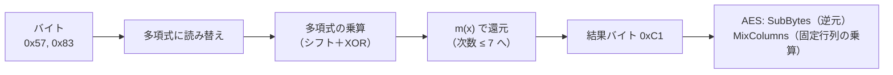

# 06. 有限体 GF(2^n) と AES

> 親: [README](./README.md) ｜ 前: [05 体と有限体GF(p)](./05_fields-and-gfp.md) ｜ 層: 基礎(Layer 1)

**この1ページで分かること**

- バイト ⇔ 多項式の対応と、GF(2^8) の加算（＝XOR）・乗算（＝掛けて m(x) で還元）
- AES 標準例 `{57}・{83} = {C1}` をシフトと XOR だけで手計算する手順
- SubBytes / MixColumns がこの GF(2^8) 演算をどこで使うか

`GF(p)` は元の個数が**素数**の有限体だった。だが AES はバイト（8ビット、
256通り）を1つの元として扱うため、`GF(2^8)` という**素数のべき乗個**の
元を持つ有限体が必要になる。一般構成の理論は多項式編に譲り、ここでは
AES が実際に使う `GF(2^8)` の演算を1例、最初から最後まで手で追う。

---

## GF(2^8) とバイトの対応

```
バイト b7 b6 ... b1 b0（8ビット）
  ⇔ 多項式 b7·x^7 + b6·x^6 + ... + b1·x + b0   （係数は GF(2) = {0,1}）

GF(2^8) := GF(2)[x] / (m(x)),   m(x) = x^8 + x^4 + x^3 + x + 1   （= 0x11B）

加算:  ビットごとの XOR（繰り上がりなし）
乗算:  多項式として掛けたあと m(x) で割った余りを取る
```

「既約多項式（それ以上低次の多項式の積に分解できない多項式）`f(x)` で割った
剰余環が拡大体になる」という**一般論**は
[`../04_polynomials-ideals/03_quotient-rings-gf2n.md`](../04_polynomials-ideals/03_quotient-rings-gf2n.md) 参照。
ここでは AES 固有の `m(x)` を使った**具体的な計算**だけを扱う。

---

## 計算例：{57}・{83} を計算する（AES の標準例）

### Step 1: バイト → 多項式

```
0x57 = 0101 0111  →  x^6 + x^4 + x^2 + x + 1
0x83 = 1000 0011  →  x^7 + x + 1
```

### Step 2: 多項式の掛け算（XOR で係数結合、繰り上がりなし）

`0x83` のビットが立つ位置は `0, 1, 7` なので、`0x57` をその分シフトして XOR する:

```
0x57 << 0 = 0x0057
0x57 << 1 = 0x00AE
0x57 << 7 = 0x2B80
------------------ XOR
            0x2B79   ( = x^13+x^11+x^9+x^8+x^6+x^5+x^4+x^3+1 )
```

### Step 3: m(x) で還元（次数8以上を落とす）

次数が8以上の間、最高次の項に合わせて `m(x)` をシフトして XOR する。

```
0x2B79 (最高次 13)  XOR  m(x)<<5 = 0x2360   →  0x0819  (最高次 11)
0x0819 (最高次 11)  XOR  m(x)<<3 = 0x08D8   →  0x00C1  (最高次  7 < 8 → 終了)
```

**結果: {57} · {83} = {C1}**（Rijndael/FIPS-197 の標準的な検証例と一致）。

---

## なぜ「シフトして XOR」で還元できるか

`m(x) = x^8+x^4+x^3+x+1 ≡ 0` なので `x^8 ≡ x^4+x^3+x+1`。つまり `x^8` は
「消して」`x^4+x^3+x+1` に置き換えてよい、というのが `m(x)` を掛けて XOR する操作の正体
（`m(x)<<k` は `x^k·m(x) ≡ 0` を利用して次数 `8+k` の項を消している）。

---

## AES での使い道



- **SubBytes**: `GF(2^8)` での乗法逆元（`0` は例外的に `0` に対応）を求めたあと、
  固定のアフィン変換（ビットの1次変換＋定数の XOR）を施す。非線形性の源。
- **MixColumns**: 状態行列の各列に、`{01},{02},{03}` を要素とする固定行列を
  この `GF(2^8)` 乗算で掛けて拡散（diffusion）させる。

詳細は Paar & Pelzl, *Understanding Cryptography* Ch. 4（README の参考参照）。

---

## 演習（解答つき）

1. `{02}・{87}` を計算せよ（`0x87` を1ビット左シフトし、最上位ビットが溢れたら `0x1B` と XOR する「xtime」手順を使う）。
2. `{57}・{83}` の還元前の多項式の次数はいくつだったか。なぜ次数8以上のまま残せないのか。
3. `{01}` が乗法単位元であることを定義から一言で説明せよ。

<details><summary>解答</summary>

1. `0x87 = 1000 0111`、最上位ビットが1なので:
   `(0x87<<1) & 0xFF = 0x0E`、これと `0x1B` を XOR → `0x0E ^ 0x1B = 0x15`。
   **{02}・{87} = {15}**。
2. 次数13。`GF(2^8)` の元は「1バイト＝次数7以下の多項式」と対応づけられているため、
   次数8以上のままでは1バイトの表現に収まらない。`m(x)` で還元して次数7以下に戻す必要がある。
3. 任意の元 `a`（次数7以下）に `1`（`x^0` の項のみ）を掛けても次数は7以下のまま変わらず、
   還元が不要でそのまま `a` が返るため。

</details>

---

## 次への接続

群・環・体・有限体という代数の道具が揃った。次はこの土台の上に、
RSA・DH の安全性を支える整数論（素数・フェルマー/オイラーの定理・離散対数問題）へ進む。
→ [`../03_number-theory/`](../03_number-theory/README.md)
