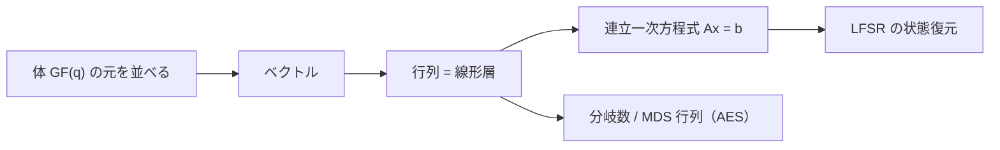

# 07. 有限体上の線形代数

> 親: [README](./README.md) ｜ 前: [06 有限体GF(2^n)とAES](./06_gf2n-and-aes.md) ｜ 層: 基礎(Layer 1)

**この1ページで分かること**

- ビット列の XOR は `GF(2)` 上のベクトル加算そのもの——線形代数は体を変えても同じ形で動く
- ブロック暗号の線形層は行列積で、連立一次方程式が解けると LFSR の状態が復元される
- 拡散の強さを測る分岐数と、それを最大にする MDS 行列

「01 と 10 を XOR すると 11」——これはもう線形代数（ベクトルの足し算）。体の元を並べたものがベクトル、写す規則が行列。
LFSR 解読・AES の拡散層・格子暗号まで、この道具が姿を変えて現れる。

---

## まず一番小さな例

```
GF(2)^3 のベクトル加算 = ビットごとの XOR:  (1,0,1) + (1,1,0) = (0,1,1)
スカラーは 0 と 1 だけ:                       1·v = v,  0·v = 0
```



---

## 有限体の上にベクトルを載せる

実数上のベクトル空間の公理は任意の体 `GF(q)` 上でもそのまま成り立つ。**違いはスカラー（係数）が `q` 個しかないこと**だけ。
一次独立（どれも他の組み合わせで作れない）・基底（全体を作れる最小の組）・次元（基底の本数）の定義も変わらない。

`GF(2)ⁿ` は **n ビットのビット列そのもの**。`(1,0,0), (0,1,0), (0,0,1)` が基底（次元 3）、`(1,1,0)` と `(0,1,1)` は一次独立。

---

## 行列は「線形層」そのもの

行列×ベクトルは成分の演算を体の演算に置き換えるだけ。**ブロック暗号の線形層は行列積**——`GF(2⁸)` 上の 4×4 行列が AES の MixColumns、`GF(2)` 上の置換行列がビットの並べ替え（[06](./06_gf2n-and-aes.md) の演算が係数）。

行列の合成は行列の積。**線形処理をいくら重ねても 1 つの行列に潰れる**——S-box のような非線形部品が要る理由。

---

## 連立一次方程式を解く＝状態を復元する

Gauss の消去法（行を足し引きして未知数を消していく解法）は `GF(q)` 上でも動く。割り算は逆元を掛けるだけ（[`06_modular-inverse`](../01_modular-arithmetic/06_modular-inverse.md)）。

決定的な違いは解の個数。`Ax = b` が解を持つとき（`rank` ＝ 独立な方程式の本数）、

```
解の個数 = q^(n − rank(A))
```

実数上なら「一意」か「無限個」の二択だが、**GF(q) 上では有限個**になる。
この違いが暗号の攻撃コストに直結する——LFSR の状態復元がその典型例である。

```
n ビットの LFSR の出力を n ビット観測する
  → 未知数 n 個（初期状態）に対して一次方程式が n 本立つ
  → rank が n なら解は一意 → 初期状態が確定 → 以降の全出力が予測できる
```

**線形が致命的な理由**——攻撃コストが総当たり `2ⁿ` から連立方程式の求解（多項式時間）に落ちる。詳細は
[`../../../02_cryptography/02_symmetric-crypto/01_stream-ciphers-and-lfsr.md`](../../../02_cryptography/02_symmetric-crypto/01_stream-ciphers-and-lfsr.md) が本体。

---

## MDS 行列と分岐数

線形層の「拡散の強さ」を測る指標が**分岐数**である。

```
分岐数 B(M) = 非零ベクトル x について、wt(x) + wt(Mx) の最小値
              （wt = 非零成分の個数）
```

`n` 次正方行列の分岐数は最大 `n+1`。達成する行列が **MDS 行列**（Maximum Distance Separable、符号理論由来）で、**すべての正方小行列式が非零**と同値。

分岐数が大きいほど 1 成分の変化が多くの成分に波及し、差分・線形解読で辿れる「アクティブな成分数」の下界を決める。AES の MixColumns は 4×4 MDS で分岐数 **5**（最大）。行列の選定理由は
[`../../../02_cryptography/02_symmetric-crypto/03_aes-internals.md`](../../../02_cryptography/02_symmetric-crypto/03_aes-internals.md) が本体。

---

## 暗号での出口：同じ道具が何度も出てくる

| 場面 | 何が線形代数か | 本体 |
|---|---|---|
| LFSR の解読 | 出力から初期状態を解く連立一次方程式 | [`02_symmetric-crypto/01_stream-ciphers-and-lfsr.md`](../../../02_cryptography/02_symmetric-crypto/01_stream-ciphers-and-lfsr.md) |
| AES の MixColumns | `GF(2⁸)` 上の MDS 行列積 | [`02_symmetric-crypto/03_aes-internals.md`](../../../02_cryptography/02_symmetric-crypto/03_aes-internals.md) |
| 線形解読 | `GF(2)` 上の線形近似式 | `courses/coursera-crypto1/04_block-ciphers/04_advanced-attacks.md` |
| マスキング | 秘密をシェアに分けるアフィン分解 | [`04_side-channels/04_countermeasures.md`](../../../04_hardware-security/04_side-channels/04_countermeasures.md) |
| Shamir 秘密分散 | 多項式補間＝Vandermonde 行列の可逆性 | [`06_advanced-topics-map.md`](../../../02_cryptography/06_advanced-topics-map.md) |
| R1CS | 算術回路を3つの制約行列に落とす | [`03_ppt-cryptographic/02_zero-knowledge-proofs.md`](../../../03_privacy/03_ppt-cryptographic/02_zero-knowledge-proofs.md) |
| 格子 | 基底＝一次独立なベクトルの組（係数を整数に制限） | [`06_lattices/`](../06_lattices/README.md) |

---

## 演習（解答つき）

1. `GF(2)³` のベクトル `(1,1,0)` と `(0,1,1)` は一次独立か。理由も述べよ。
2. 8ビットの LFSR の出力を8ビット観測したところ、立てた連立方程式の rank が 6 だった。
   初期状態の候補は何通りか。
3. ある4×4の線形変換の分岐数が2だった。この変換を暗号の拡散層に使うと何が問題か。

<details><summary>解答</summary>

1. 一次独立である。`GF(2)` 上でスカラーは `0` と `1` しかないため、一次従属になるのは
   一方が他方の定数倍（＝完全に一致する）場合のみ。`(1,1,0) ≠ (0,1,1)` なので独立。
2. `q^(n−rank) = 2^(8−6) = 2² = 4` 通り。rank が満杯（8）でないため解は一意に定まらず、
   観測データと矛盾しない初期状態が4通り残る。
3. 分岐数の理論上の最大値は `n+1 = 5` なので、2は非常に低い。ある入力で1成分だけ変えても
   出力側では高々1成分しか変わらない経路が存在しうるということであり、拡散が弱い。
   差分・線形解読でアクティブな成分数を少なく保てる経路が残ってしまい、
   攻撃者に有利な低確率でない差分特性・線形近似を許してしまう。

</details>

---

## 次への接続

係数を体の元から**整数**に制限すると、連続だった空間が「点の格子」になり、
Gauss 消去で解けた問題が解けなくなる。これが耐量子暗号の土台である。
→ [`../06_lattices/README.md`](../06_lattices/README.md)

---

## 参考

- MacWilliams, F.J., Sloane, N.J.A. *The Theory of Error-Correcting Codes*（MDS符号の標準的な教科書）。
- Daemen, J., Rijmen, V. *The Design of Rijndael: AES — The Advanced Encryption Standard*. Springer（分岐数の定義とAESでの適用）。
