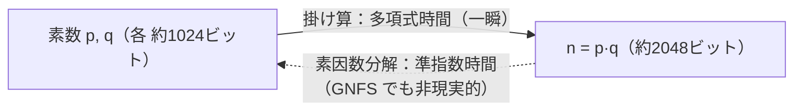

# 01. 素数と素因数分解

> 親: [README](./README.md) ｜ 次: [02 フェルマーの小定理](./02_fermat-little-theorem.md) ｜ 層: 基礎(Layer 1)

**この1ページで分かること**

- 素因数分解が「順序を除いてただ一通り」に定まる理由（算術の基本定理）
- 試し割りは √n まで調べれば十分なこと、それでも 2048 ビットの n では非現実的なこと
- 「掛けるのは簡単・分解は困難」という非対称性が RSA を支える構図

「6 = 2×3」は誰でも分かるが、600 桁の数を 2 つの素数に分けるのは誰にもできない。RSA の安全性はこの一点に根ざす。
素数の定義と一意分解を確認し、「小さいと一瞬・大きいと非現実的」を数値で体感する。

---

## まず一番小さな例

```
6  = 2 × 3          素数（1 と自分以外で割れない数）2 つの積
12 = 2 × 2 × 3      = 2² × 3。順序を変えても同じ分解しかない
```

---

## 定義：素数と算術の基本定理

```
素数 (prime):    1 より大きい整数 p であって、1 と p 自身以外に正の約数を持たないもの
                  例: 2, 3, 5, 7, 11, 13, ...
合成数 (composite): 素数でない 2 以上の整数（複数の素数の積に分解できる）

算術の基本定理 (Fundamental Theorem of Arithmetic):
  任意の整数 n > 1 は、素数の積として
      n = p1^e1 · p2^e2 · ... · pk^ek
  の形に、順序を除いてただ一通りに表せる（一意分解性）。
```

「一意」が本質。RSA の `n = p·q` は、この一意性があって初めて「分解すれば `p, q` はただ一つ」と言える。

---

## 計算例：試し割りで 91 を素因数分解

```
91 は偶数でない            → 2 では割れない
9+1=10 は3の倍数でない     → 3 では割れない
末尾が 0 でも 5 でもない    → 5 では割れない
91 ÷ 7 = 13                → 7 で割り切れた！
13 は素数か？ √13 ≈ 3.6 なので 2, 3 だけ確認すればよい → どちらでも割れない → 13 は素数

∴ 91 = 7 × 13
```

**√n までで十分な理由**: `n = a·b`（`a ≤ b`）なら必ず `a ≤ √n`。約数ペアの小さい方は √n 以下に必ず現れる。

### なぜ RSA モジュラスの分解は無理なのか

91 は √91 ≈ 9.5 で候補 4 個。RSA のモジュラス（modulus: mod 演算の法。RSA では公開される `n`）は **2048 ビット**（10 進 600 桁超）。

```
p, q はそれぞれ約 1024 ビットの素数 → n = p·q は約 2048 ビット
試し割りで探すべき範囲は √n ≈ 1024 ビットの数 ≈ 2^1024 通り
```

2^1024 通りの総当たりは全計算資源でも宇宙年齢の何倍もかかる。最良の **一般数体篩法 (GNFS)** でも**準指数時間**（多項式より遅く指数より速い）で、ビット長を 2 倍にすると困難さが跳ね上がる。
一方 `p × q` は筆算レベルの多項式時間。この非対称性が RSA の土台。



---

## 演習（解答つき）

1. `221` を試し割りで素因数分解せよ（ヒント: √221 ≈ 14.9、調べる素数は 2,3,5,7,11,13）。
2. `197` は素数か判定せよ。
3. RSA の n が 2048 ビットのとき、試し割りは √n ビット程度の数まで調べる必要がある。
   これがなぜ「計算困難」と言えるのか、一言で述べよ。

<details><summary>解答</summary>

1. 221 は奇数（2で割れない）。2+2+1=5 は3の倍数でない（3で割れない）。
   末尾が0/5でない（5で割れない）。221÷7≈31.6（割れない）。221÷11≈20.1（割れない）。
   221÷13=17 → 割り切れた。17 は素数（√17≈4.1、2,3で割れない）。
   **∴ 221 = 13 × 17**
2. √197 ≈ 14.0。2,3,5,7,11,13 のどれでも割り切れない（奇数・digit和17・末尾7・
   197/7≈28.1・197/11≈17.9・197/13≈15.2）。**∴ 197 は素数**
3. 探索範囲が √n ≈ 2^1024 通りという天文学的な指数関数的サイズになり、
   既知の最良アルゴリズム（GNFS）でも準指数時間しかかからないため、
   現実的な時間内には終わらない。

</details>

---

## 次への接続 / 暗号での出口

素因数分解の困難さだけでは RSA は動かない。暗号化・復号が「正しく元に戻る」ことを
保証するには、素数が持つ別の性質 — **フェルマーの小定理** — が必要になる。
→ [02 フェルマーの小定理](./02_fermat-little-theorem.md)

## 動かして確認する

`91 = 7 × 13` を試し割りで求める過程を追えます。`221` や `197`（演習の答え）も試してください。

<div class="algo-widget" data-algo="primes-factorization" data-inputs="n:91"></div>
