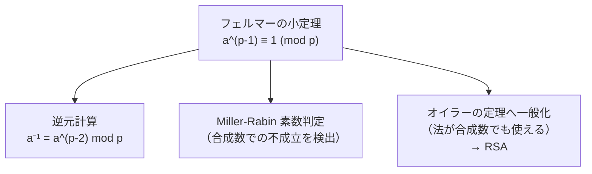

# 02. フェルマーの小定理

> 親: [README](./README.md) ｜ 前: [01 素数と素因数分解](./01_primes-factorization.md) ｜ 次: [03 オイラーの定理](./03_euler-phi-theorem.md) ｜ 層: 基礎(Layer 1)

素数 `p` を法にすると、`p` と互いに素などんな数も「`p-1` 乗すると 1 に戻る」という
驚くほど規則的な性質が現れる。これがフェルマーの小定理。
逆元の別ルート・Miller-Rabin 素数判定・RSA の正当性証明の全てがここから始まる。

**この1ページで分かること**

- 素数 `p` と互いに素な `a` については `a^(p-1) ≡ 1 (mod p)` が必ず成り立つこと（と証明の骨子）
- この定理から逆元計算（`a^(p-2)`）と Miller-Rabin 素数判定が生まれること
- 「法が素数のときだけ」という制約が、次のオイラーの定理への動機になること

---

## 定義

```
フェルマーの小定理 (Fermat's Little Theorem)
  p が素数、gcd(a, p) = 1 のとき:
      a^(p-1) ≡ 1  (mod p)

系（a と p が互いに素でなくても成り立つ形）:
      a^p ≡ a  (mod p)
```

---

## 計算例：`3^6 mod 7` を検証する

`p = 7`（素数）、`a = 3`（`gcd(3,7)=1`）として、`3^(7-1) = 3^6` を段階的に計算する。

```
3^1 mod 7 = 3
3^2 mod 7 = 3·3        =  9 mod 7 = 2
3^3 mod 7 = 3·2        =  6 mod 7 = 6
3^4 mod 7 = 3·6        = 18 mod 7 = 4
3^5 mod 7 = 3·4        = 12 mod 7 = 5
3^6 mod 7 = 3·5        = 15 mod 7 = 1   ← フェルマーの小定理どおり 1 に戻った
```

`a = 3` 以外でも同じことが起きる。`p = 7` に対し `a = 1..6` すべてで `a^6 mod 7` を計算すると:

| a | 1 | 2 | 3 | 4 | 5 | 6 |
|---|---|---|---|---|---|---|
| a^6 mod 7 | 1 | 1 | 1 | 1 | 1 | 1 |

`gcd(a, 7) = 1` を満たす（＝ 7 の倍数でない）どの `a` でも `a^6 ≡ 1 (mod 7)` になる。
これは偶然ではなく、`p` が素数であることから必然的に導かれる規則性。

---

## なぜ成り立つか（証明スケッチ）

`gcd(a, p) = 1` のとき、集合 `{a, 2a, 3a, ..., (p-1)a} mod p` は
`{1, 2, ..., p-1}` を並べ替えたものに一致する（`a` が mod p で逆元を持つため、
異なる `k` に対し `ka mod p` も異なる値になる）。

両方の集合の積を mod p で比較すると:

```
a^(p-1) · (p-1)!  ≡  (p-1)!   (mod p)
```

`(p-1)!` は `p` と互いに素（`p` より小さい数の積だから `p` を因数に持たない）なので
両辺を `(p-1)!` で割れる（＝ 逆元を掛けられる）。よって `a^(p-1) ≡ 1 (mod p)`。∎

---

## 応用：逆元計算と Miller-Rabin



`a·a^(p-2) = a^(p-1) ≡ 1 (mod p)` なので、**`a^(p-2) mod p` は `a` の逆元そのもの**。
拡張ユークリッド（[../01_modular-arithmetic/06_modular-inverse.md](../01_modular-arithmetic/06_modular-inverse.md)）
とは別ルートで逆元を求められる（ただし高速べき乗＝繰り返し二乗法が必要で、法が素数の場合限定）。

また、合成数 `n` はほとんどの `a` について `a^(n-1) ≡ 1 (mod n)` が **成り立たない**。
この「不成立」を検出条件に使う確率的素数判定が **Miller-Rabin テスト** で、
フェルマー小定理の強化版として Magma（数式処理システム）で実装される。

---

## 演習（解答つき）

1. `2^10 mod 11` を直接計算し、フェルマーの小定理（`p=11` なので `2^10 ≡ 1`）と一致するか確かめよ。
2. `5^12 mod 13` を、フェルマーの小定理を使って **計算せずに** 求めよ。
3. `a^(p-2) mod p` が `a` の逆元になる理由を一行で述べよ。

<details><summary>解答</summary>

1. `2^1=2, 2^2=4, 2^3=8, 2^4=16≡5, 2^5≡10, 2^6≡9, 2^7≡7, 2^8≡3, 2^9≡6, 2^10≡1 (mod 11)`。
   フェルマーの小定理の予言（`gcd(2,11)=1` なので `2^10≡1`）と **一致する**。
2. `p=13` は素数、`gcd(5,13)=1`、指数 `12 = p-1` なのでフェルマーの小定理より
   直接計算せずに **`5^12 ≡ 1 (mod 13)`**。
3. `a·a^(p-2) = a^(p-1) ≡ 1 (mod p)` となり、これは逆元の定義（掛けると1になる相手）を満たすから。

</details>

---

## 次への接続 / 暗号での出口

フェルマーの小定理は法 `p` が **素数** のときしか使えない。しかし RSA の法は
`n = p·q`（合成数）。この制約を外し、任意の合成数に一般化したのが次のオイラーの定理。
→ [03 オイラーの定理](./03_euler-phi-theorem.md)

## 動かして確認する

`3^6 mod 7` が1に戻る様子を1乗ずつ追えます。表の他の `a`（1〜6）も試してください。

<div class="algo-widget" data-algo="fermat-little-theorem" data-inputs="a:3,exponent:6,m:7"></div>
