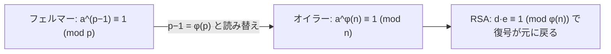

# 03. オイラーのトーシェント関数とオイラーの定理

> 親: [README](./README.md) ｜ 前: [02 フェルマーの小定理](./02_fermat-little-theorem.md) ｜ 次: [04 CRT](./04_crt.md) ｜ 層: 基礎(Layer 1)

**この1ページで分かること**

- `φ(n)`＝「n と互いに素な数の個数」の定義と、RSA で使う公式 `φ(pq) = (p-1)(q-1)`
- フェルマーの小定理を合成数の法へ一般化したオイラーの定理
- RSA の鍵生成（`e` と `d` の関係）が `φ(n)` の上に成り立っていること

「1〜n のうち n と共通の約数を持たない数は何個？」を数えるのが `φ(n)`。RSA の法 `n = p·q` は合成数なのでフェルマーが使えず、この個数で一般化する。
これが RSA 鍵生成の根拠そのもの。

---

## まず一番小さな例

```
n = 6:  1〜6 で 6 と互いに素なのは {1, 5}  → φ(6) = 2
        5² = 25 ≡ 1 (mod 6)                 → a^φ(n) ≡ 1 が成り立つ
```



---

## 定義：オイラーのトーシェント関数 φ(n)

```
φ(n) := 1 以上 n 以下の整数のうち、n と互いに素なもの（gcd(k, n) = 1）の個数

性質1（素数）:   p が素数のとき          φ(p) = p - 1
                （1 以上 p 未満の全ての数が p と互いに素だから）

性質2（乗法性）: gcd(a, b) = 1 のとき     φ(a·b) = φ(a)·φ(b)

系（RSA の形）: p, q が異なる素数、n = p·q のとき
                φ(n) = φ(p)·φ(q) = (p-1)(q-1)
```

---

## オイラーの定理

```
オイラーの定理 (Euler's Theorem)
  gcd(a, n) = 1 のとき:
      a^φ(n) ≡ 1  (mod n)
```

オイラーの定理は **フェルマーの小定理を合成数の法へ一般化したもの**。両者を並べると:

| | フェルマーの小定理（[02](./02_fermat-little-theorem.md)） | オイラーの定理 |
|---|---|---|
| 使える法 | 素数 `p` のみ | 任意の `n`（合成数も可） |
| 条件 | `gcd(a, p) = 1` | `gcd(a, n) = 1` |
| 主張 | `a^(p-1) ≡ 1 (mod p)` | `a^φ(n) ≡ 1 (mod n)` |
| 関係 | `n = p`（素数）の特殊ケース（`φ(p) = p-1` で一致） | 一般形 |

---

## 計算例：φ(15) を定義から数え、公式で検算する

`n = 15 = 3 × 5` として、1〜15 の整数がそれぞれ 15 と互いに素かどうかを確認する。

| k | 1 | 2 | 3 | 4 | 5 | 6 | 7 | 8 | 9 | 10 | 11 | 12 | 13 | 14 | 15 |
|---|---|---|---|---|---|---|---|---|---|----|----|----|----|----|----|
| gcd(k,15) | 1 | 1 | 3 | 1 | 5 | 3 | 1 | 1 | 3 | 5 | 1 | 3 | 1 | 1 | 15 |
| 互いに素? | ○ | ○ | × | ○ | × | × | ○ | ○ | × | × | ○ | × | ○ | ○ | × |

○ の個数を数えると `1, 2, 4, 7, 8, 11, 13, 14` の **8個**。∴ `φ(15) = 8`。

公式で検算: `φ(15) = φ(3)·φ(5) = (3-1)(5-1) = 2 × 4 = 8`。一致する。

### オイラーの定理を数値で確認する

`a = 2`（`gcd(2,15)=1`）で `a^φ(15) = 2^8` を計算する。

```
2^1=2, 2^2=4, 2^3=8, 2^4=16, 2^5=32, 2^6=64, 2^7=128, 2^8=256
256 mod 15 = 256 - 15×17 = 256 - 255 = 1
```

`2^8 ≡ 1 (mod 15)` — オイラーの定理どおり 1 に戻った。

---

## なぜ成り立つか（証明スケッチ）

フェルマーの証明（[02](./02_fermat-little-theorem.md)）と同じ発想。`n` と互いに素な数の集合 `R = {r₁, …, r_φ(n)}` に `a` を掛けると、`{a·rᵢ mod n}` は `R` の並べ替えになる（`a` に逆元があるので写り先が重ならない）。

積を比較: `a^φ(n) · ∏rᵢ ≡ ∏rᵢ (mod n)`。`∏rᵢ` は `n` と互いに素なので逆元を掛けて `a^φ(n) ≡ 1`。∎

---

## 暗号での出口：RSA 鍵生成

RSA の鍵生成は φ(n) そのものに依存する。

```
1. p, q を異なる素数として選び n = p·q
2. φ(n) = (p-1)(q-1) を計算
3. gcd(e, φ(n)) = 1 となる公開指数 e を選ぶ
4. 秘密指数 d を d·e ≡ 1 (mod φ(n)) で決める（拡張ユークリッド、../01_modular-arithmetic/06）
```

復号が元に戻る理由（`(M^e)^d ≡ M`）: `d·e = 1 + k·φ(n)` とオイラーの定理 `M^φ(n) ≡ 1` の組み合わせ（`gcd(M,n)=1` の場合。`M` が `p, q` の倍数なら CRT で拡張）。

---

## 演習（解答つき）

1. `φ(21)` を素因数分解 `21 = 3×7` を使って公式で求めよ。
2. `a = 4` として `4^φ(21) mod 21` を計算し、オイラーの定理を確認せよ。
3. `p` が素数のとき `φ(p²)` はいくつか（ヒント: `1` から `p²` の中で `p` の倍数だけを除く）。

<details><summary>解答</summary>

1. `φ(21) = φ(3)·φ(7) = 2 × 6 = 12`
2. `gcd(4,21)=1` なので `4^12 mod 21` を計算する。`4^2=16`, `4^3=64=63+1≡1 (mod 21)`。
   よって `4^12 = (4^3)^4 ≡ 1^4 = 1 (mod 21)`。オイラーの定理どおり成立。
3. `1` から `p²` までの整数のうち `p` の倍数は `p, 2p, …, p·p` の `p` 個。
   よって `φ(p²) = p² - p = p(p-1)`。

</details>

---

## 次への接続

オイラーの定理は「1つの法 `n`」に対する規則性を示す。RSA の復号を高速化するには、
`n = p·q` を **2つの小さい法 `mod p`, `mod q` に分解して計算する** という別方向の道具が必要になる。
→ [04 中国剰余定理](./04_crt.md)

## 動かして確認する

`φ(15)` を `1〜15` の全数チェックで数える過程を追えます（本文の表と同じ結果になることを確認してください）。

<div class="algo-widget" data-algo="euler-phi-theorem" data-inputs="n:15"></div>
