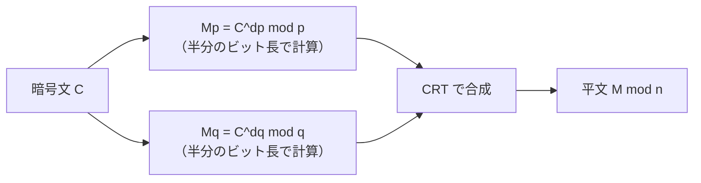

# 04. 中国剰余定理（CRT）

> 親: [README](./README.md) ｜ 前: [03 オイラーの定理](./03_euler-phi-theorem.md) ｜ 次: [05 困難な問題](./05_hard-problems.md) ｜ 層: 基礎(Layer 1)
> 直感的な入口（最初の例）は [`../01_modular-arithmetic/07_crt-intro.md`](../01_modular-arithmetic/07_crt-intro.md)。ここでは証明・一般化・RSA-CRT の詳細を扱う。

複数の法に関する連立合同式には **なぜ・どんな条件で** ただ一つの解が存在するのか。
ここでは存在性・一意性を証明し、モジュラスが素数でなくても成り立つ一般形を確認したうえで、
RSA 復号を高速化する CRT-RSA の原理まで押さえる。

**この1ページで分かること**

- 互いに素な法の連立合同式に、解がただ一つ存在すること（存在性＝構成、一意性）
- 逆元を使って解を実際に組み立てる手順
- RSA 復号を理論上約4倍高速化する CRT-RSA の原理

---

## 主張（一般形）

```
中国剰余定理 (Chinese Remainder Theorem)
  m₁, m₂, …, m_k が「どの2つも互いに素」（pairwise coprime, gcd(mᵢ,mⱼ)=1 for i≠j）のとき、
  連立合同式
      x ≡ a₁ (mod m₁)
      x ≡ a₂ (mod m₂)
         ⋮
      x ≡ a_k (mod m_k)
  は M = m₁·m₂·⋯·m_k を法として、0 ≤ x < M の範囲にただ一つの解を持つ。
```

モジュラス `mᵢ` は素数である必要はない。「互いに素」でありさえすれば成り立つ
（例えば `4` と `9` はどちらも素数ではないが互いに素 — 下の例で使う）。

---

## なぜ成り立つか：存在性と一意性

**存在性**: 構成的に解を作れることを示せば十分。各 `i` について
`Mᵢ = M/mᵢ`（`mᵢ` を除いた残り全部の積）とすると `gcd(Mᵢ, mᵢ) = 1` なので、
`Mᵢ` は mod `mᵢ` で逆元 `yᵢ` を持つ（[../01_modular-arithmetic/06_modular-inverse.md](../01_modular-arithmetic/06_modular-inverse.md)）。

```
x = Σ aᵢ·Mᵢ·yᵢ   (i = 1..k)
```

とおくと、`j ≠ i` のとき `Mⱼ` は `mᵢ` を因数に含む（`mᵢ` は `Mⱼ = M/mⱼ` の積の中に残っている）ので
`aⱼ·Mⱼ·yⱼ ≡ 0 (mod mᵢ)`。一方 `aᵢ·Mᵢ·yᵢ ≡ aᵢ·1 = aᵢ (mod mᵢ)`（`yᵢ` の定義より）。
よって `x mod mᵢ = aᵢ` が全ての `i` で成り立つ — これが解の構成。

**一意性**: `x, x'` が両方とも解だとすると、全ての `i` で `x ≡ x' (mod mᵢ)`、
つまり `mᵢ | (x - x')`。`mᵢ` は互いに素なので、それら全ての積 `M` も `(x-x')` を割り切る
（互いに素な数それぞれで割り切れるなら、その積でも割り切れる）。
`0 ≤ x, x' < M` の範囲では `M | (x-x')` は `x = x'` を意味する。∎

---

## 構成的に解く：x ≡ 1 (mod 4), x ≡ 2 (mod 9)

`4` と `9` は互いに素（`gcd(4,9)=1`）なので CRT が使える。

```
M = 4 × 9 = 36
M₁ = M/4 = 9,   M₂ = M/9 = 4
```

逆元を求める:

```
y₁ = 9⁻¹ mod 4：9 mod 4 = 1 なので 1⁻¹ ≡ 1 (mod 4)   → y₁ = 1
y₂ = 4⁻¹ mod 9：4×7 = 28 = 27+1 ≡ 1 (mod 9)          → y₂ = 7
```

解を合成する:

```
x ≡ a₁·M₁·y₁ + a₂·M₂·y₂
  ≡ 1·9·1 + 2·4·7
  ≡ 9 + 56 = 65 ≡ 65 - 36 = 29   (mod 36)
```

検算: `29 mod 4 = 1` ✓、`29 mod 9 = 2`（`27=9×3`, `29-27=2`）✓ → **x = 29**（`mod 36` で一意）。

---

## 暗号での出口：RSA-CRT による復号高速化

RSA 復号 `M = C^d mod n`（`n = p·q`）を素直に計算すると `n` は約2048ビットの巨大数になり、
べき乗の各ステップが重い。CRT を使うと:

```
1. dp = d mod (p-1),  dq = d mod (q-1)   （事前計算）
2. Mp = C^dp mod p,   Mq = C^dq mod q    （p, q は n の半分のビット長 → 高速）
3. CRT で Mp, Mq から M mod n を合成
```



べき乗の計算量はおおよそビット長の3乗に比例するため、半分の桁数の計算を2回行うほうが
元の桁数で1回計算するより `2 × (1/2)³ = 1/4` の時間で済む — **理論上およそ4倍高速**。
OpenSSL など主要な実装がこの CRT-RSA を標準採用している。

---

## 演習（解答つき）

1. `x ≡ 2 (mod 5)`, `x ≡ 3 (mod 8)` を満たす最小の正の整数を CRT で求めよ（`gcd(5,8)=1`）。
2. モジュラスが互いに素でない場合（例: `mod 4` と `mod 6`）に上の一意性の証明がそのままでは
   成り立たない理由を一言で述べよ。
3. RSA-CRT で `dp = d mod (p-1)` と置き換えても結果が変わらない理由を一言で述べよ。

<details><summary>解答</summary>

1. `M=40, M₁=8, M₂=5`。`y₁=8⁻¹ mod5`: `8≡3(mod5)`, `3×2=6≡1` → `y₁=2`。
   `y₂=5⁻¹ mod8`: `5×5=25≡1(mod8)` → `y₂=5`。
   `x ≡ 2·8·2 + 3·5·5 = 32+75=107 ≡ 107-80=27 (mod 40)`。検算: `27mod5=2`✓, `27mod8=3`✓。**x=27**
2. `4` と `6` は互いに素でない（`gcd=2`）ため、「互いに素な `mᵢ` それぞれで割り切れるなら
   積でも割り切れる」という論法が崩れる。解が存在しない、または一意でない組み合わせが起こりうる。
3. `gcd(C,p)=1` ならフェルマーの小定理より `C^(p-1)≡1(mod p)` なので、指数を `mod (p-1)` に
   落としても `C^d mod p` の値は変わらない。指数のビット長が短くなり計算量が減る。

</details>

---

## 次への接続

CRT は「複数の法にどう分解して速く計算するか」という **効率** の話だった。
次は視点を変え、「なぜ暗号として安全なのか」という **困難性の根拠** そのものを見る —
素因数分解問題と離散対数問題。
→ [05 困難な問題](./05_hard-problems.md)

## 動かして確認する

`x≡1(mod4), x≡2(mod9)` を CRT で合成する過程を追えます。

<div class="algo-widget" data-algo="crt" data-inputs="remainders:[1,2],moduli:[4,9]"></div>
