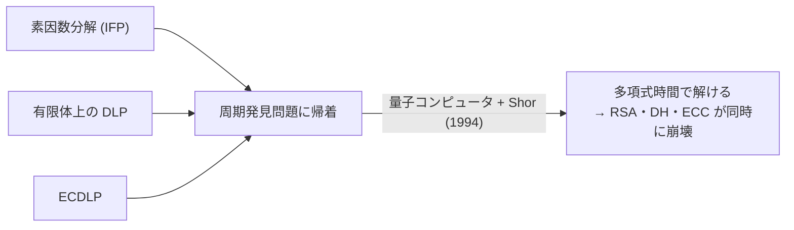

# 05. 困難な問題：素因数分解と離散対数

> 親: [README](./README.md) ｜ 前: [04 CRT](./04_crt.md) ｜ 層: 基礎(Layer 1)

ここまでの概念（素数・フェルマー・オイラー・CRT）は「正しく暗号が動く」ことを支える道具だった。
最後に問うべきは「なぜ **破れない** のか」。公開鍵暗号の安全性は、ある計算問題が
**一方向には簡単・逆向きには（今のところ）計算困難** という非対称性の上に築かれている。

**この1ページで分かること**

- RSA・DH・ECC の安全性がそれぞれどの計算問題（IFP・DLP・ECDLP）に依存するか
- 「一方向は簡単・逆向きは困難」という非対称性の正体
- Shor のアルゴリズムがこの3問題すべてを量子計算で多項式時間に潰すこと

---

## 素因数分解問題（IFP）と離散対数問題（DLP）

| 問題 | 与えられるもの → 求めるもの | 安全性の根拠になる暗号 | 最良の古典アルゴリズム |
|---|---|---|---|
| 素因数分解問題（IFP: Integer Factorization Problem） | `n = p·q` → 大きな素数 `p, q` | RSA | 準指数時間（一般数体篩法 GNFS） |
| 離散対数問題（DLP: Discrete Logarithm Problem） | 巡回群 `G`・生成元 `g`・`y = g^x` → 秘密の `x` | DH 鍵共有・DSA・ElGamal | 有限体 `Z_p^*` 上では準指数時間（指数計算法など） |
| 楕円曲線離散対数問題（ECDLP） | 楕円曲線上の点 `G, xG` → 秘密の `x` | ECDH・ECDSA | 指数時間相当（Pollard の ρ 法、群の位数の平方根程度） |

巡回群・生成元は「1つの元 `g` の累乗だけで群全体を作れる群と、その `g`」のこと
（[../02_groups-rings-fields/03_cyclic-groups-generators.md](../02_groups-rings-fields/03_cyclic-groups-generators.md)）。

有限体上の DLP と違い、一般の楕円曲線には準指数時間アルゴリズムが知られていない。
このため同じ安全性を得るのに必要な鍵長が大幅に短くて済む
（256bit 楕円曲線 ≈ 3072bit RSA/DH 相当）。

---

## 「簡単な方向」と「困難な方向」を対比する

| 暗号系 | 簡単な方向（多項式時間） | 困難な方向（準指数〜指数時間） |
|---|---|---|
| RSA | `p, q` を掛けて `n = p·q` を作る | `n` から `p, q` を求める（素因数分解） |
| DH / ElGamal | `g, x` から `g^x mod p` を計算する | `g, g^x mod p` から `x` を求める（離散対数） |
| ECDH / ECDSA | `G, x` から点 `xG` を計算する | `G, xG` から `x` を求める（ECDLP） |

「掛ける」「べき乗する（＝繰り返し二乗法）」はどれも筆算レベルの多項式時間で一瞬に終わる。
逆方向はどれも、鍵の桁数を少し増やすだけで必要な計算量が跳ね上がる — この非対称性こそが
公開鍵暗号を成立させている「命題」そのもの。

---

## 量子コンピュータでこの非対称性が消える：Shor のアルゴリズム

古典計算機では IFP・DLP・ECDLP はいずれも困難（ECDLP が最も困難）とされてきた。
ところが **Shor のアルゴリズム**（1994年）は、これらを周期発見問題に帰着して
量子コンピュータ上で多項式時間で解く。Shor の手法は一般の有限アーベル群上の DLP に
一般化できるため、楕円曲線の群も例外にならない。

つまり「ECDLP は古典的には DLP より困難」という優位は、
**量子計算の下では両方とも多項式時間に潰れて消える**。RSA も DH も ECDH も
（十分な規模の量子コンピュータがあれば）等しく破られる。これが耐量子暗号（PQC）
研究の直接の動機になっている。

---

## 演習（解答つき）

1. RSA と DH のそれぞれで、「簡単な方向」と「困難な方向」を一言ずつで説明せよ。
2. なぜ ECDSA は RSA よりずっと短い鍵長（256bit 程度）で同等の安全性を主張できるのか。
3. Shor のアルゴリズムが実用規模の量子コンピュータで動いたとして、RSA・ECDSA のどちらか
   一方だけが安全であり続けるということはあるか。

解答

1. RSA: 簡単＝ `p×q` の掛け算、困難＝ `n` から `p,q` を復元する素因数分解。
   DH: 簡単＝ `g^x mod p` の計算（繰り返し二乗法）、困難＝ `g^x` から `x` を求める離散対数。
2. 有限体上の DLP や素因数分解には準指数時間の攻撃（指数計算法・GNFS）が知られているが、
   一般の楕円曲線群には準指数時間アルゴリズムが知られておらず、最良でも群の位数の平方根
   程度の指数時間（Pollard の ρ 法）しかかからない。同じ「ビットあたりの安全性」を得るのに
   必要な鍵長がずっと短くて済む。
3. ない。Shor のアルゴリズムは有限アーベル群上の DLP 一般（有限体上の DLP も ECDLP も）と
   素因数分解の両方を多項式時間で解くため、実用規模の量子コンピュータが実現すれば
   RSA・DH・ECDH/ECDSA は **同時に** 安全性を失う。

---

## 次への接続

素因数分解と離散対数の困難性が、RSA・DH・ECC という公開鍵暗号3本柱の安全性証明の
出発点になる。実際の暗号方式（鍵生成・暗号化・署名アルゴリズム）そのものは
[`../../../02_cryptography/`](../../../02_cryptography/index.md)（作成後は `index.md` から）で扱う。
本フォルダの役割は「なぜ安全と言えるか」の数学的根拠までを扱うことにある。
