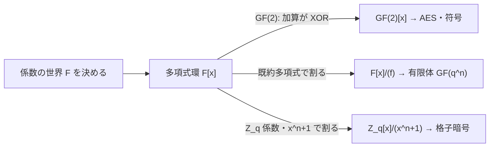

# 01. 多項式環 F[x] とその演算

> 親: [README](./README.md) ｜ 次: [02 既約多項式](./02_irreducible-polynomials.md) ｜ 層: 基礎(Layer 1)

**この1ページで分かること**

- 多項式も整数と同じように加減乗除ができ、環 `F[x]` をなすこと（整数 `Z` との対応表）
- 係数が 0/1・加算が XOR の `GF(2)[x]` の計算感覚（AES の土台）
- 整数の割り算と同じ形の除算アルゴリズム（商と余りの一意性）と筆算の手順

多項式とは「`x` の何乗かに係数を掛けて足したもの」。係数を整数の代わりに 0/1 だけにすると、足し算が XOR になり、AES や符号理論の土台がそのまま現れる。

---

## 最小の例：GF(2) 上で `(x+1)·(x+1)`

係数は `{0,1}` で、`1+1=0`（XOR）とする。

```
(x + 1)(x + 1) = x^2 + x + x + 1
               = x^2 + (1⊕1)x + 1
               = x^2 + 1            ← 中間の x 項が消える（2x = 0）
```

普通の代数なら `x^2 + 2x + 1` だが、GF(2) では `2 = 0` なので真ん中が消える。この「係数の世界を決めれば計算規則が決まる」感覚が本ファイルの全部。

---

## 多項式環 F[x] の定義

```
F[x] = { a_n x^n + a_{n-1} x^{n-1} + ... + a_1 x + a_0 : a_i ∈ F, n ≥ 0 }

加算: 同じ次数の係数どうしを F の加算で足す
乗算: 分配法則で展開し、同じ次数の係数を F の加算で集める
```

`F` が体（加減乗除が自由にできる集合、[05 体と GF(p)](../02_groups-rings-fields/05_fields-and-gfp.md)）なら `F[x]` は可換環（掛け算の順序を入れ替えられる環）。整数環 `Z` との対応が道しるべになる:

| 整数環 `Z` | 多項式環 `F[x]` |
|---|---|
| 数の大きさ（絶対値） | 次数 `deg` |
| 素数 | 既約多項式（→ [02](./02_irreducible-polynomials.md)） |
| 除算 `a = q·b + r`（`0 ≤ r < b`） | 除算 `a(x) = q(x)·b(x) + r(x)`（`deg r < deg b`） |
| `Z/nZ`（`n` が素数なら体） | `F[x]/(f)`（`f` が既約なら体 → [03](./03_quotient-rings-gf2n.md)） |

`Z[x]`（整数係数）も暗号に登場する。NTRU や Ring-LWE（格子ベースの耐量子暗号）は `Z_q[x]/(x^n+1)` の上で定義される（[04](./04_ideals-groebner-intro.md)）。



---

## GF(2)[x]: 係数が XOR になる多項式環

| 演算 | 例 | 結果 |
|---|---|---|
| 加算 | `(x^2+x+1) + (x+1)` | `x^2`（`x` と定数が消える） |
| 乗算 | `(x+1)(x+1)` | `x^2 + 1` |
| 減算 | `a - b` | `a + b` と同じ（引き算は XOR） |

引き算が XOR になるおかげで、除算の「引く」操作も XOR で済む。

---

## 多項式の除算アルゴリズム

```
任意の a(x), b(x) ∈ F[x]（b(x) ≠ 0）に対し、
  a(x) = q(x)·b(x) + r(x)      deg(r) < deg(b)
を満たす q(x), r(x) ∈ F[x] が一意に存在する。
```

手順は整数の筆算と同じ:
1. 最高次の項どうしを割って商の項を 1 つ決める
2. その項と除数を掛けて被除数から引く（GF(2) では XOR）
3. 余りの次数が除数の次数未満になるまで繰り返す

---

## 計算例：GF(2)[x] での筆算

`x^3 + x + 1` を `x + 1` で割る。

```
          x^2  +  x
        ┌───────────────────
x + 1  │ x^3 + 0x^2 + x + 1

Step 1: x^3 ÷ x = x^2 を商に。 (x+1)·x^2 = x^3 + x^2
        引く(XOR): (x^3+0x^2+x+1) ⊕ (x^3+x^2) = x^2 + x + 1
Step 2: x^2 ÷ x = x を商に。   (x+1)·x = x^2 + x
        引く(XOR): (x^2+x+1) ⊕ (x^2+x) = 1
Step 3: 余り 1 の次数(0) < 除数の次数(1) → 終了
```

結果: `x^3 + x + 1 = (x+1)(x^2+x) + 1`。
検算: `(x+1)(x^2+x) + 1 = x^3 + (1⊕1)x^2 + x + 1 = x^3+x+1` ✓
余りが 0 でない＝ `x+1` は `x^3+x+1` を割り切らない。[02](./02_irreducible-polynomials.md) の既約性判定で再利用する。

---

## 演習（解答つき）

1. GF(2)[x] で `(x^2+1) + (x^3+x+1)` を計算せよ。
2. GF(2)[x] で `(x+1)(x^2+x+1)` を展開せよ。
3. GF(2)[x] で `x^3+x^2+1` を `x+1` で割り、商と余りを求めよ。

<details><summary>解答</summary>

1. 係数を XOR: `x^3 + (0⊕1)x^2 + x + (1⊕1) = x^3 + x^2 + x`
2. `x^3+x^2+x + x^2+x+1 = x^3 + (1⊕1)x^2 + (1⊕1)x + 1 = x^3 + 1`
   （これは `x^3+1 = (x+1)(x^2+x+1)` という有名な因数分解に一致する）
3. `x^3+x^2+1 = (x+1)·x^2 + 1`。
   `(x+1)·x^2 = x^3+x^2`、引くと `(x^3+x^2+1)⊕(x^3+x^2) = 1`（次数0 < 1 で終了）。
   商 `x^2`、余り `1`。

</details>

---

## 次への接続

`x+1` で割ったときに余りが 0 にならない多項式（上の `x^3+x+1`）は、「小さい次数の積に分解できない」候補。これを体系的に判定するのが **既約多項式**。
→ [02 既約多項式](./02_irreducible-polynomials.md)

## 動かして確認する

`(x+1)(x²+x+1)` を筆算せずビット演算で求める過程を追えます（多項式は
係数を2進数のビットとして扱い、`x+1`＝`3`, `x²+x+1`＝`7` のように入力します）。

<div class="algo-widget" data-algo="polynomial-rings" data-inputs="a:3,b:7"></div>
