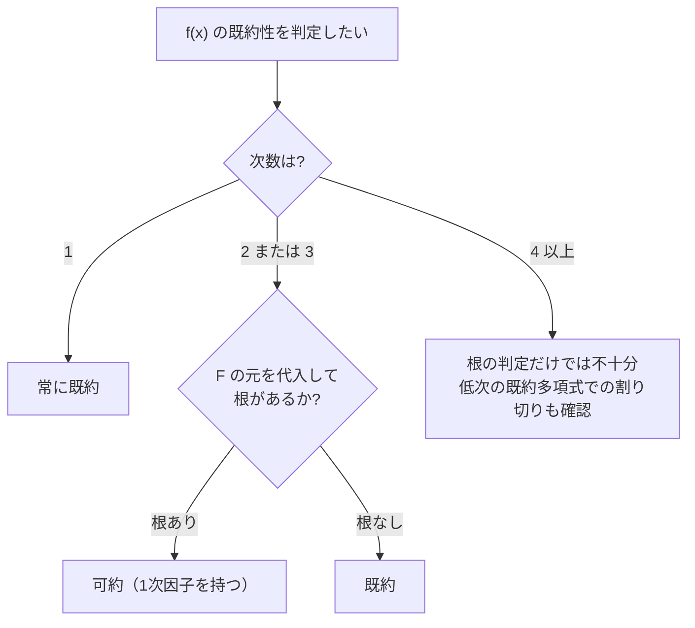

# 02. 既約多項式（Irreducible Polynomial）

> 親: [README](./README.md) ｜ 前: [01 多項式環](./01_polynomial-rings.md) ｜ 次: [03 剰余環と GF(2^n)](./03_quotient-rings-gf2n.md) ｜ 層: 基礎(Layer 1)

整数の世界で「素数」が特別だったように、多項式の世界では **既約多項式** が
特別な役割を持つ。次の概念（[03](./03_quotient-rings-gf2n.md)）で有限体
GF(q^n) を作る材料になるのがこれ。GF(2) 上の低次多項式を実際に全部
分類して、判定の感覚を掴む。

**この1ページで分かること**

- 既約多項式＝「多項式版の素数」の定義
- 次数2・3なら根の有無だけで既約性を判定できる理由（と次数4以上での落とし穴）
- GF(2) 上の低次既約多項式の完全リスト（2次は1個、3次は2個）

---

## 既約多項式の定義

```
f(x) ∈ F[x]（次数 1 以上）が既約（irreducible）とは:
  f(x) = g(x)·h(x)  （deg(g), deg(h) ≥ 1）
  という分解が存在しない

そうでなければ可約（reducible）
```

素数が「1 と自分自身以外の約数を持たない整数」であるのと同じ形で、
既約多項式は「定数倍以外の多項式の積に分解できない多項式」。

**次数 2・3 に限った近道**: 次数 2 または 3 の多項式が可約なら、
必ず 1次因子（＝ 体の中の根）を持つ（次数の和が2か3である以上、
片方が必ず次数1になるため）。つまり **F 上の根の有無を調べるだけで
既約性が判定できる**。ただし次数4以上ではこの近道は使えない
（下記の注を参照）。



---

## 計算例：GF(2) 上の次数2の全分類

モニック（最高次係数1）な次数2の多項式は `x^2 + ax + b`（a, b ∈ {0,1}）の
4通りだけ。`f(0)`, `f(1)` を GF(2) で計算し、根の有無で判定する。

| 多項式 | f(0) | f(1) | 判定 | 備考 |
|---|---|---|---|---|
| `x^2` | 0（根） | 1 | 可約 | `= x·x` |
| `x^2+1` | 1 | 0（根） | 可約 | `= (x+1)^2` |
| `x^2+x` | 0（根） | 0（根） | 可約 | `= x(x+1)` |
| `x^2+x+1` | 1 | 1 | **既約** | 根なし。GF(4) 構成に使う（→[03](./03_quotient-rings-gf2n.md)） |

GF(2) 上のモニック2次多項式のうち既約なのは **1個だけ**。

---

## 計算例：GF(2) 上の次数3の全分類

モニックな次数3の多項式は `x^3 + ax^2 + bx + c` の8通り。同じく
`f(0)`（＝ `c`）と `f(1)`（＝ `1+a+b+c` mod 2）で根の有無を判定する。

| 多項式 | f(0) | f(1) | 判定 | 因数分解（可約時） |
|---|---|---|---|---|
| `x^3` | 0（根） | 1 | 可約 | `x·x·x` |
| `x^3+1` | 1 | 0（根） | 可約 | `(x+1)(x^2+x+1)` |
| `x^3+x` | 0（根） | 0（根） | 可約 | `x(x+1)^2` |
| `x^3+x+1` | 1 | 1 | **既約** | — |
| `x^3+x^2` | 0（根） | 0（根） | 可約 | `x^2(x+1)` |
| `x^3+x^2+1` | 1 | 1 | **既約** | — |
| `x^3+x^2+x` | 0（根） | 1 | 可約 | `x(x^2+x+1)` |
| `x^3+x^2+x+1` | 1 | 0（根） | 可約 | `(x+1)^3` |

GF(2) 上のモニック3次多項式のうち既約なのは **2個**（`x^3+x+1` と
`x^3+x^2+1`）。この2つは AES 以外の GF(8) 構成や符号理論でよく登場する。
（`x^3+x+1` は [01](./01_polynomial-rings.md) の筆算例で `x+1` では割り切れないことを確認済み。）

---

## 注：次数4以上では根の判定だけでは不十分

次数4の `(x^2+x+1)^2 = x^4+x^2+1` を展開すると、`f(0)=1, f(1)=1` で
**根を持たないのに可約**（既約多項式の2乗だから）。次数4以上では
根の判定に加えて、既約な低次多項式による割り切りまで確認する必要がある。
一般的な判定アルゴリズム（Rabin の既約性テストなど）は深掘り候補。

---

## 演習（解答つき）

1. GF(2) 上で `x^2+1` は既約か。根で判定せよ。
2. GF(2) 上で `x^3+x^2+x+1` を分類し、可約なら因数分解を示せ。
3. `x^4+x^2+1` が根を持たないのに可約である理由を一言で説明せよ。

<details><summary>解答</summary>

1. `f(1) = 1+1 = 0` → `x=1` が根 → **可約**（`= (x+1)^2`）。
2. `f(1) = 1+1+1+1 = 0` → `x=1` が根 → **可約**。実際 `(x+1)^3 = x^3+x^2+x+1`。
3. 次数4は「次数2＋次数2」の分解もあり得るため、根（次数1の因子）がなくても
   既約な2次式どうしの積として可約になりうる（`(x^2+x+1)^2` がその例）。

</details>

---

## 次への接続

既約多項式 `f(x)`（次数 `n`）を1つ固定すると、それを法として多項式を
「割った余り」の世界に持ち込める。この操作で有限体 `GF(q^n)` を作るのが
次の概念。
→ [03 剰余環と GF(2^n)](./03_quotient-rings-gf2n.md)
