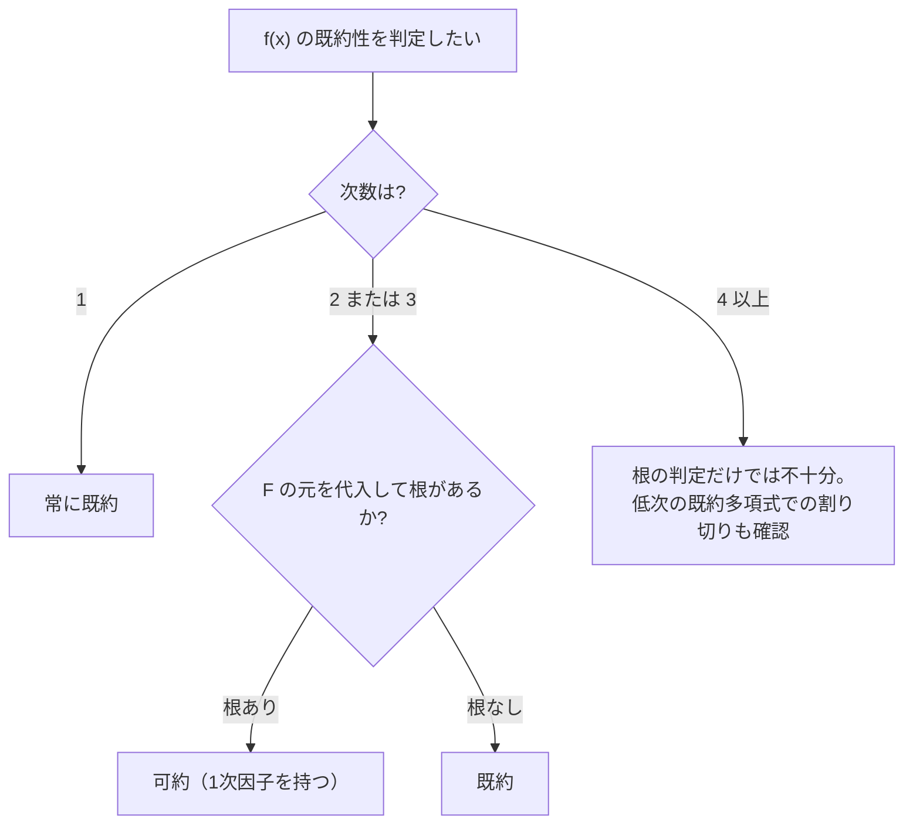

# 02. 既約多項式（Irreducible Polynomial）

> 親: [README](./README.md) ｜ 前: [01 多項式環](./01_polynomial-rings.md) ｜ 次: [03 剰余環と GF(2^n)](./03_quotient-rings-gf2n.md) ｜ 層: 基礎(Layer 1)

**この1ページで分かること**

- 既約多項式＝「多項式版の素数」の定義
- 次数2・3なら根の有無だけで既約性を判定できる理由（と次数4以上での落とし穴）
- GF(2) 上の低次既約多項式の完全リスト（2次は1個、3次は2個）

整数の「素数」にあたるのが多項式の**既約多項式**。次の [03](./03_quotient-rings-gf2n.md) で有限体を作る材料になる。

---

## 最小の例：`x^2+1` と `x^2+x+1`（GF(2) 上）

```
x^2 + 1     : x=1 を代入 → 1+1 = 0    根がある → (x+1)(x+1) に分解できる → 可約
x^2 + x + 1 : x=0 → 1,  x=1 → 1+1+1 = 1   根がない → 分解できない → 既約
```

「代入して 0 になる `x` があるか」を見るだけで、2 次式の既約性が決まる。

---

## 既約多項式の定義

```
f(x) ∈ F[x]（次数 1 以上）が既約（irreducible）とは:
  f(x) = g(x)·h(x)  （deg(g), deg(h) ≥ 1）
  という分解が存在しない
そうでなければ可約（reducible）
```

素数が「1 と自分以外の約数を持たない整数」なのと同じ形で、既約多項式は「定数倍以外の積に分解できない多項式」。

**次数 2・3 の近道**: 可約なら次数の和が 2 か 3 なので必ず 1 次因子（＝根）を持つ。**根の有無だけで判定できる**。次数 4 以上ではこの近道は使えない（後述）。



---

## 計算例：GF(2) 上の次数2の全分類

モニック（最高次の係数が 1）な 2 次式は `x^2 + ax + b` の 4 通り。

| 多項式 | f(0) | f(1) | 判定 | 備考 |
|---|---|---|---|---|
| `x^2` | 0（根） | 1 | 可約 | `= x·x` |
| `x^2+1` | 1 | 0（根） | 可約 | `= (x+1)^2` |
| `x^2+x` | 0（根） | 0（根） | 可約 | `= x(x+1)` |
| `x^2+x+1` | 1 | 1 | **既約** | GF(4) 構成に使う（→[03](./03_quotient-rings-gf2n.md)） |

既約なのは **1 個だけ**。

---

## 計算例：GF(2) 上の次数3の全分類

モニックな 3 次式は 8 通り。`f(0) = c`、`f(1) = 1+a+b+c` (mod 2)。

| 多項式 | f(0) | f(1) | 判定 | 因数分解（可約時） |
|---|---|---|---|---|
| `x^3` | 0（根） | 1 | 可約 | `x·x·x` |
| `x^3+1` | 1 | 0（根） | 可約 | `(x+1)(x^2+x+1)` |
| `x^3+x` | 0（根） | 0（根） | 可約 | `x(x+1)^2` |
| `x^3+x+1` | 1 | 1 | **既約** | — |
| `x^3+x^2` | 0（根） | 0（根） | 可約 | `x^2(x+1)` |
| `x^3+x^2+1` | 1 | 1 | **既約** | — |
| `x^3+x^2+x` | 0（根） | 1 | 可約 | `x(x^2+x+1)` |
| `x^3+x^2+x+1` | 1 | 0（根） | 可約 | `(x+1)^3` |

既約は **2 個**（`x^3+x+1` と `x^3+x^2+1`）。GF(8) 構成や符号理論でよく登場する。`x^3+x+1` が `x+1` で割り切れないことは [01](./01_polynomial-rings.md) の筆算で確認済み。

---

## 注：次数4以上では根の判定だけでは不十分

`(x^2+x+1)^2 = x^4+x^2+1` は `f(0)=1, f(1)=1` で**根を持たないのに可約**（既約多項式の 2 乗）。次数 4 以上では、既約な低次多項式による割り切りまで確認する。一般的な判定法（Rabin のテストなど）は深掘り候補。

---

## 演習（解答つき）

1. GF(2) 上で `x^2+1` は既約か。根で判定せよ。
2. GF(2) 上で `x^3+x^2+x+1` を分類し、可約なら因数分解を示せ。
3. `x^4+x^2+1` が根を持たないのに可約である理由を一言で説明せよ。

<details><summary>解答</summary>

1. `f(1) = 1+1 = 0` → `x=1` が根 → **可約**（`= (x+1)^2`）。
2. `f(1) = 1+1+1+1 = 0` → `x=1` が根 → **可約**。実際 `(x+1)^3 = x^3+x^2+x+1`。
3. 次数4は「次数2＋次数2」の分解もあり得るため、根（次数1の因子）がなくても
   既約な2次式どうしの積として可約になりうる（`(x^2+x+1)^2` がその例）。

</details>

---

## 次への接続

既約多項式 `f(x)`（次数 `n`）を 1 つ固定し、それを法として「割った余り」の世界に持ち込むと有限体 `GF(q^n)` ができる。
→ [03 剰余環と GF(2^n)](./03_quotient-rings-gf2n.md)
