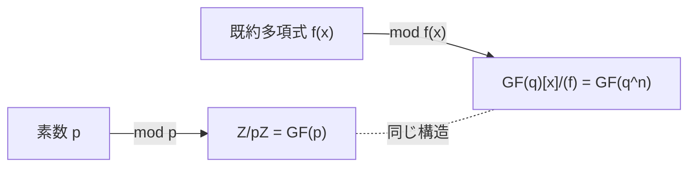

# 03. 剰余環による拡大体の構成 GF(q^n)

> 親: [README](./README.md) ｜ 前: [02 既約多項式](./02_irreducible-polynomials.md) ｜ 次: [04 イデアルと Gröbner 基底](./04_ideals-groebner-intro.md) ｜ 層: 基礎(Layer 1)

**この1ページで分かること**

- 既約多項式 `f(x)` を法とする「余りの世界」が有限体 `GF(q^n)` になること
- 最小の例 GF(4) の加算表・乗算表を自力で作れるようになる還元規則
- AES の `GF(2^8)` がこの一般構成の一例に過ぎないこと

「7 で割った余り」の世界 `Z/7Z` が体になったのと同じ発想を、多項式に移す。既約多項式で割った余りの世界が新しい有限体になる。

---

## 最小の例：`x^2 ≡ x+1` で計算する

`f(x) = x^2+x+1`（GF(2) 上で唯一の既約 2 次式、[02](./02_irreducible-polynomials.md)）を法にとる。

```
x^2 + x + 1 ≡ 0   なので   x^2 ≡ x + 1   （還元規則）

x · x = x^2 ≡ x + 1
```

次数 2 以上が出たらこの置き換えで次数 1 以下に落とす。元は `{0, 1, x, x+1}` の 4 つだけ。これが GF(4)。

---

## 剰余環による拡大体の構成

```
GF(q) 上の既約多項式 f(x)（次数 n）を1つ固定する。

GF(q^n) := GF(q)[x] / (f(x))

元:     GF(q) 係数の次数 n-1 以下の多項式（全部で q^n 個）
加算:   係数ごとに GF(q) の加算
乗算:   多項式として掛けたあと、f(x) で割った余りを取る（f(x) ≡ 0 で還元）
```

`f(x)` が既約であることが体になる鍵（[04](./04_ideals-groebner-intro.md) でイデアルの言葉で補足）。

| | 整数の場合 | 多項式の場合 |
|---|---|---|
| 材料 | 素数 `p` | 既約多項式 `f(x)`（次数 `n`） |
| 構成 | `Z/pZ`（mod p の余り） | `GF(q)[x]/(f(x))`（`f` で割った余り） |
| 元の個数 | `p` 個 | `q^n` 個 |
| 体になる条件 | `p` が素数 | `f(x)` が既約 |



---

## 計算例：GF(4) = GF(2)[x] / (x^2+x+1)

### 加算表（係数ごとの XOR。還元は不要）

| + | 0 | 1 | x | x+1 |
|---|---|---|---|---|
| **0** | 0 | 1 | x | x+1 |
| **1** | 1 | 0 | x+1 | x |
| **x** | x | x+1 | 0 | 1 |
| **x+1** | x+1 | x | 1 | 0 |

### 乗算表（掛けたあと `x^2 ≡ x+1` で還元）

```
x · x = x^2  ≡ x+1
x · (x+1) = x^2 + x ≡ (x+1) + x = 1      （x+x=0 が消える）
(x+1)·(x+1) = x^2+1 ≡ (x+1)+1 = x        （1+1=0 が消える）
```

| × | 0 | 1 | x | x+1 |
|---|---|---|---|---|
| **0** | 0 | 0 | 0 | 0 |
| **1** | 0 | 1 | x | x+1 |
| **x** | 0 | x | x+1 | 1 |
| **x+1** | 0 | x+1 | 1 | x |

**閉性**: 結果はすべて `{0, 1, x, x+1}` に収まる ✓。非零元 `{1, x, x+1}` は `x^1=x, x^2=x+1, x^3=1` と巡回群（1 つの元の累乗で全体を尽くす群、[03 巡回群](../02_groups-rings-fields/03_cyclic-groups-generators.md)）をなす。「有限体の乗法群は必ず巡回群」の具体例。

---

## AES への接続（本体は別ファイル）

AES の `GF(2^8) = GF(2)[x] / (x^8+x^4+x^3+x+1)` は `q=2, n=8` に適用しただけ。SubBytes（逆元計算）・MixColumns（固定行列との多項式乗算）の本体は [06 GF(2^n) と AES](../02_groups-rings-fields/06_gf2n-and-aes.md)。

---

## 演習（解答つき）

GF(4) = GF(2)[x]/(x^2+x+1) 上で計算せよ。

1. `x + (x+1)` を加算表から求めよ。
2. `(x+1) · (x+1)` を還元規則から直接計算し、乗算表と一致することを確認せよ。
3. `x` の逆元（`x · ? = 1` となる元）を乗算表から求めよ。

<details><summary>解答</summary>

1. 加算表より `x + (x+1) = 1`。
2. `(x+1)(x+1) = x^2 + x + x + 1 = x^2 + 1 ≡ (x+1) + 1 = x`。表の `(x+1, x+1)` も `x` で一致 ✓。
3. 乗算表の `x` の行を見ると `x · (x+1) = 1` → **`x` の逆元は `x+1`**。

</details>

---

## 次への接続

「既約多項式で割った余りを取る」は、**`(f(x))` というイデアルで剰余環を作る**一般操作の特殊ケース。イデアルの言葉で見直すと、なぜ既約性が体になる条件なのかが明確になる。
→ [04 イデアルと Gröbner 基底](./04_ideals-groebner-intro.md)

## 動かして確認する

`x・(x+1) ≡ 1 (mod x²+x+1)` の還元ステップを追えます。乗算表の他の組み合わせも試してください。

<div class="algo-widget" data-algo="quotient-rings-gf2n" data-inputs="a:2,b:3"></div>
