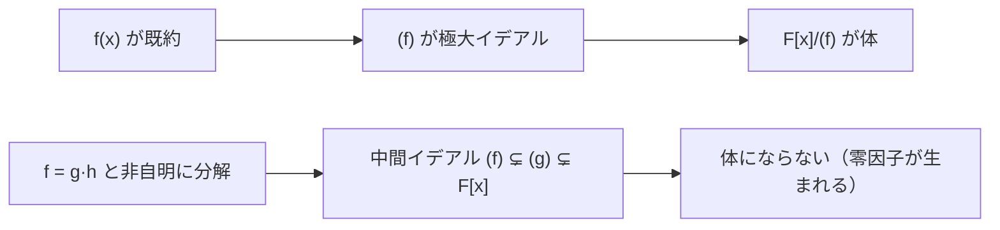

# 04. イデアルと Gröbner 基底入門

> 親: [README](./README.md) ｜ 前: [03 剰余環](./03_quotient-rings-gf2n.md) ｜ 層: 基礎(Layer 1)

**この1ページで分かること**

- イデアルの定義と、「n の倍数全体 nZ」の一般化としての見方
- 「`f` が既約 ⟺ `(f)` が極大イデアル ⟺ `F[x]/(f)` が体」という論理の鎖
- 多変数の割り算を整える Gröbner 基底と、多変数公開鍵暗号への攻撃の関係

「余りを取る」操作の正体は**イデアル**（掛け算を吸収する部分集合）による剰余。この一般化で「なぜ既約だと体になるか」が見え、多変数への拡張が Gröbner 基底になる。

---

## 最小の例：偶数全体 `2Z`

```
2Z = { ..., -4, -2, 0, 2, 4, ... }

偶数 − 偶数 = 偶数        （引き算で閉じている）
任意の整数 × 偶数 = 偶数  （何を掛けても中に留まる＝吸収する）
```

この 2 つの性質を持つ部分集合がイデアル。`Z/2Z` は `2Z` で余りを取った世界＝ `{偶, 奇}` の 2 元体。

---

## イデアルの定義

```
環 R の部分集合 I がイデアルとは:
  1. 加法部分群:  0 ∈ I,  a,b ∈ I ⇒ a-b ∈ I
  2. 吸収律:      r ∈ R, a ∈ I ⇒ r·a ∈ I

単項イデアル（principal ideal）:
  1つの元 a が生成する (a) := { r·a : r ∈ R }  ＝「a の倍数全体」
```

すべてのイデアルが単項で書ける環を**主イデアル整域（PID）**と呼ぶ。

---

## F[x] は PID、Z[x] はそうではない

`F[x]` が PID である理由: [01](./01_polynomial-rings.md) の除算アルゴリズムが使えるから。イデアル `I` の次数最小の元 `f` を取れば、任意の `g ∈ I` を割った余り `r = g − q·f` も `I` に属し、次数最小性から `r = 0`。つまり `I = (f)`。

**環論の一般則: `R/I` が体 ⟺ `I` が極大イデアル**（それより真に大きい真のイデアルがないもの）。`F[x]` では `(f)` が極大 ⟺ `f` が既約（可約なら `f = gh` で `(f) ⊊ (g) ⊊ F[x]` という中間ができる）。だから「既約多項式で割ると体になる」。



| 環 | PID か | 根拠 |
|---|---|---|
| `Z` | はい | 整数の除算アルゴリズム |
| `F[x]` | はい | 多項式の除算アルゴリズム |
| `Z[x]` | いいえ | `(2, x)` が単項で書けない |

`Z[x]` の反例: `(2, x) = { f : f(0) が偶数 }`。これが `(g)` なら `g` は 2 の約数 `±1, ±2` だが、`±1` なら `(g)=Z[x]`（`1 ∉ (2,x)` に矛盾）、`±2` なら `x` が 2 の倍数（矛盾）。

---

## Gröbner 基底：多変数の「割り算」を揃える

1 変数では「`f` で割った余り」は一意。多変数 `F[x_1,...,x_n]` で生成元が複数あると、**余りが割る順番に依存する**。

### 小さな例：順番で余りが変わる

`I = (f_1, f_2)`, `f_1 = xy − 1`, `f_2 = y^2 − 1`（辞書式順序 x > y）、`g = xy^2` を割る。

```
f_1 から割る:  xy^2 = y·(xy-1) + y        余り y
f_2 から割る:  xy^2 = x·(y^2-1) + x       余り x
```

同じ `g` なのに余りが `y` にも `x` にもなる。`{f_1, f_2}` はまだ「良い」生成系ではない。

**Buchberger のアルゴリズム**は S-多項式（生成元どうしの差分）を計算して生成元を足し、割る順番によらず余りが一意になる生成系——**Gröbner 基底**——を作る。ユークリッド互除法の多変数版にあたる。

### 暗号での関連

| 対象 | 内容 |
|---|---|
| 多変数公開鍵暗号（MQ 問題） | Rainbow・UOV・HFE は連立多変数二次方程式の困難性に依存。Gröbner 基底計算はこれを直接解く汎用手法 |
| 代数的攻撃 | F4/F5（高速 Gröbner 基底算法）・XL（線形化）で多変数暗号やブロック暗号を攻撃。HFE は F5 で破られた |

---

## 演習（解答つき）

1. イデアルの定義から、`{0}` と `R` 自身が常に `R` のイデアル（自明イデアル）で
   あることを確認せよ。
2. `Z[x]` のイデアル `(2, x) = { f : f(0) が偶数 }` について、`3x+4` と `x+5` は
   それぞれ含まれるか判定せよ。
3. `GF(2)[x] / (x^2+1)` は体か？ `x^2+1` の既約性から判定せよ。

<details><summary>解答</summary>

1. `{0}`: `0-0=0 ∈ {0}`、`r·0=0 ∈ {0}` で両条件を満たす。`R`: 環全体は明らかに
   加法群かつ `r·a ∈ R` が常に成立するので、両方ともイデアルの条件を満たす。
2. `3x+4`: `f(0)=4` は偶数 → **含まれる**。`x+5`: `f(0)=5` は奇数 → **含まれない**。
3. `GF(2)` 上で `(x+1)^2 = x^2 + 2x + 1 = x^2+1`（`2x=0`）。つまり `x^2+1 = (x+1)^2`
   は**既約ではない**（1次式の2乗に分解できる）。よって `(x^2+1)` は極大イデアルで
   はなく、`GF(2)[x]/(x^2+1)` は**体にならない**（実際 `x+1` はこの環の零因子）。

</details>

---

## 次への接続

多項式環 `Z_q[x]/(x^n+1)` の上に格子を作ると **Ring-LWE**、その一般化が **Module-LWE**。NIST 標準の ML-KEM（FIPS 203）はこれを基盤にする。**このフォルダの剰余環がそのまま耐量子暗号の土台**——詳細は [04 Ring-LWE と Module-LWE](../06_lattices/04_ring-and-module-lwe.md)。標準の地図は [06 発展トピック地図](../../../02_cryptography/06_advanced-topics-map.md)。
