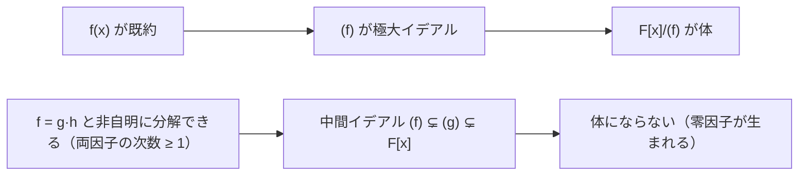

# 04. イデアルと Gröbner 基底入門

> 親: [README](./README.md) ｜ 前: [03 剰余環](./03_quotient-rings-gf2n.md) ｜ 層: 基礎(Layer 1)

[03](./03_quotient-rings-gf2n.md) では「既約多項式 `f(x)` で割った余りを取ると拡大体になる」と
述べたが、これは実は代数学の一般操作——**イデアルによる剰余**——の特殊ケースに過ぎない。
ここではイデアルの定義から始め、「なぜ既約性が体になる条件なのか」を明確にしたうえで、
多変数版の割り算にあたる Gröbner 基底へ足を伸ばす。多変数多項式系を解く技術は
多変数公開鍵暗号の安全性評価に直結し、格子暗号への入口にもなる。

**この1ページで分かること**

- イデアルの定義と、「n の倍数全体 nZ」の一般化としての見方
- 「`f` が既約 ⟺ `(f)` が極大イデアル ⟺ `F[x]/(f)` が体」という論理の鎖
- 多変数の割り算を整える Gröbner 基底と、多変数公開鍵暗号への攻撃の関係

---

## イデアルとは

```
環 R の部分集合 I が以下を満たすとき、I を R のイデアルと呼ぶ:
  1. 加法部分群である:  0 ∈ I,  a,b ∈ I ⇒ a-b ∈ I
  2. 吸収律を満たす:    r ∈ R, a ∈ I ⇒ r·a ∈ I  （R が可換なら左右の区別なし）

単項イデアル（principal ideal）:
  1つの元 a ∈ R が生成するイデアル (a) := { r·a : r ∈ R }
  「a の倍数全体」という、整数の nZ とまったく同じ発想。
```

環のすべてのイデアルが単項イデアルとして書ける環を**主イデアル整域（PID）**と呼ぶ。

---

## F[x] は PID、Z[x] はそうではない

体 `F` 上の多項式環 `F[x]` は PID である。理由は[01](./01_polynomial-rings.md)で
確認した除算アルゴリズム（`a = q·b + r`, `deg r < deg b`）がそのまま使えるから:
イデアル `I` の中で次数最小の元 `f` を1つ取れば、`I` の任意の元 `g` を `f` で割った
余り `r = g - q·f` も `I` に属すが、次数最小性から `r = 0` しかありえない。つまり
`I = (f)`。

この事実は03の疑問にも答える。**環論の一般則: `R/I` が体 ⟺ `I` が極大イデアル**
（極大イデアル＝環全体ではないイデアルのうち、それより真に大きい真のイデアルが存在しないもの）。
`F[x]` は PID なので、`(f)` が極大イデアルになるのはちょうど `f` が既約のとき
（既約でなければ `f = gh` と分解でき `(f) ⊊ (g) ⊊ F[x]` という中間イデアルができ
極大性が崩れる）。だから「既約多項式で割ると体になる」。



一方 `Z[x]` は PID **ではない**。反例: イデアル `(2, x) = {2a(x) + x·b(x) : a,b ∈ Z[x]}`
は単一多項式の倍数として書けない。実際 `(2,x) = { f ∈ Z[x] : f(0) が偶数 }` であり、
これが単項 `(g)` だとすると `g` は `2` の約数（`g = ±1, ±2`）でなければならないが、
`g=±1` なら `(g)=Z[x]` となり矛盾（`1 ∉ (2,x)`）、`g=±2` なら `x` も `2` の倍数で
なければならず矛盾。よって `(2,x)` は非単項イデアルの具体例。

---

## Gröbner 基底：多変数の「割り算」を揃える

`F[x]` の1変数の世界では「`f` で割った余り」は一意に決まった。ところが多変数
`F[x_1,...,x_n]` では生成元が複数あるとき、順番に割っていくだけでは
**余りが生成元を選ぶ順番に依存してしまう**。

### 小さな例：順番で余りが変わる

`I = (f_1, f_2)`, `f_1 = xy - 1`, `f_2 = y^2 - 1`（辞書式順序 x > y）とし、
`g = xy^2` を割ってみる。

```
f_1 から割る:  xy^2 = y·(xy-1) + y        余り y（y は xy にも y^2 にも割れない）
f_2 から割る:  xy^2 = x·(y^2-1) + x       余り x（x も xy にも y^2 にも割れない）
```

同じ `g` を同じ生成元の組で割ったのに、順番を変えただけで余りが `y` にも `x` にも
なる。1変数の場合と違い、`{f_1, f_2}` はまだ「良い」生成系ではない。

**Buchberger のアルゴリズム**は、このような組み合わせ（S-多項式と呼ばれる差分）を
計算して追加の生成元を足していき、割る順番によらず余りが一意に決まる特別な生成系——
**Gröbner 基底**——を作る。1変数の PID でユークリッド互除法が gcd を計算するのの、
多変数版の一般化にあたる。

### 暗号での関連

- **多変数公開鍵暗号（MQ 問題）**: Rainbow・UOV・HFE などは連立多変数二次方程式
  `f_1=...=f_m=0` を解く困難性に安全性を置く。Gröbner 基底計算はこの問題を
  直接解く汎用アルゴリズムにあたる。
- **代数的攻撃**: F4/F5（高速 Gröbner 基底算法）や XL アルゴリズム（線形化による
  近似解法）は、多変数暗号や一部のブロック暗号を連立多項式系として攻撃する手法。
  HFE がこの種の攻撃（Faugère の F5）で破られた例が有名。

---

## 演習（解答つき）

1. イデアルの定義から、`{0}` と `R` 自身が常に `R` のイデアル（自明イデアル）で
   あることを確認せよ。
2. `Z[x]` のイデアル `(2, x) = { f : f(0) が偶数 }` について、`3x+4` と `x+5` は
   それぞれ含まれるか判定せよ。
3. `GF(2)[x] / (x^2+1)` は体か？ `x^2+1` の既約性から判定せよ。

<details><summary>解答</summary>

1. `{0}`: `0-0=0 ∈ {0}`、`r·0=0 ∈ {0}` で両条件を満たす。`R`: 環全体は明らかに
   加法群かつ `r·a ∈ R` が常に成立するので、両方ともイデアルの条件を満たす。
2. `3x+4`: `f(0)=4` は偶数 → **含まれる**。`x+5`: `f(0)=5` は奇数 → **含まれない**。
3. `GF(2)` 上で `(x+1)^2 = x^2 + 2x + 1 = x^2+1`（`2x=0`）。つまり `x^2+1 = (x+1)^2`
   は**既約ではない**（1次式の2乗に分解できる）。よって `(x^2+1)` は極大イデアルで
   はなく、`GF(2)[x]/(x^2+1)` は**体にならない**（実際 `x+1` はこの環の零因子）。

</details>

---

## 次への接続

多項式環 `Z_q[x]/(x^n+1)`（円分多項式＝1 の原始 k 乗根だけを根に持つ多項式。`n` が2の冪のとき `x^n+1` は k=2n の場合）上で定義される
**Ring-LWE** は、格子暗号を効率化した変種。NTRU も同じ多項式環の上に構成される。
NIST 標準の Kyber（CRYSTALS-Kyber, FIPS 203 で ML-KEM）は厳密には Ring-LWE を
一般化した **Module-LWE** が基盤（同じリング上の `k×k` サイズの行列・ベクトルを
扱う——Ring-LWE が「1リング」なら Module-LWE は「リングの行列」）で、パラメータは
`q=3329, n=256`。多項式環の代数構造が効率的な実装と安全性証明を両立させる鍵になる。
格子暗号の標準の地図は [`../../../02_cryptography/06_advanced-topics-map.md`](../../../02_cryptography/06_advanced-topics-map.md)、
安全性仮定の数学的詳細は両フォルダ共通の深掘りキュー（Layer 2、未着手）で扱う。
