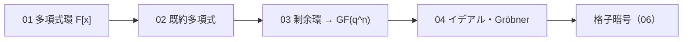

# 多項式環・イデアル（Polynomials and Ideals）

> 対応科目: Computer Algebra for Cryptography / Advanced Methods in Cryptography ｜ 層: 基礎(Layer 1)
> 親: [../index.md](../index.md)

## 一言で

「多項式を整数のように扱う」代数構造が多項式環とイデアル。素数↔既約多項式、mod p↔mod f(x) という対応で、整数の知識がそのまま持ち上がる。計算機代数の実習の対象であり、格子暗号（Ring-LWE/NTRU/Kyber）の前提。

---

## 概念ファイル（番号順に読む）

| # | ファイル | 内容 | 備考 |
|---|---|---|---|
| 01 | [01_polynomial-rings.md](./01_polynomial-rings.md) | 多項式環 F[x] の定義・加減乗、GF(2)[x] の XOR 演算、除算アルゴリズム | GF(2)[x] での筆算トレースあり |
| 02 | [02_irreducible-polynomials.md](./02_irreducible-polynomials.md) | 既約多項式の定義（素数の多項式版）、次数2・3の全分類 | GF(2) 上の全8+4パターンを表で分類 |
| 03 | [03_quotient-rings-gf2n.md](./03_quotient-rings-gf2n.md) | 剰余環 GF(q)[x]/(f(x)) による拡大体構成の一般論 | GF(4) の加算・乗算表を完全構築 |
| 04 | [04_ideals-groebner-intro.md](./04_ideals-groebner-intro.md) | イデアル・PID・Gröbner 基底入口・格子暗号への橋渡し | (2,x) が単項でない例、Ring-LWE/Kyber |

---

## なぜ重要か / コースでの位置づけ

| 場面 | 使うもの |
|---|---|
| 計算機代数 | GF(2^n)・多項式環・Gröbner 基底・因数分解。除算・既約性判定が実装課題の最初のステップ |
| 格子暗号 | Ring-LWE・NTRU の前提。LLL/BKZ も安全性の文脈で再登場 |
| ML-KEM | Module-LWE はこのフォルダの剰余環の延長（格子本体は [`../06_lattices/`](../06_lattices/README.md)） |

---

## このフォルダで「本体」を置かないもの（DRY）

- **AES の SubBytes/MixColumns での GF(2^8) の使い方**（既約多項式 x^8+x^4+x^3+x+1 での具体的な演算例）
  → 本体は [`../02_groups-rings-fields/06_gf2n-and-aes.md`](../02_groups-rings-fields/06_gf2n-and-aes.md)。
  **このフォルダが持つのは「剰余環で拡大体を作る」一般論**（[03](./03_quotient-rings-gf2n.md)）であり、
  AES 固有の応用はそちらに委ねる。
- **格子そのもの・LWE・Ring/Module-LWE の詳細** → [`../06_lattices/`](../06_lattices/README.md)
  （このフォルダは多項式環という**土台**を提供するだけ。格子の本体はそちら）
- **PQC 標準の地図（どの方式が FIPS か）** → [`../../../02_cryptography/06_advanced-topics-map.md`](../../../02_cryptography/06_advanced-topics-map.md)

---

## つまずき / 深掘り候補（Layer 2）

- [ ] AES の GF(2^8) 演算を手で計算 → `deep/aes-field-arithmetic/`
- [ ] Buchberger アルゴリズムの動作例 → `deep/groebner-buchberger/`
- [ ] 多項式の既約性判定アルゴリズム → `deep/irreducibility-test/`

---

## 参考

- Paar & Pelzl, *Understanding Cryptography*, Ch. 4（GF(2^8) と AES）
- NIST PQC Kyber 仕様（Ring-LWE 構造の参考）: https://pq-crystals.org/kyber/
