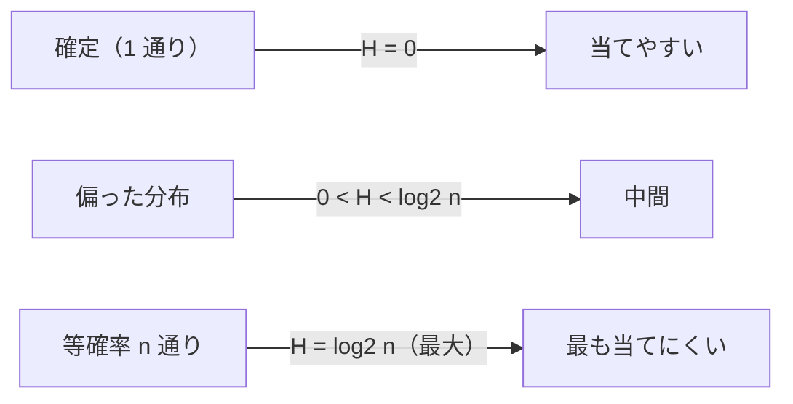

# 01. シャノンエントロピー — 予測しにくさの尺度

> 親: [README](./README.md) ｜ 次: [02 条件付きエントロピー・相互情報量](./02_conditional-mutual-info.md) ｜ 層: 基礎(Layer 1)

**この1ページで分かること**

- 不確かさをビット単位で数値化するシャノンエントロピー `H(X)` の定義
- 公平コイン＝1bit・偏ったコイン＜1bit・等確率 n 通り＝log2(n) という計算感覚
- 「128ビットの鍵」と「弱いパスワード」をエントロピーで比べる見方

エントロピーは「当てにくさ」をビットで数えたもの。「鍵は何ビット必要か」「このパスワードはどれだけ強いか」はすべてこの尺度で語る。

---

## 最小の例：公平なコイン 1 枚 = 1 bit

`P(表) = P(裏) = 0.5`

```
H(X) = -0.5·log2(0.5) - 0.5·log2(0.5)
     = -0.5·(-1) - 0.5·(-1)
     = 0.5 + 0.5 = 1 bit
```

「表裏どちらが出たか」を伝えるのに**ちょうど 1 ビット**要る、という意味。表が出やすいコインなら、結果はもっと当てやすいので 1 bit より小さくなる。

---

## 定義

確率変数 `X`（試行の結果に応じて値が確率的に決まる変数）が値 `x_1, ..., x_n` を確率 `P(x_1), ..., P(x_n)` で取るとき、

```
H(X) = -Σ_i P(x_i) · log2 P(x_i)     [単位: ビット (bit)]
```

| 約束 | 理由 |
|---|---|
| `log2` を使う | 「1 ビットで区別できる場合の数」を単位にする |
| `0·log2 0 = 0` | 極限で 0 に収束する |
| `H(X)` が大きい＝当てにくい | 全部同じ値なら `H(X) = 0` |

---

## 計算例：偏ったコインと 8 面ダイス

### (b) 偏ったコイン（P(表) = 0.9）

```
log2(0.9) ≈ -0.152,  log2(0.1) ≈ -3.322

H(X) = -0.9·(-0.152) - 0.1·(-3.322) = 0.137 + 0.332 ≈ 0.469 bit
```

ほぼ表なので予測しやすく、1 bit より小さい。

### (c) 公平な 8 面ダイス

```
H(X) = -Σ_{i=1}^{8} (1/8)·log2(1/8) = log2(8) = 3 bit
```

一般に `n` 個が等確率なら `H(X) = log2(n)`（最大エントロピー）。

| ケース | 分布 | H(X) | 直感 |
|---|---|---|---|
| (a) 公平なコイン | (0.5, 0.5) | 1 bit | 2 択として最大に当てにくい |
| (b) 偏ったコイン | (0.9, 0.1) | ≈ 0.469 bit | ほぼ表なので当てやすい |
| (c) 公平な 8 面ダイス | 各 1/8 | 3 bit | 等確率 n 通りなら log2(n) |



---

## 性質：0 ≤ H(X) ≤ log2(n)

| 端 | 状態 | 意味 |
|---|---|---|
| 下限 `0` | 結果が 1 つに確定 | 不確かさゼロ |
| 上限 `log2(n)` | `n` 個が等確率 | 一番当てにくい |

(a)(b)(c) はすべてこの範囲に収まる。

---

## パスワード・鍵の強度への接続

「鍵は 128 ビットのエントロピーを持つ」＝ `H(K) = 128 bit`、典型的には `2^128` 通りから一様に選ばれる状態。辞書の単語 1 つ（候補 1 万語）のパスワードは `H ≈ log2(10000) ≈ 13.3 bit` しかない。ビット数が総当たりの手間に直結する話は [04 鍵長と安全性](./04_key-length-security.md)。

---

## 演習（解答つき）

1. 4面ダイス（等確率）のエントロピー `H(X)` を求めよ。
2. `P(晴)=0.7, P(雨)=0.3` の天気予報のエントロピーを小数第3位まで求めよ。
3. コインが「必ず表」（`P(表)=1, P(裏)=0`）のとき `H(X)` はいくつか。理由も述べよ。

<details><summary>解答</summary>

1. 等確率4通り → `H(X) = log2(4) = 2 bit`。
2. `log2(0.7) ≈ -0.515`, `log2(0.3) ≈ -1.737`
   `H(X) = -0.7·(-0.515) - 0.3·(-1.737) = 0.360 + 0.521 = 0.881 bit`
3. `H(X) = 0`。`P(表)=1` の項は `1·log2(1) = 1·0 = 0`、`P(裏)=0` の項は約束により `0`。
   結果が確定しているので不確かさはゼロ。

</details>

---

## 次への接続

単独の `X` の不確かさは測れた。次は「`Y` を知った後で `X` はどれだけ不確かさが減るか」——条件付きエントロピーと相互情報量へ。
→ [02 条件付きエントロピー・相互情報量](./02_conditional-mutual-info.md)

## 動かして確認する

偏ったコイン（本文ケース(b)）のエントロピーを1項ずつ積み上げる様子を追えます。
公平なコイン `[0.5, 0.5]` や8面ダイス相当 `[0.125,0.125,0.125,0.125,0.125,0.125,0.125,0.125]` も試してください。

<div class="algo-widget" data-algo="entropy" data-inputs="probabilities:[0.9,0.1]"></div>
