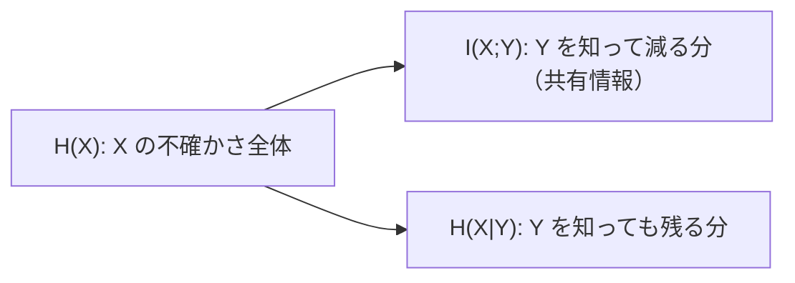

# 02. 条件付きエントロピーと相互情報量

> 親: [README](./README.md) ｜ 前: [01 シャノンエントロピー](./01_entropy.md) ｜ 次: [03 完全秘匿とOTP](./03_perfect-secrecy-otp.md) ｜ 層: 基礎(Layer 1)

**この1ページで分かること**

- 「Y を知った後に残る X の不確かさ」＝条件付きエントロピー `H(X|Y)`
- 「Y を知ると X の不確かさがどれだけ減るか」＝相互情報量 `I(X;Y)`
- `I(X;Y) = 0` が「暗号文が平文について何も語らない」の数学的表現になること

「ヒントをもらったら、答えはどれだけ当てやすくなるか」を数値にする。暗号では「暗号文 `C` を見た攻撃者は平文 `M` について何を知れるか」そのもの。

---

## 最小の例：ヒントが効く場合と効かない場合

`X` = コインの表裏、`Y` = ヒント。

| ヒント `Y` | `Y` を聞いた後の `X` の不確かさ | 減った分 |
|---|---|---|
| 「X と同じ値」を必ず教える | 0 bit（完全に分かる） | 1 bit |
| X と無関係なコイン | 1 bit（変わらない） | 0 bit |

「残る分」が条件付きエントロピー `H(X|Y)`、「減った分」が相互情報量 `I(X;Y)`。

---

## 定義

```
条件付きエントロピー:
H(X|Y) = -Σ_{x,y} P(x,y) · log2 P(x|y)     （Y を知った後の X の平均的な不確かさ）

相互情報量:
I(X;Y) = H(X) - H(X|Y) = H(Y) - H(Y|X)     （X と Y が共有する情報量）
```

| 性質 | 意味 |
|---|---|
| `H(X|Y) ≤ H(X)` | 情報は不確かさを増やさない |
| `I(X;Y) = 0` ⟺ 独立 | `Y` を知っても `X` について何も分からない |
| `I(X;Y) ≥ 0` | 常に成立 |



---

## 計算例：2x2 同時分布

X, Y を共に 2 値とし、次の同時確率表（2 つの変数が同時にその値を取る確率）を使う。

| P(X, Y) | Y=0 | Y=1 | 周辺 P(X) |
|---|---|---|---|
| X=0 | 0.4 | 0.1 | 0.5 |
| X=1 | 0.1 | 0.4 | 0.5 |
| 周辺 P(Y) | 0.5 | 0.5 | 1.0 |

対角が 0.4 なので「同じ値になりやすい」相関がある。

### H(X), H(Y)

周辺分布は `(0.5, 0.5)` → 公平コインと同じで `H(X) = H(Y) = 1 bit`。

### H(X|Y)

条件付き確率 `P(x|y) = P(x,y)/P(y)`:

```
P(X=0|Y=0) = 0.4/0.5 = 0.8    P(X=1|Y=0) = 0.2
P(X=0|Y=1) = 0.2              P(X=1|Y=1) = 0.8

log2(0.8) ≈ -0.322,  log2(0.2) ≈ -2.322
H(X|Y=0) = H(X|Y=1) = 0.8·0.322 + 0.2·2.322 = 0.722 bit
H(X|Y) = 0.5·0.722 + 0.5·0.722 = 0.722 bit
```

### I(X;Y)

```
I(X;Y) = H(X) - H(X|Y) = 1 - 0.722 = 0.278 bit
```

表は対称なので `H(Y|X) = 0.722` でも `H(Y) - H(Y|X) = 0.278 bit` → 一致 ✓。片方を知るともう片方の不確かさが 0.278 bit 減る。

---

## 演習（解答つき）

1. 表から `P(Y=1|X=1)` を計算し、対称性から予想される値と一致するか確認せよ。
2. 同時エントロピー `H(X,Y) = -Σ P(x,y)·log2 P(x,y)` を上の表から計算し、
   `H(X,Y) = H(X) + H(Y|X)` が成り立つか検証せよ。
3. もし表の4マスがすべて 0.25（独立）だったら `I(X;Y)` はいくつになるか。

<details><summary>解答</summary>

1. `P(Y=1|X=1) = P(X=1,Y=1)/P(X=1) = 0.4/0.5 = 0.8`。本文の `P(X=1|Y=1) = 0.8` と
   対称性の通り一致する。
2. `H(X,Y) = -2·(0.4·log2 0.4) - 2·(0.1·log2 0.1)`
   `log2(0.4) ≈ -1.322`, `log2(0.1) ≈ -3.322`
   `= -2·0.4·(-1.322) - 2·0.1·(-3.322) = 1.058 + 0.664 = 1.722 bit`
   `H(X) + H(Y|X) = 1 + 0.722 = 1.722 bit` → 一致 ✓
3. 全マス独立（`P(x,y)=P(x)P(y)`）なら `H(X|Y)=H(X)` となり `I(X;Y) = 0 bit`
   （`Y` を知っても `X` の不確かさは変わらない）。

</details>

---

## 次への接続

`I(X;Y) = 0`＝「暗号文が平文について何も語らない」を暗号の目標として厳密に定義したのが**完全秘匿**。次でワンタイムパッドがこれを達成する仕組みを見る。
→ [03 完全秘匿とOTP](./03_perfect-secrecy-otp.md)
