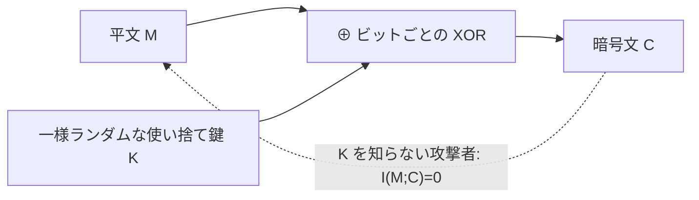

# 03. 完全秘匿とワンタイムパッド（OTP）

> 親: [README](./README.md) ｜ 前: [02 条件付きエントロピー・相互情報量](./02_conditional-mutual-info.md) ｜ 次: [04 鍵長と安全性](./04_key-length-security.md) ｜ 層: 基礎(Layer 1)

**この1ページで分かること**

- 完全秘匿の定義（`P(M|C) = P(M)`、同値に `I(M;C) = 0`）
- OTP（一様ランダムな使い捨て鍵との XOR）が完全秘匿を達成する仕組み
- その代償である Shannon の限界定理 `H(K) ≥ H(M)`

「暗号文を見ても平文について何も分からない」を数学で言い切ったのが**完全秘匿**。それを達成する唯一クラスの方式が OTP で、代償は「平文と同じ長さの使い捨て鍵」。

---

## 最小の例：1 bit の OTP

平文 `M ∈ {0,1}`、鍵 `K` は公平コイン、`C = M ⊕ K`。

| M | K=0 | K=1 |
|---|---|---|
| 0 | C=0 | C=1 |
| 1 | C=1 | C=0 |

暗号文 `C=1` を見ても、`M=0`（`K=1`）か `M=1`（`K=0`）かは半々。`K` が半々なので、`C` は `M` について何も教えない。

---

## 定義

```
完全秘匿（Shannon, 1949）:
  任意の平文分布 P(M) と、任意の m・c について  P(M=m | C=c) = P(M=m)

同値な言い換え:  I(M;C) = 0,   H(M|C) = H(M)
```

ポイントは「**任意の平文分布で**」。特定の分布（例: 一様）だけでは不十分。

---

## OTP が完全秘匿を達成する理由

**ワンタイムパッド（OTP）**: `M, K` を同じ長さの bit 列、`K` は一様ランダム・使い捨て（再利用禁止）として `C = M ⊕ K`。



2 bit で確かめる。`M, K ∈ {00,01,10,11}`、`P(K=k) = 1/4`。

### XOR の全表（行=M, 列=K, 中身=C）

| M＼K | 00 | 01 | 10 | 11 |
|---|---|---|---|---|
| 00 | 00 | 01 | 10 | 11 |
| 01 | 01 | 00 | 11 | 10 |
| 10 | 10 | 11 | 00 | 01 |
| 11 | 11 | 10 | 01 | 00 |

**各行は `{00,01,10,11}` の並べ替え**（`M` を固定すれば `K → C` は 1 対 1）。

### 固定した暗号文 c=01 で確認

| m | `m⊕k=01` を満たす k | P(K=k) |
|---|---|---|
| 00 | 01 | 1/4 |
| 01 | 00 | 1/4 |
| 10 | 11 | 1/4 |
| 11 | 10 | 1/4 |

どの `m` でも `P(C=01 | M=m) = 1/4`（`m` によらず一定）。すべての `c` で同様なので `M` と `C` は独立。ベイズの定理（条件付き確率を逆向きに計算する公式）から

```
P(M=m | C=c) = P(C=c|M=m)·P(M=m) / P(C=c) = (1/4)·P(M=m) / (1/4) = P(M=m)
```

`P(M)` がどんな分布でも成り立つ。これが完全秘匿。

---

## Shannon の限界定理：H(K) ≥ H(M)

完全秘匿には**鍵のエントロピーが平文のエントロピー以上**必要。

直感: `c` を固定したとき、鍵が変われば別の平文に復号できなければならない（でないと `c` から `m` が絞られる）。「平文の可能性の数」以上の「鍵の可能性」が要る。OTP は `H(K) = H(M)` の**等号**で達成（無駄がない代わりに使い捨て）。厳密な証明は `deep/otp-proof/`（README）。

---

## 演習（解答つき）

1. `c = 10` のとき、`m ⊕ k = 10` を満たす `(m, k)` を全て挙げ、`k` が重複なく
   4値すべて現れることを確認せよ。
2. もし `K` が一様でなく `P(K=00)=0.5`、残り3値が各 `1/6` だったら、完全秘匿は
   成り立つか。理由を述べよ。
3. 一様な `K`（4値）の `H(K)` を求め、2bit平文空間の最大エントロピーと比較せよ。

<details><summary>解答</summary>

1. `m=00→k=10, m=01→k=11, m=10→k=00, m=11→k=01`。`k` は `{10,11,00,01}` で
   重複なく4値すべて出現 → 全単射を確認。
2. 成り立たない。`P(C=c|M=m) = P(K = m⊕c)` は `m⊕c` の値によって `0.5` だったり
   `1/6` だったりするため `m` に依存してしまい、`c` を見ることで `m` の候補に
   偏りが生まれる（完全秘匿の定義が崩れる）。
3. `H(K) = log2(4) = 2 bit`。2bit平文空間の最大エントロピー（一様分布時）も
   `log2(4) = 2 bit`。等号 `H(K) = H(M)` でぎりぎり条件を満たしている。

</details>

---

## 次への接続

OTP は理想だが「平文と同じ長さの使い捨て鍵」を毎回共有するのは非現実的。「安全」に必要な鍵の**長さ**は実務上どう決まるのか、総当たりの計算量から見る。
→ [04 鍵長と安全性](./04_key-length-security.md)
