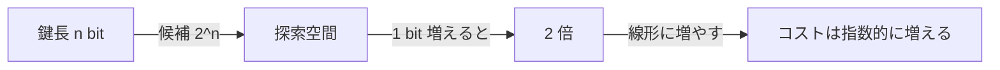

# 04. 鍵長と安全性の直感

> 親: [README](./README.md) ｜ 前: [03 完全秘匿とOTP](./03_perfect-secrecy-otp.md) ｜ 層: 基礎(Layer 1)

**この1ページで分かること**

- 鍵長 n ビット＝総当たり候補 `2^n` 個、という探索空間の対応
- 「128bit 鍵は現実的な計算資源では破れない」という見積もりの根拠
- 平均を測る Shannon エントロピーと、一発勝負を測る min-entropy の使い分け

使い捨てにできない実用暗号は、「攻撃者が鍵を**総当たり**で探すのにどれだけかかるか」で安全性を測る（計算量的安全性）。鍵の bit 数がそのまま探索空間の広さ。

---

## 最小の例：4 桁の暗証番号

`0000`〜`9999` の 4 桁なら候補は `10^4 = 1 万`。1 秒に 1 回試せば最悪 約 3 時間。鍵も同じで、`n` bit なら候補 `2^n`。1 bit 増えるごとに候補は **2 倍**。

---

## 総当たり探索空間：bit 数 vs 候補数

| 鍵長 | 候補数 (2^n) | 近似値 | 例 |
|---|---|---|---|
| 56 bit | 2^56 | ≈ 7.2 × 10^16 | DES（現在は非推奨） |
| 128 bit | 2^128 | ≈ 3.4 × 10^38 | AES-128 |
| 256 bit | 2^256 | ≈ 1.2 × 10^77 | AES-256 |

56→128 の 72 bit 差だけで候補数は `2^72 ≈ 4.7 × 10^21` 倍。



---

## なぜ 128 bit は（現状）現実的に破れないか

1 秒に `10^18` 回（現実離れした超高速 ASIC 群）試せても、

```
3.4×10^38 個 ÷ 10^18 回/秒 ≈ 3.4×10^20 秒 ≈ 1.1×10^13 年
```

宇宙年齢（約 138 億年 = `1.38×10^10` 年）の**約 780 倍**。鍵長を線形に増やすだけで探索コストは指数関数的に効く。256 bit はさらに桁違いの余裕。

---

## 一言だけ min-entropy

Shannon エントロピー `H(X)` は「平均的な当てにくさ」。安全性では**一発勝負で当てる確率**が重要なことがあり、それを測るのが **min-entropy**（最頻値の確率だけで決まるエントロピー）:

```
H_∞(X) = -log2( max_x P(x) )
```

| | Shannon エントロピー `H(X)` | min-entropy `H_∞(X)` |
|---|---|---|
| 定義 | `-Σ P(x)·log2 P(x)` | `-log2(max_x P(x))` |
| 測るもの | 平均的な当てにくさ | 最頻値を一発で当てられる確率 |
| 偏ったコイン `P(表)=0.9` | ≈ 0.469 bit | `-log2(0.9)` ≈ 0.152 bit |
| 安全性評価での役割 | 平均量の議論 | 鍵・パスワード強度の保守的な評価 |

min-entropy の方が小さい（＝攻撃者に有利）。鍵やパスワードの強度は「一番当てやすい値をどれだけ引きやすいか」で測る方が保守的で適切。

---

## 演習（解答つき）

1. `2^40` の近似値を求め、`2^128` と比べて何桁違うか（オーダーの差）を答えよ。
2. 攻撃者が1秒間に10^12回試せるとして、128bit鍵を総当たりし尽くすのに
   何年かかるか（オーダーで）求めよ。
3. `P(表)=0.5` の公平コインについて `H_∞(X)` を求め、Shannon エントロピー
   `H(X)=1 bit` と比較せよ。

<details><summary>解答</summary>

1. `2^40 ≈ 1.1×10^12`。`2^128 / 2^40 = 2^88 ≈ 3.1×10^26` → 約26桁（10^26倍）違う。
2. `3.4×10^38 ÷ 10^12 ≈ 3.4×10^26 秒`。1年 ≈ 3.15×10^7秒なので
   `3.4×10^26 / 3.15×10^7 ≈ 1.1×10^19 年`。宇宙年齢より遥かに大きい。
3. `H_∞(X) = -log2(0.5) = 1 bit`。公平コインでは最頻値も1/2しかないので
   Shannon エントロピーと min-entropy が一致する（分布が一様なときの特徴）。

</details>

---

## 次への接続

ここまでは「鍵が理想的に一様ランダム」を前提にした。実際に `H_∞(K)` を鍵長ぶん稼ぐには、真にランダムなビット列を生成する物理的な源が要る。ハードウェア乱数生成器（RNG）や PUF（Physically Unclonable Function、個体差を指紋のように使う回路）がその役割。
→ [`../../../04_hardware-security/03_security-building-blocks.md`](../../../04_hardware-security/03_security-building-blocks.md)
