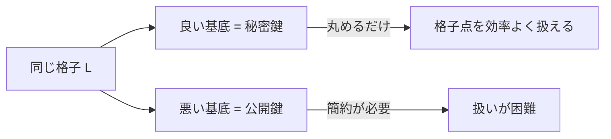

# 01. 格子と基底

> 親: [README](./README.md) ｜ 次: [02 SVP と CVP](./02_hard-problems-svp-cvp.md) ｜ 層: 基礎(Layer 1)

**この1ページで分かること**

- 格子＝ベクトルの係数を「整数だけ」に制限した、飛び飛びの点の集合
- 同じ格子を張る基底は無数にあり、「良い基底」と「悪い基底」がある
- 基底を変えても変わらない量（行列式・最短ベクトル長）が理論の足場になる

格子は、方眼紙の交点を n 次元に伸ばしたもの。ベクトル空間（[07 有限体上の線形代数](../02_groups-rings-fields/07_linear-algebra-over-fields.md)）の係数を整数に縛ると、Gauss 消去（連立一次方程式を機械的に解く手順）で瞬時に解けた問題が急に難しくなる。

---

## 最小の例：2 次元の 2 つの基底

```
基底 B  = {(1,0), (0,1)}   →  整数係数で足し合わせると Z² の全格子点
基底 B' = {(1,1), (1,2)}   →  例: (1,0) = 2·(1,1) − 1·(1,2),  (0,1) = −(1,1) + (1,2)
```

`B'` からも `Z²` の全点が作れる。**同じ点集合を、別の「ものさし」で張っている**。`B` は短く直交（良い基底）、`B'` は長く斜め（悪い基底）。

---

## 格子の定義

```
一次独立な n 本のベクトル b₁, ..., bₙ ∈ R^n が与えられたとき、
それらの整数係数の線形結合全体を格子と呼ぶ:

  L(B) = { c₁b₁ + c₂b₂ + ... + cₙbₙ : c₁,...,cₙ ∈ Z }
```

`b₁,...,bₙ` を**基底**（格子を張る「ものさし」の組）、まとめた行列 `B` を基底行列と呼ぶ。一次独立の定義は [07](../02_groups-rings-fields/07_linear-algebra-over-fields.md) と同じ。変わるのは係数を**実数から整数へ**制限する点だけ。

| 係数 | できるもの | 性質 |
|---|---|---|
| 実数 | ベクトル空間 | 連続・すき間なし |
| 整数 | 格子 | 離散・飛び飛びの点 |

この対比が格子暗号の出発点。

---

## 同じ格子、違う基底

同じ格子は複数の基底で張れる。2 つの基底 `B, B'` が同じ格子を張るのは、**ユニモジュラ行列**（成分が整数で行列式が `±1` の正方行列）`U` で `B' = BU` と書けるとき、かつそのときに限る。

```
格子の点（●）は基底によらず同じ:
  ●   ●   ●   ●
  ●   ●   ●   ●
  ●   ●   ●   ●

良い基底: 短い2本の矢印がほぼ直角に交わる
悪い基底: 長い2本の矢印が鋭角で交わる（同じ点集合を張るが扱いにくい）
```

| | 良い基底 | 悪い基底 |
|---|---|---|
| ベクトルの長さ | 短い | 長い |
| 互いの角度 | ほぼ直交 | 鋭角 |
| 近い格子点を探す | 四捨五入で済む | 探索が困難 |



**これが暗号のトラップドア**（持つ人だけ楽になる秘密の仕掛け）**の源**。悪い基底だけから格子点を効率よく扱えないことが、次ファイルの困難性に直結する。

---

## 基底によらない不変量：行列式

基底の選び方は無限にあるが、**行列式（基本領域の体積）は基底の取り方によらない**。

```
det(L) := |det(B)|
```

`B' = BU`（`|det(U)|=1`）なら `|det(B')| = |det(B)|·|det(U)| = |det(B)|`。「基底が変わっても変わらないもの」を持つことが、格子を理論的に扱う足場になる。

---

## 逐次最小：最短ベクトルの長さ

```
λ₁(L) := 格子 L の非零ベクトルのうち、長さが最小のものの長さ
```

`λ₁` も基底に依存しない格子自身の性質。これを**見つける**問題（最短ベクトル問題 SVP）が次ファイルの主役。

---

## 演習（解答つき）

1. `Z²`（整数座標平面）の基底を2通り挙げ、両方が同じ格子を張ることを確認せよ。
2. 基底 `B` と、行列式が `2` の整数行列 `M` について、`BM` は元の格子と同じ格子を張るか。
3. 「良い基底」と「悪い基底」があるとき、与えられた点に近い格子点を探す作業の
   難しさはどう違うか、直感で述べよ。

<details><summary>解答</summary>

1. 例: `B = {(1,0),(0,1)}` と `B' = {(1,1),(0,1)}`。`B' = BU`（`U = [[1,0],[1,1]]`,
   `det(U)=1`）なのでユニモジュラ変換であり、同じ格子 `Z²` を張る。
2. 張らない。ユニモジュラ行列（行列式 `±1`）でなければ格子は変わる——
   `det(BM) = det(B)·det(M) = 2·det(B)` となり、元の格子よりも「粗い」
   （点の間隔が広い）別の格子になる。
3. 良い基底（短く直交に近い）なら、各基底ベクトルの整数倍を四捨五入するだけで
   近い格子点にほぼ辿り着ける。悪い基底（長く鋭角）では、その素朴な丸め方が
   大きく外れることがあり、正しい格子点を探すには基底を作り直す（簡約する）か
   高コストな探索が必要になる。

</details>

---

## 次への接続

「良い基底なら簡単、悪い基底だと難しい」という直感を、具体的な計算問題として定式化する。
→ [02 SVP と CVP](./02_hard-problems-svp-cvp.md)

---

## 参考

- Micciancio, D., Goldwasser, S. *Complexity of Lattice Problems: A Cryptographic Perspective*. Springer.
- Peikert, C. (2016). *A Decade of Lattice Cryptography*. Foundations and Trends in Theoretical Computer Science.
