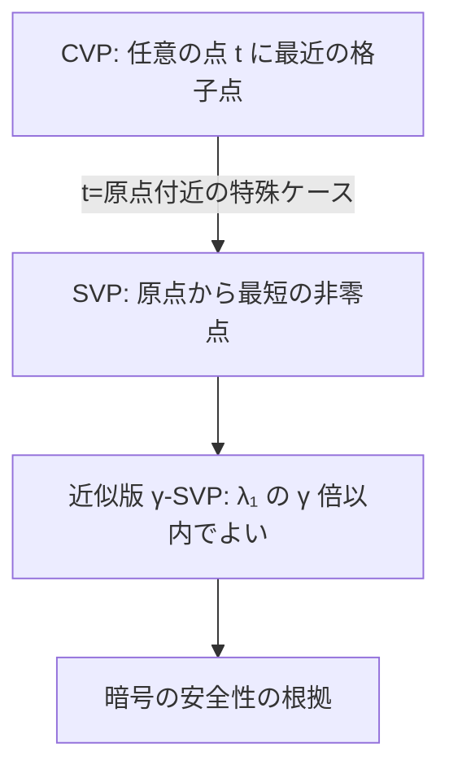

# 02. SVP と CVP

> 親: [README](./README.md) ｜ 前: [01 格子と基底](./01_lattices-and-bases.md) ｜ 次: [03 LWE と SIS](./03_lwe-and-sis.md) ｜ 層: 基礎(Layer 1)

**この1ページで分かること**

- SVP（最短ベクトル）と CVP（最近ベクトル）という 2 つの計算問題
- 暗号が使うのは「近似版」であり、「NP困難だから安全」とは言えない
- 基底簡約（LLL/BKZ）の限界がパラメータを決め、Shor は直接効かない

格子の点は規則正しく無限に並ぶのに、「一番短い点」「一番近い点」を探すのは驚くほど難しい。この難しさが格子暗号の土台。

---

## 最小の例：2 次元で目視する

```
格子 L = Z² を基底 {(3,1), (2,1)} で渡されたとする（長く斜めの悪い基底）。
  SVP: 最短の非零点は? → (3,1) − (2,1) = (1,0)  長さ 1
  CVP: 点 t = (2.4, 0.6) に最も近い格子点は? → 座標を丸めて (2,1)（距離 ≈ 0.57）
```

2 次元なら図を描けば見つかる。この「目で分かる」が次元とともに消えるのが問題。

---

## 2 つの問題

| 問題 | 問い | 一言で |
|---|---|---|
| **SVP**（Shortest Vector Problem） | 非零ベクトルのうち最短のもの（`λ₁(L)` を実現）を求めよ | 原点から最短の点 |
| **CVP**（Closest Vector Problem） | 格子上にない点 `t` に最も近い格子点を求めよ | 任意の点から最短の点 |

SVP は CVP の特殊ケースで、CVP を解ければ SVP も解ける。



---

## 厳密版と近似版

暗号で扱うのは主に**近似版 γ-SVP**（`λ₁` の `γ` 倍以内の長さのベクトルを求めればよい緩和版）。`γ` が大きいほど易しい。

| | 厳密 SVP | 多項式近似率の γ-SVP |
|---|---|---|
| 計算量の位置づけ | ランダム化還元で NP困難（Ajtai, 1998） | NP困難とは知られていない（`NP∩coNP` に属す） |
| 暗号との関係 | 使わない | 安全性の根拠 |

**「NP困難だから安全」という単純化はできない**。格子暗号の安全性は「効率的なアルゴリズムが知られていない」という経験的信頼に立つ。

---

## なぜ次元が上がると難しくなるのか

2 次元なら図を描けば最短ベクトルは目で分かる。次元が上がると**候補が爆発的に増え**、暗号で使う 512 次元規模では直感も総当たりも効かない。

```
良い基底があれば: 基底ベクトルを丸めるだけで SVP/CVP に近い答えが出る（01 参照）
悪い基底しかなければ: まず「良い基底を作る」こと自体が難しい問題になる
```

---

## 基底簡約：LLL と BKZ

**基底簡約**（悪い基底から短く直交に近い基底を作り直すアルゴリズム）の 2 大手法。

| アルゴリズム | 実行時間 | 得られる近似の質 |
|---|---|---|
| **LLL**（Lenstra–Lenstra–Lovász, 1982） | 多項式時間 | 弱い（近似率が次元に対し指数的 `2^O(n)`） |
| **BKZ**（blockwise Korkine–Zolotarev） | ブロックサイズ `β` に応じて増大 | `β` を上げるほど良い |

暗号のパラメータ（次元・鍵長）は「この次元・この `β` では BKZ が現実的な時間で解けない」という見積もりから逆算して決める。アルゴリズムのトレースは深掘りキュー行き（[README](./README.md)）。

---

## 耐量子性の根拠

RSA・DH を破る Shor のアルゴリズムは、**周期を見つける問題**（素因数分解・離散対数）に特化した量子アルゴリズム（[05 困難な問題](../03_number-theory/05_hard-problems.md)）。格子問題はその周期的・群構造を持たないため、**Shor は格子問題に直接は効かない**。

⚠️ 正確には**「現時点で格子問題を効率的に解く量子アルゴリズムは知られていない」**。「量子でも絶対に解けない」証明があるわけではない。

---

## 演習（解答つき）

1. 厳密 SVP と近似 SVP（γ-SVP）の違いを述べよ。暗号が使うのはどちらか。
2. 「良い基底＝秘密鍵」になりうる理由を、[01](./01_lattices-and-bases.md) の内容を踏まえて述べよ。
3. Shor のアルゴリズムが格子問題に直接は効かない理由を一言で述べよ。

<details><summary>解答</summary>

1. 厳密 SVP は `λ₁` そのものを実現するベクトルを求める問題で、（ランダム化還元のもとで）
   NP困難であることが知られている。近似 SVP（γ-SVP）は `λ₁` の `γ` 倍以内の長さの
   ベクトルで妥協する緩和版で、暗号が安全性の根拠にするのは**近似版**——
   ただし多項式近似率での近似版は NP困難とは知られていない。
2. 良い基底（短く直交に近い）を持つ者は SVP/CVP に近い答えを効率的に計算できるが、
   悪い基底しか持たない者はまず良い基底を作り直す（簡約する）こと自体が難しい。
   両者に与える基底を変えるだけで「解ける人」と「解けない人」を作り分けられるため、
   良い基底を秘密に持つ者だけが計算できる、というトラップドアが成立する。
3. Shor のアルゴリズムは素因数分解・離散対数のような**周期を見つける問題**に特化しており、
   格子問題はそのような周期的構造を持たないため。

</details>

---

## 次への接続

「格子問題そのもの」から、それを暗号の安全性証明に使える形——
**ノイズを乗せた連立一次方程式**——に変換する。
→ [03 LWE と SIS](./03_lwe-and-sis.md)

---

## 参考

- Ajtai, M. (1998). *The Shortest Vector Problem in L2 is NP-hard for Randomized Reductions*. STOC.
- Lenstra, A.K., Lenstra, H.W., Lovász, L. (1982). *Factoring Polynomials with Rational Coefficients*. Mathematische Annalen（LLLアルゴリズムの原論文）。
- Chen, Y., Nguyen, P.Q. (2011). *BKZ 2.0: Better Lattice Security Estimates*. ASIACRYPT.
