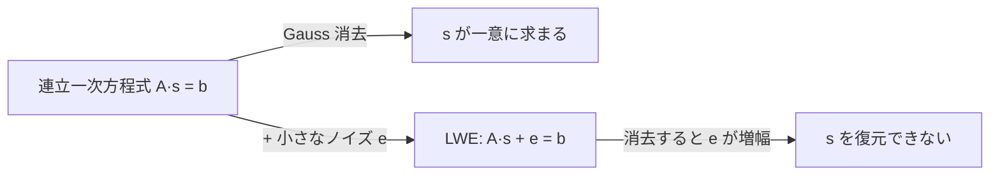

# 03. LWE と SIS

> 親: [README](./README.md) ｜ 前: [02 SVP と CVP](./02_hard-problems-svp-cvp.md) ｜ 次: [04 Ring-LWE と Module-LWE](./04_ring-and-module-lwe.md) ｜ 層: 基礎(Layer 1)

**この1ページで分かること**

- LWE ＝ 連立一次方程式の右辺に小さなノイズを足しただけで解けなくなる問題
- 探索版と判定版があり、安全性証明で使うのは判定版
- SIS は LWE と双対の「短い解」を探す問題。ノイズは安全性の源で FHE の重さの源

連立一次方程式は Gauss 消去で必ず解ける（[07](../02_groups-rings-fields/07_linear-algebra-over-fields.md)）。**右辺にほんの少しノイズを足すだけで解けなくなる**。これが LWE の核心で、現行の耐量子暗号標準のほぼすべてがこの 1 つの仮定の上に建つ。

---

## 最小の例：2 変数・mod 7

```
ノイズなし:  s₁ + 2s₂ = 5,  3s₁ + s₂ = 4   (mod 7)  → 消去法で s = (2, 5) が一意に決まる
LWE:        s₁ + 2s₂ = 5 + e₁,  3s₁ + s₂ = 4 + e₂   e ∈ {−1,0,1}
```

右辺が `±1` ずれるだけで、`s` の候補が複数に増え、式を増やしても「どの式がどれだけずれたか」は分からない。

---

## ノイズなしなら解ける、足すと解けない

```
ノイズなし: A·s = b       (mod q)   A: 既知の行列, b: 既知, s: 秘密
LWE:       A·s + e = b   (mod q)   e: 小さい値に偏った分布（離散ガウス分布等）のノイズ
```

Learning With Errors（LWE, Regev, 2005）はこの 1 行に尽きる。

| | 式 | 解き方 |
|---|---|---|
| ノイズなし | `A·s = b` | Gauss 消去で高速に `s` が求まる |
| LWE | `A·s + e = b`（`e≠0`） | 効率的な方法が知られていない |

Gauss 消去は `s' = A⁻¹b = s + A⁻¹e` を返す。`A⁻¹e` の項が小さなノイズを増幅し、正しい `s` に戻らない。



---

## 探索 LWE と判定 LWE

| 版 | 問い | 用途 |
|---|---|---|
| 探索 LWE | `(A, b)` から秘密 `s` を求めよ | 直感的な定義 |
| 判定 LWE | `(A, b)` が LWE の標本か一様ランダムかを見分けよ | **安全性証明で直接使う** |

「攻撃者は LWE の出力を一様ランダムと区別できない」という形で暗号方式の意味論的安全性（暗号文から平文の情報が漏れないこと）を証明する（一般論は `courses/coursera-crypto1/03_stream-ciphers/06_semantic-security.md`）。

---

## 格子問題との関係

LWE を効率的に解けるなら**格子の困難問題（近似 SVP 等）も解ける**、つまり LWE は格子問題以上に難しい——という帰着（ある問題の解法を別の問題の解法に変換すること）がある。

⚠️ Regev の元の帰着（2005, STOC）は**量子アルゴリズムを使う帰着**。一部のパラメータ領域では古典的な帰着もあるが、**「LWE は最悪時の格子問題と同じくらい難しい」と無条件には言えない**。帰着の種類とパラメータ条件を明示する必要がある。

---

## SIS：短い解を持つ方程式

```
SIS（Short Integer Solution）:
  A·x = 0 (mod q) を満たす、成分がすべて小さい非零ベクトル x を求めよ
```

`x=0` なら自明に満たすので、問うのは**「非零かつ短い」解**。これも最短ベクトル問題に近い格子問題に帰着される。

| 問題 | 主な用途 | 標準 |
|---|---|---|
| LWE | 暗号化・鍵共有 | ML-KEM |
| SIS | 署名 | ML-DSA |

---

## ノイズは安全性の源であり扱いにくさの源

[FHE の性能問題](../../../04_hardware-security/01_digital-platform-design.md)の正体はこのノイズ。演算のたびにノイズが増え、大きくなりすぎると復号できない。**格子暗号のセキュリティと FHE の重さは、同じ 1 つのノイズの裏表**。

---

## 演習（解答つき）

1. ノイズの無い `A·s=b` を Gauss 消去で解く手順を1行で述べよ。ノイズが入ると
   同じ手順のどこが破綻するか。
2. 探索 LWE と判定 LWE の違いを述べよ。暗号の安全性証明で使われるのはどちらか。
3. ノイズを大きくすると、安全性と（暗号としての）正しさはどうトレードオフするか。

<details><summary>解答</summary>

1. `A` の逆行列（または簡約後の行基本形）を使って `s = A⁻¹b` を計算すればよい。
   ノイズが入ると `s' = A⁻¹(b) = A⁻¹(As+e) = s + A⁻¹e` となり、`A⁻¹e` の項が
   小さいはずのノイズを大きく増幅してしまうことが多く、正しい `s` に戻らない。
2. 探索 LWE は秘密 `s` そのものを求める問題、判定 LWE は `(A,b)` が LWE の出力か
   一様ランダムかを見分ける問題。暗号の安全性証明で直接使われるのは**判定版**——
   攻撃者が暗号文を一様ランダムなものと区別できないことを示す形で安全性を証明する。
3. ノイズを大きくするほど格子問題としての困難性は増し安全性が上がるが、
   同時に復号時にノイズと信号を区別する余地が狭まり、**正しく復号できる確率
   （正当性）が下がる**。安全性と正しさは同じノイズ量を巡って綱引きの関係にある。

</details>

---

## 次への接続

素の LWE は行列 `A` が大きく、鍵も計算も重い。多項式環という構造を持ち込んで
軽くする変種が実用の標準になっている。
→ [04 Ring-LWE と Module-LWE](./04_ring-and-module-lwe.md)

---

## 参考

- Regev, O. (2005). *On Lattices, Learning with Errors, Random Linear Codes, and Cryptography*. STOC 2005.
- Peikert, C. (2009). *Public-Key Cryptosystems from the Worst-Case Shortest Vector Problem*. STOC（古典的な帰着の一例）。
- Ajtai, M. (1996). *Generating Hard Instances of Lattice Problems*. STOC（SIS の原論文）。
