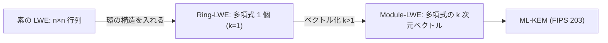

# 04. Ring-LWE と Module-LWE

> 親: [README](./README.md) ｜ 前: [03 LWE と SIS](./03_lwe-and-sis.md) ｜ 層: 基礎(Layer 1)

**この1ページで分かること**

- Ring-LWE ＝ `n×n` 行列を多項式 1 つに圧縮し、鍵を `n` 分の 1 にする工夫
- Module-LWE ＝ 多項式を成分とするベクトル。長さ `k` で安全性を細かく調整できる
- ML-KEM（FIPS 203）は Module-LWE の上に立つ。構造は効率の源であり仮定の代償でもある

素の LWE（[03](./03_lwe-and-sis.md)）は行列 `A` が `n×n` で、鍵も計算も `n²` のオーダー。**多項式環**（多項式どうしを足し引き掛けできる集合）を持ち込んで軽くするのが、標準化された方式に共通する工夫。

---

## 最小の例：`n=2`、`x²+1` で折り返す

```
R = Z_q[x]/(x²+1)   →  x² ≡ −1

a = 1 + 2x,  s = 3 + x
a·s = 3 + x + 6x + 2x² = 3 + 7x + 2(−1) = 1 + 7x
```

`n=2` なら多項式 1 つ（係数 2 個）が `2×2` 行列の情報を担う。これが `n=256` になると、`256×256 = 65536` 個の値が `256` 個で済む。

---

## Ring-LWE：行列を多項式 1 つに圧縮する

```
多項式環 R_q := Z_q[x] / (x^n + 1)   （n は2の冪。円分多項式の一種）

Ring-LWE:  a·s + e = b   （R_q 上の演算。a,s,e,b はすべて多項式）
```

`a` は `n×n` 行列と等価な情報を多項式 1 つ（`n` 個の係数）で表せる。**鍵サイズが `n` 分の 1**。環そのもの（加減乗算・既約性）は [01 多項式環](../04_polynomials-ideals/01_polynomial-rings.md) が本体。

Lyubashevsky–Peikert–Regev（EUROCRYPT 2010）が定式化し、**イデアル格子**（多項式環の構造を持つ特殊な格子）上で格子問題への帰着も示した。NTRU も同じ環の上に構成される、Ring-LWE 以前からある方式。

### 構造を入れる代償

追加の代数構造は攻撃者にも使える。**効率と、安全性の根拠となる仮定の強さはトレードオフ**。素の LWE ほど汎用的な裏付けはないが、実用上必要な効率化として広く受け入れられている。

---

## 3 段階の比較

| | 素の LWE | Ring-LWE | Module-LWE |
|---|---|---|---|
| 秘密・ノイズの形 | `n` 次元ベクトル | 多項式 1 個 | 多項式を成分とする長さ `k` のベクトル |
| 公開情報 `A` の形 | `n×n` 行列 | 多項式 1 個 | 成分が多項式の `k×k` 行列 |
| 鍵サイズ | `n²` | `n` | `k²·n` |
| パラメータ調整 | 次元 `n` | 次元 `n` | `n` と `k`（細かい） |
| 困難性の裏付け | 最も汎用的 | 構造化格子に依存 | 同左 |



**Ring-LWE が「1 リング」なら Module-LWE は「リングの行列・ベクトル」**。`k` を変えるだけで Ring-LWE（`k=1`）と素の LWE の中間で安全性水準を選べる。

---

## ML-KEM（FIPS 203）

NIST 標準の **ML-KEM**（旧称 CRYSTALS-Kyber）は Module-LWE を安全性の基盤とする。

```
パラメータ: q = 3329, n = 256
```

多項式環の構造が、効率的な実装（**NTT**＝数論変換による高速な多項式乗算）と安全性証明を同時に成り立たせる。NTT の中身は深掘りキュー行き。標準の全体地図は [06 発展トピック地図](../../../02_cryptography/06_advanced-topics-map.md) が本体。

---

## どの標準がどの困難性の上に立つか

| 格子のどの問題 | どの標準 | 本体 |
|---|---|---|
| Module-LWE | ML-KEM（FIPS 203、鍵共有） | [`06_advanced-topics-map.md`](../../../02_cryptography/06_advanced-topics-map.md) |
| SIS（[03](./03_lwe-and-sis.md)の双対） | ML-DSA（FIPS 204、署名の基盤の一部） | 同上 |
| LWE のノイズ | FHE の性能問題の正体 | [`04_hardware-security/01_digital-platform-design.md`](../../../04_hardware-security/01_digital-platform-design.md) |
| PQC 実装のマスキング | 格子演算特有の変換コスト | [`04_hardware-security/04_side-channels/04_countermeasures.md`](../../../04_hardware-security/04_side-channels/04_countermeasures.md) |

---

## 演習（解答つき）

1. Ring-LWE が素の LWE より鍵サイズを削減できる理由を一言で述べよ。
2. Module-LWE が Ring-LWE より柔軟なパラメータ設計を可能にする理由を述べよ。
3. 多項式環という構造を持ち込むことの「代償」とは何か。

<details><summary>解答</summary>

1. 素の LWE は `n×n` 行列（`n²` 個の値）で表す情報を、Ring-LWE では多項式環の元1つ
   （`n` 個の係数）で表せるため、鍵サイズが `n` 分の1になる。
2. Module-LWE は環元を成分とするベクトル・行列の「長さ `k`」を調整パラメータとして
   持つため、`k` を変えるだけで Ring-LWE（`k=1` 相当）と素の LWE の中間で
   安全性水準を細かく選べる。
3. 多項式環の代数的な構造は攻撃者にとっても利用可能な情報になりうるため、
   素の LWE ほど汎用的に確立された困難性の裏付けをまだ持たない。
   効率と引き換えに、安全性の根拠となる仮定がより特化した（強い）ものになる。

</details>

---

## 暗号での出口：格子暗号の全体像

`01`〜`04` で「格子とは何か」「なぜ難しいか」「どう暗号にするか」が揃った。
どの標準（ML-KEM/ML-DSA/SLH-DSA）がどの困難性の上に立つかという全体地図、
および PQC 移行の実務上の課題は
[`../../../02_cryptography/06_advanced-topics-map.md`](../../../02_cryptography/06_advanced-topics-map.md) へ。

---

## 参考

- Lyubashevsky, V., Peikert, C., Regev, O. (2010). *On Ideal Lattices and Learning with Errors over Rings*. EUROCRYPT.
- FIPS 203 — Module-Lattice-Based Key-Encapsulation Mechanism Standard (ML-KEM), NIST (2024): https://csrc.nist.gov/pubs/fips/203/final
- Bos, J. et al. (2018). *CRYSTALS – Kyber: A CCA-Secure Module-Lattice-Based KEM*. EuroS&P.
