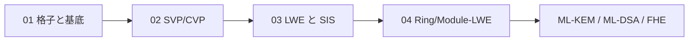

# 格子（Lattices）

> 対応科目: Advanced Methods in Cryptography ｜ 層: 基礎(Layer 1)
> 親: [../index.md](../index.md)

## 一言で

**係数を整数に制限したベクトル空間**（方眼紙の交点を n 次元に伸ばしたもの）。連続な空間が飛び飛びの点になり、Gauss 消去で解けた問題が急に難しくなる。耐量子暗号標準（ML-KEM/ML-DSA）と FHE のノイズはこの 1 つの土台の上に乗る。

---

## 概念ファイル（番号順に読む）

| # | ファイル | 内容 |
|---|---|---|
| 01 | [01_lattices-and-bases.md](./01_lattices-and-bases.md) | 格子の定義・基底の非一意性・行列式という不変量・逐次最小 |
| 02 | [02_hard-problems-svp-cvp.md](./02_hard-problems-svp-cvp.md) | SVP/CVP・厳密版と近似版の区別・LLL/BKZ・耐量子性の根拠 |
| 03 | [03_lwe-and-sis.md](./03_lwe-and-sis.md) | ノイズ付き連立一次方程式としての LWE・探索/判定・SIS・FHE との接点 |
| 04 | [04_ring-and-module-lwe.md](./04_ring-and-module-lwe.md) | Ring-LWE・Module-LWE・ML-KEM のパラメータ |

---

## なぜ重要か / コースでの位置づけ

NIST 標準 FIPS 203（ML-KEM）・FIPS 204（ML-DSA）はどちらも格子問題（Module-LWE/SIS）が根拠で、もはや実務標準。受講科目の PQ 移行・PQC 実装・FHE・MPC・FHE 高速化・FHE 応用が本フォルダに依存する。FHE のノイズは LWE のノイズと同一の道具で、FHE がなぜ遅いか（[`../../../04_hardware-security/01_digital-platform-design.md`](../../../04_hardware-security/01_digital-platform-design.md)）を理解する土台。

---

## このフォルダで「本体」を置かないもの（DRY）

- **多項式環そのもの（加減乗算・既約性）** →
  [`../04_polynomials-ideals/01_polynomial-rings.md`](../04_polynomials-ideals/01_polynomial-rings.md)（本フォルダは「その環の上に格子を作る」ところから）
- **基底・一次独立・行列式の定義そのもの** →
  [`../02_groups-rings-fields/07_linear-algebra-over-fields.md`](../02_groups-rings-fields/07_linear-algebra-over-fields.md)（本フォルダは整数係数に制限したときに何が変わるかに集中する）
- **ノイズ分布のエントロピー的な議論** → [`../05_info-theory/`](../05_info-theory/README.md)
- **どの方式が標準か（PQC 全体の地図）** →
  [`../../../02_cryptography/06_advanced-topics-map.md`](../../../02_cryptography/06_advanced-topics-map.md)（本フォルダは「なぜ難しいと信じられているか」の数学）
- **PQC 実装のマスキングコスト** →
  [`../../../04_hardware-security/04_side-channels/04_countermeasures.md`](../../../04_hardware-security/04_side-channels/04_countermeasures.md)

---

## つまずき / 深掘り候補（Layer 2）

- [ ] LLL / BKZ の動作をトレースする → `deep/lattice-reduction/`
- [ ] 最悪時から平均時への帰着の証明（Regev 2005） → `deep/worst-case-reduction/`
- [ ] ML-KEM の具体的なパラメータ選定の根拠 → `deep/kyber-parameters/`
- [ ] NTT（数論変換）の実装と最適化 → `deep/ntt/`

---

## 参考

- Regev, O. (2005). *On Lattices, Learning with Errors, Random Linear Codes, and Cryptography*. STOC 2005.
- Lyubashevsky, V., Peikert, C., Regev, O. (2010). *On Ideal Lattices and Learning with Errors over Rings*. EUROCRYPT.
- Micciancio, D., Goldwasser, S. *Complexity of Lattice Problems: A Cryptographic Perspective*. Springer.
- FIPS 203, 204 — NIST Post-Quantum Cryptography Standards (2024): https://www.nist.gov/news-events/news/2024/08/nist-releases-first-3-finalized-post-quantum-encryption-standards
