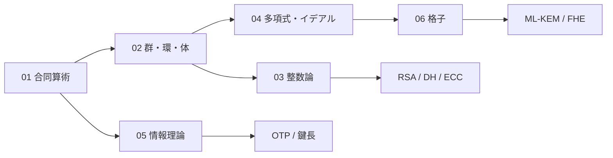

# 暗号数学 — 地図

> 層: 地図 (Layer 0)

「暗号で使う数学の土台」。暗号系科目が前提とする代数・整数論・情報理論・格子を、概念理解レベル（Layer 1）で押さえる。数学が不安なら 01 から順に、1 ファイルずつ「最小の例 → 定義」の順で読めばよい。

## 読む順

| # | ページ | 内容（1行） |
|---|---|---|
| 01 | [合同算術](01_modular-arithmetic/README.md) | 余り→合同式→gcd→拡張ユークリッド→逆元→CRT 入口 |
| 02 | [群・環・体](02_groups-rings-fields/README.md) | 二項演算→位数→巡回群→環→体→GF(2^n)→線形代数 |
| 03 | [整数論](03_number-theory/README.md) | 素数・Fermat・Euler・CRT・離散対数・素因数分解 |
| 04 | [多項式・イデアル](04_polynomials-ideals/README.md) | 多項式環・既約多項式・剰余環 GF(q^n)・イデアル・Gröbner 基底 |
| 05 | [情報理論](05_info-theory/README.md) | エントロピー・相互情報量・完全秘匿(OTP)・鍵長 |
| 06 | [格子](06_lattices/README.md) | 格子と基底・SVP/CVP・LWE と SIS・Ring/Module-LWE |

進捗チェックリスト

- [ ] `01_modular-arithmetic/` — 合同算術（概念別フォルダ: 余り→合同式→演算→gcd→拡張ユークリッド→逆元→CRT入口）
- [ ] `02_groups-rings-fields/` — 群・環・体・有限体 GF(p), GF(2^n)・線形代数（概念別フォルダ: 二項演算→位数→巡回群→環→体→GF(2^n)→線形代数）
- [ ] `03_number-theory/` — 素数・フェルマー小定理・オイラー・CRT・離散対数・素因数分解（概念別フォルダ）
- [ ] `04_polynomials-ideals/` — 多項式環・既約多項式・イデアル・Gröbner 基底概観（概念別フォルダ）
- [ ] `05_info-theory/` — エントロピー・条件付きエントロピー・相互情報量・完全秘匿（概念別フォルダ）
- [ ] `06_lattices/` — 格子と基底・SVP/CVP・LWE と SIS・Ring/Module-LWE（概念別フォルダ）

科目対応・深掘りキュー・関連領域

### 科目対応マップ

| ファイル | 暗号での出口 |
|---|---|
| 01 合同算術 | RSA 鍵生成、DH |
| 02 群・環・体 | DH/ECC の群、AES の GF(2^8)、LFSR 解読と MixColumns の線形代数 |
| 03 整数論 | RSA・DH の安全性根拠 |
| 04 多項式・イデアル | GF(2^n) 構成、多変数暗号、Ring-LWE への入口（格子本体は 06） |
| 05 情報理論 | 完全秘匿（OTP）、鍵長と安全性 |
| 06 格子 | ML-KEM/ML-DSA（耐量子暗号）、FHE のノイズ |

### 深掘りキュー（Layer 2 候補）

詰まった用語や「もっと掘りたい」項目をここに溜める。
`deep/<topic-slug>/` を新設して枝を伸ばす。

- [ ] （読み進めながら追記）

## 参考（サブ領域全体）
