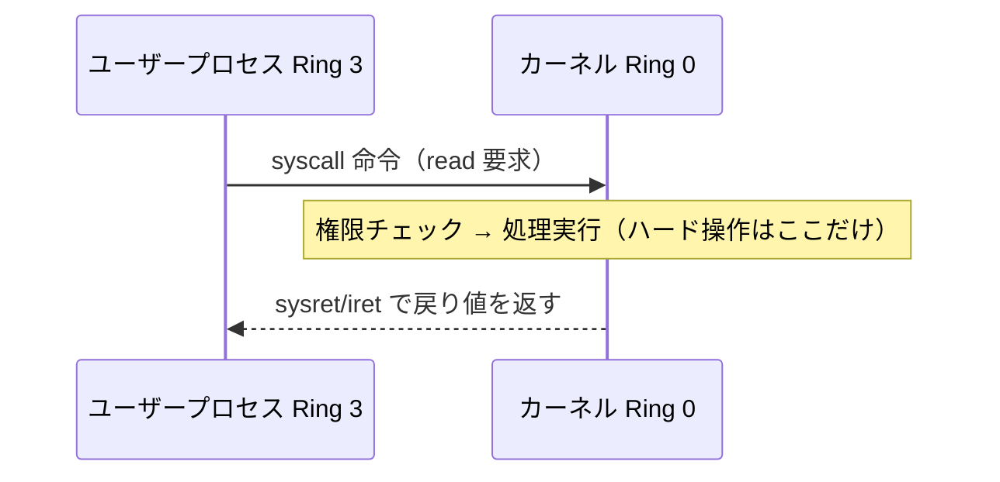

# プロセスと OS

> 対応科目: Development of Secure Software ｜ 前: [01 C言語とメモリ](./01_c-and-memory.md) ｜ 次: [03 システムソフトウェア](./03_systems-software.md) ｜ 層: 基礎(Layer 1)

## 一言で

OS は各プログラムに「自分専用の部屋（仮想アドレス空間）」と「入れる部屋の格（権限レベル）」を割り当てる。
その分離の仕組みと、C 系攻撃から守る保護機構（ASLR・NX・カナリア）を押さえる。

**この1ページで分かること**

- OS がプロセスごとにメモリを分離する仕組み（MMU＝仮想→物理アドレス変換を行うハードウェア＋ページ権限）
- ユーザーモードとカーネルモードの境界、そこを越える唯一の正規手段＝システムコール（アプリがOS機能を呼ぶ入口）
- C系攻撃を防ぐ実行時保護（NX・ASLR・カナリア）が何を防ぎ、どこに限界があるか

---

## 押さえる概念

### 最小の例: 同じ番地でも別の部屋

| プロセス | 仮想アドレス | → 物理アドレス |
|---|---|---|
| A（ブラウザ） | `0x1000` | `0x7A3000` |
| B（エディタ） | `0x1000` | `0x2F0000` |

A と B は同じ `0x1000` を使っているつもりだが、実際の DRAM 上では別の場所。この対応表を持つのが OS、変換するのが MMU。

### プロセスとスレッド

| 用語 | 意味 |
|---|---|
| プロセス | 実行中プログラムの実体。OS が独立した仮想アドレス空間を与える |
| スレッド | プロセス内の実行単位。同じプロセスのスレッドはアドレス空間を共有 |

分離がなければ、あるプログラムのバグが別プログラムのメモリを壊せてしまう。

### 仮想メモリとメモリ保護

CPU は仮想アドレス（プログラムが見る番地）を使い、MMU（Memory Management Unit）が物理アドレス（実際の DRAM 上の番地）へ変換する。
変換表＝ページテーブルに、OS はページ（固定サイズの区画、通常 4KB）ごとの権限を設定できる:

| ページ属性 | 意味 |
|---|---|
| R (Read) | 読み取り可 |
| W (Write) | 書き込み可 |
| X (Execute) | 実行可 |

これにより「コード領域は書き込み不可」「データ領域は実行不可」を強制できる。

### 特権レベル（user/kernel）

x86-64 の保護リング:

```
Ring 0 = カーネルモード（OS カーネル）— ハードウェアへの直接アクセス可
Ring 3 = ユーザーモード（一般プロセス）— OS API 経由のみ
```

通常アプリは Ring 3 で動作し、ハードウェアや他プロセスのメモリに直接触れない。
この境界を破って Ring 0 を得るのが「特権昇格」。

#### 特権レベルの対比（メモリ保護が何を防ぐか）

| 操作 | ユーザーモード (Ring 3) | カーネルモード (Ring 0) |
|---|---|---|
| 自分のアドレス空間の読み書き | 可能 | 可能 |
| 他プロセスのメモリへの直接アクセス | **不可**（ページテーブルで分離） | 可能 |
| ハードウェアへの直接アクセス（I/O 命令等） | **不可**（実行すると例外発生） | 可能 |
| 特権命令の実行（`hlt`, `cli` 等） | **不可** | 可能 |
| カーネル機能の呼び出し | **不可**（システムコール経由のみ） | 直接呼び出し可能 |

「不可」の行がまさにメモリ保護・特権分離が防いでいる内容。攻撃者がこの境界を破ることが「特権昇格」。

### システムコール

ユーザーモードのプロセスがカーネル機能を使う唯一の正規の窓口。`read()`, `write()`, `open()`, `mmap()`, `execve()` など。
NX（後述）でシェルコードを直接実行できないとき、攻撃者は既存コード片を繋ぐ **ROP チェーン**（`03_systems-software.md`）で
システムコール相当の処理を呼ぶことを狙う。



`syscall` 命令で境界を越える一瞬だけカーネルに処理を委ね、それ以外は Ring 3 に閉じ込められている。

### UNIX 系の権限モデル

| 用語 | 意味 |
|---|---|
| UID / GID | プロセスが持つユーザー ID / グループ ID |
| setuid ビット | 実行時にファイル所有者の権限で動くフラグ。例: root 所有の `passwd` |
| 最小権限の原則 | 必要最小限の権限だけ与える。破ると攻撃面が広がる |

setuid バイナリの脆弱性は特権昇格に直結する（「認証とアクセス制御」と接続）。

### 実行時保護機構の概観

現代の OS と CPU が提供する主な緩和策:

| 機構 | 仕組み | 目的 | 限界 |
|---|---|---|---|
| **NX / DEP** (Non-eXecutable) | データページに X 権限を付与しない | シェルコード直接実行を阻止 | ROP で回避可能 |
| **ASLR** (Address Space Layout Randomization) | スタック/ヒープ/ライブラリのベースアドレスを起動ごとにランダム化 | アドレスの予測を困難にする | 情報リークと組み合わせれば回避可能 |
| **スタックカナリア** | リターンアドレスの直前にランダム値を配置し、リターン前に検証 | スタック上書きを検出する | カナリア値のリーク・4バイト境界整合の悪用で回避可能 |
| **RELRO** | 関数ポインタテーブル（GOT）を読み取り専用にする | GOT 書き換え攻撃を阻止 | Partial RELRO は保護範囲が限定的 |
| **PIE** (Position-Independent Executable) | 実行ファイル自体もランダムなアドレスに配置 | ASLR の効果を実行ファイル本体にも適用 | ASLR が無効なら無意味 |

これらは積み重ねて使う「多層防御」。1つが回避されても次の層で阻止することを目指す。

### ASLR の具体例

```
// ASLR OFF の場合: 毎回同じアドレス
libc ベースアドレス: 0x7ffff7a0d000

// ASLR ON の場合: 起動のたびに変化
1回目: libc ベースアドレス: 0x7f3b2a1c0000
2回目: libc ベースアドレス: 0x7f8d45e70000
```

攻撃者が固定アドレスを決め打ちできなくなる。ただし**情報リーク**（アドレスが外に漏れる欠陥）があれば突破される。

---

## なぜ重要か / コースでの位置づけ

C 系脆弱性の「防御側」の話がここ。

| 論点 | 要点 |
|---|---|
| NX と ROP | NX がシェルコードを止める → 攻撃者は既存コード片（ガジェット）を繋ぐ ROP へ |
| ASLR と情報リーク | 書式文字列攻撃がアドレスを漏らし ASLR を無効化する典型 |
| 特権昇格 | setuid + バッファオーバーフロー = root シェル |
| Ring 0 到達 | エクスプロイト連鎖の最終目標がカーネルである理由 |

ペネトレーションテストでも保護機構の有無確認（`checksec`）が基本操作。

---

## 演習（解答つき）

1. ユーザーモードのプロセスが `read()` を呼んでからカーネルの処理結果を受け取るまで、
   どの命令で Ring 3 → Ring 0 の境界を越え、どの命令で戻るか。
2. なぜユーザーモードのプロセスはハードウェアに直接アクセスできないのか。この制限を破ることを何と呼ぶか。
3. ASLR・NX・スタックカナリアのうち、「攻撃を検出する」ものと「攻撃そのものを困難にする」ものをそれぞれ挙げよ。

<details><summary>解答</summary>

1. `syscall` 命令で Ring 3 → Ring 0 に入り、カーネルの処理後は `sysret`/`iret` 命令で Ring 3 に戻る。
2. ページテーブル・特権命令によって Ring 3 では特権命令やハードウェア直接操作が例外を発生させ阻止されるため。
   これを破って Ring 0 権限を得ることを「特権昇格」と呼ぶ。
3. 検出するもの: **スタックカナリア**（リターン前に値を検証し、破壊されていれば異常終了させる）。
   困難にするもの: **ASLR**（アドレス予測を困難にする）、**NX**（シェルコード領域の実行自体を禁止する）。

</details>

---

## 次への接続

システムコールとリターンアドレスの取り扱いが分かったので、次は `03_systems-software.md` で
「ソースコードがどうやってこの ROP チェーンを組めるバイナリになるか」（コンパイル・リンク・ELF構造）を見る。
→ [03 システムソフトウェア](./03_systems-software.md)

---

## つまずき / 深掘り候補

- [ ] ROP（Return-Oriented Programming）の詳細 → `deep/rop/`
- [ ] ASLR バイパス手法（情報リーク + ASLR）→ `deep/aslr-bypass/`
- [ ] Linux カーネルの特権昇格手法概観 → `deep/privilege-escalation/`
- [ ] `checksec` の読み方と各フラグの意味 → `deep/checksec/`
- [x] Lampson のアクセス制御マトリックス → [`06_systems-security/03_authn-authz-access-control.md`](../../06_systems-security/03_authn-authz-access-control.md) で扱った

---

## 参考

- Wikipedia — Address space layout randomization:
  https://en.wikipedia.org/wiki/Address_space_layout_randomization
- PaX / grsecurity の ASLR 解説 (歴史的経緯): https://pax.grsecurity.net/docs/aslr.txt
- Linux man page — `mprotect(2)`: https://man7.org/linux/man-pages/man2/mprotect.2.html
- OWASP Testing Guide — Memory Corruption Testing:
  https://owasp.org/www-project-web-security-testing-guide/
- "Bypassing NX bit using return-to-libc" — 各種 CTF write-up で概念を確認可
