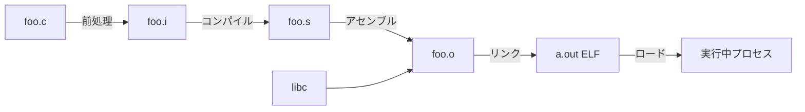

# システムソフトウェア（コンパイル・リンク・実行形式）

> 対応科目: Development of Secure Software / Capita Selecta: Secure Software ｜ 前: [02 プロセスと OS](./02_process-and-os.md) ｜ 次: [index.md](../03_hardware-digital-logic/index.md) ｜ 層: 基礎(Layer 1)

## 一言で

書いた C コードは、そのままでは CPU に読めない。5 段階の「翻訳」を経て実行ファイルになり、メモリに載って動く。
その翻訳結果（ELF）の構造と関数呼び出しの約束事を知ると、逆アセンブル解析や ROP 攻撃が腑に落ちる。

**この1ページで分かること**

- C ソースが実行プロセスになるまでの5段階と、各段階を担うツール
- ELF（Linux の実行ファイル形式）の主要セクションと、攻撃面になる GOT（外部関数のアドレス表）と PLT（それを参照する呼び出しスタブ）
- ROP（既存コード片を繋いで攻撃する手法）が呼び出し規約とスタックの仕組みからどう成り立つか

---

## 押さえる概念

### 最小の例: hello.c を段階ごとに止める

```bash
gcc -E hello.c -o hello.i   # 前処理だけ（#include が展開された巨大なテキスト）
gcc -S hello.i -o hello.s   # アセンブリまで（人間が読める機械語の手前）
gcc -c hello.s -o hello.o   # 機械語だが printf の住所は未解決
gcc hello.o -o hello        # リンクして完成
```

4 回に分けて実行すると、各段階の中間ファイルが手元に残る。

### ソースから実行中プロセスまでの5ステップ



| ステップ | 入力 | 出力 | 担当ツール |
|---|---|---|---|
| 前処理 | `.c`（`#include`/マクロ含む） | `.i`（展開済みソース） | `cpp`（`gcc -E`） |
| コンパイル | `.i` | `.s`（アセンブリ） | `cc1`（`gcc -S`） |
| アセンブル | `.s`（アセンブリ） | `.o`（オブジェクト） | `as` |
| リンク | `.o` + ライブラリ | 実行ファイル（ELF） | `ld` |
| ロード | 実行ファイル | メモリ上のプロセス | OS ローダー |

セキュリティ的に重要なのは **リンク** と **ロード** の段階（後述の GOT/PLT, ASLR）。

### ELF（Executable and Linkable Format）の概観

Linux の実行ファイル形式。中身は「セクション」と呼ぶ区画に分かれる（解析者が必ず見る箇所）:

| セクション | 内容 | 権限 |
|---|---|---|
| `.text` | 実行可能コード | R-X |
| `.rodata` | 読み取り専用データ（文字列リテラル等） | R-- |
| `.data` | 初期化済み書き込み可変数 | RW- |
| `.bss` | 未初期化書き込み可変数 | RW- |
| `.got` / `.got.plt` | グローバルオフセットテーブル（外部関数アドレス） | RW- |
| `.plt` | プロシージャリンケージテーブル（遅延束縛スタブ） | R-X |
| `.symtab` | シンボルテーブル（関数名・変数名とアドレスの対応） | （ロード対象外） |

`.bss` はサイズだけ記録され中身（ゼロ）はファイルに書かれない（ロード時に OS がゼロ埋めで確保）。
`.symtab` は `SHF_ALLOC` を持たずメモリに載らない（デバッグ・リンク専用。`strip` で消しても動く）。

**GOT 書き換え攻撃**: `.got.plt` に格納された `printf` のアドレスを `system` に書き換えると、  
次回 `printf()` 呼び出しが `system()` にリダイレクトされる。RELRO（`02_process-and-os.md`）はこれを防ぐ。

### 動的リンクと GOT/PLT

```
プログラム → PLT スタブ → GOT エントリ → 実際の libc 関数
                               ↑
                       ロード時 or 初回呼び出し時に動的リンカ（ld.so / rtld）が書き込む
```

動的リンク（ライブラリを実行時に結合）は実行ファイルが小さくなる反面、GOT という書き込み可能な
「関数の住所表」が攻撃面になる。Partial RELRO でも `.got.plt` は書き込み可。読み取り専用になるのは Full RELRO（`-z relro -z now`）のみ。

### 呼び出し規約とスタックフレーム（x86-64 System V ABI）

関数 `foo(int a, int b, int c)` の呼び出し時:

1. 引数 → `rdi`, `rsi`, `rdx`（最初の6引数はレジスタ渡し、以降はスタック）
2. `call foo` → リターンアドレスを `rsp` に push
3. `push rbp; mov rbp, rsp` → フレームポインタを設定
4. ローカル変数 → `rbp-8`, `rbp-16` … に配置
5. `ret` → スタックからリターンアドレスを pop して `rip` にセット

**ROP（Return-Oriented Programming）**: NX で新しいコードを実行できないとき、既存コード内の `…; ret` で終わる
小片（**ガジェット**）を、リターンアドレスの列で数珠つなぎにして任意の処理（例: `execve("/bin/sh", ...)`）を組む。

```
スタック（攻撃者が制御する状態）:
  [ガジェット1アドレス]  ← ret で飛ぶ
  [ガジェット2アドレス]  ← ガジェット1の ret で飛ぶ
  [ガジェット3アドレス]  ← ガジェット2の ret で飛ぶ
  ...
```

### デバッガと逆アセンブラの位置づけ

| ツール | 用途 | セキュリティでの役割 |
|---|---|---|
| `gdb` | デバッガ（動的解析） | エクスプロイト開発、脆弱性検証 |
| `objdump`, `readelf` | 静的解析（ELF 構造確認） | ガジェット探索、セクション確認 |
| `Ghidra`, `IDA` | 逆アセンブラ/デコンパイラ | バイナリ解析、マルウェア解析 |
| `pwntools` | CTF/エクスプロイト支援ライブラリ | ROP チェーン自動構築、通信処理 |

ラボ/プロジェクトおよび Capita Selecta: Secure Software で実際に使う可能性が高い。

### コンパイラのセキュリティオプション

```bash
gcc -fstack-protector-strong  # スタックカナリア有効化
gcc -D_FORTIFY_SOURCE=2       # 危険な標準関数の境界チェック強化
gcc -pie -fPIE                # PIE（Position-Independent Executable）
gcc -Wl,-z,relro,-z,now       # RELRO（Full RELRO）
```

`checksec` コマンドでバイナリに何の保護が入っているか一発確認できる。

---

## なぜ重要か / コースでの位置づけ

| 科目 | ここが効く場面 |
|---|---|
| Development of Secure Software | C 系脆弱性を「作る/読む/壊す/直す」。ラボで実バイナリを解析 |
| Capita Selecta: Secure Software | ROP・heap exploitation・fuzzing の前提として ELF 構造 |
| Software Lifecycle | 静的解析ツールがコード→バイナリのどの段階で何を検出するか |

---

## 演習（解答つき）

1. 宣言（プロトタイプ）はあるが定義（本体）を実装し忘れた関数を呼び出すコードは、コンパイル自体は
   通ることが多い。実際にはどの段階で失敗し、そのエラーは一般に何と呼ばれるか。
2. 未初期化のグローバル変数はどの ELF セクションに置かれるか。またそのセクションがファイルサイズを
   ほぼ消費しない理由を述べよ。
3. 静的リンクと動的リンクで、実行ファイルのサイズと GOT の要不要はどう変わるか。

<details><summary>解答</summary>

1. コンパイル・アセンブルは宣言（シグネチャ）だけで通り、`.o` には未解決のシンボル参照が残る。
   失敗するのは **リンク段階**で、`ld` がその関数の定義をどの `.o`/ライブラリにも見つけられず
   "undefined reference"（未定義参照）エラーになる。
2. `.bss`。ELF には「このセクションは何バイト」というサイズ情報だけが記録され、中身のゼロ値は
   ファイルに書き込まれない。ロード時に OS がそのサイズ分だけゼロ埋めのメモリページを確保するため、
   ファイルサイズにはほぼ影響しない。
3. 静的リンクはライブラリのコードを実行ファイルに埋め込むためサイズが大きくなるが、実行時に外部
   ライブラリを解決する必要がない。動的リンクは実行ファイルが小さくなる代わりに、実行時に
   GOT/PLT 経由で関数アドレスを解決する必要がある（GOT が必要になるのは動的リンクの場合のみ）。

</details>

---

## 次への接続

ソースコードから実行中プロセスに至る変換の全体像、ELF 構造、呼び出し規約と ROP の仕組みが揃った。
これで `01_prerequisites/02_low-level-c-os/` は完了。次の `03_hardware-digital-logic/` では、
ここまで前提としてきた「メモリ」「命令」「レジスタ」を支えるハードウェア層（CMOS 論理・組み合わせ/
順序回路・命令セットアーキテクチャ）を見ていく。ELF の命令バイト列が最終的にどんな論理回路で
解釈されるかがここでつながる。
→ [index.md](../03_hardware-digital-logic/index.md)

---

## つまずき / 深掘り候補

- [ ] ROP チェーン構築の実例（`pwntools` 使用） → `deep/rop/`
- [ ] x86-64 ABI 詳細（呼び出し規約全貌） → `deep/calling-convention/`
- [ ] `Ghidra` / `gdb` の基本操作 → `deep/debugging-tools/`
- [ ] GOT 書き換え攻撃の具体例 → `deep/got-overwrite/`
- [ ] macOS の Mach-O 形式（ELF との比較） → `deep/macho-vs-elf/`

---

## 参考

- Wikipedia — Executable and Linkable Format:
  https://en.wikipedia.org/wiki/Executable_and_Linkable_Format
- System V Application Binary Interface — AMD64 Architecture Processor Supplement (ABI 仕様):
  https://gitlab.com/x86-psABIs/x86-64-ABI
- Phrack — "Return-to-libc" 攻撃の古典的解説:
  https://phrack.org/issues/58/4.html
- Hovav Shacham. "The Geometry of Innocent Flesh on the Bone: Return-into-libc without Function Calls."
  *CCS 2007.* (ROP の提唱論文)
- pwntools ドキュメント: https://docs.pwntools.com/
- checksec.sh: https://github.com/slimm609/checksec.sh
