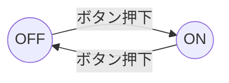

# 組合せ回路と順序回路

> 対応科目: Design of Digital Platforms: Concepts ／ Design Seminar ｜ 前: [01 CMOS 論理](./01_cmos-logic.md) ｜ 次: [03 HDL・アーキテクチャ](./03_hdl-and-architecture/README.md) ｜ 層: 基礎(Layer 1)

## 一言で

電卓のように「今の入力だけで答えが決まる」回路と、信号機のように「前の状態を覚えて動く」回路の 2 種類がある。
後者の「覚える」部品がフリップフロップ、覚えた状態で動きを切り替える設計図が FSM。

**この1ページで分かること**

- 組合せ回路（入力だけで決まる）と順序回路（状態を持つ）の違い、その境界にあるフリップフロップ（1ビット記憶素子）
- クロック周期を決めるタイミング制約と、セットアップ/ホールドの「窓」を破る故障注入攻撃の原理
- パイプライン化がなぜスループットを上げつつレイテンシを増やすか

## 押さえる概念

### 最小の例: 2 状態のスイッチ



同じ「ボタン押下」入力でも、今 OFF なら ON に、ON なら OFF になる。出力が入力だけでは決まらず**状態**に依存する。
これが順序回路（FSM）の最小形。状態を覚える 1 ビットの箱がフリップフロップ。

### 組合せ回路 (Combinational Logic)

出力 = f(現在の入力のみ)。代表例: 加算器、MUX（複数入力から 1 つ選ぶ）、エンコーダ/デコーダ、比較器。

| 実装の流れ | 内容 |
|---|---|
| 真理値表 → 論理式 | 積和形（SOP）か和積形（POS） |
| 論理式の最小化 | カルノー図（K-map）で 4 変数程度まで手動 |
| 論理式 → ゲート | NAND/NOR に落とす |

#### 加算器の例

```
半加算器:  S = A XOR B,   C_out = A AND B
全加算器:  S = A XOR B XOR C_in,   C_out = majority(A,B,C_in)
リップルキャリー加算器: 全加算器を n 段直列 → 遅延 O(n)
キャリー先見加算器（CLA）: 遅延 O(log n)、面積増加
```

遅延と面積のトレードオフがここでも現れる。

### 順序回路 (Sequential Logic)

出力 = f(現在の入力, 内部状態)。状態を保持する素子がフリップフロップとラッチ。

#### フリップフロップの種類

| 種類 | 動作 |
|---|---|
| D-FF | クロック立ち上がりで D の値を Q に取り込む（最も一般的） |
| JK-FF | J=1,K=0→セット、J=0,K=1→リセット、J=K=1→トグル |
| T-FF | T=1 でトグル（カウンタに利用） |
| SR ラッチ | 非同期・レベルセンシティブ（グリッチに弱い） |

**同期設計の原則**: 全フリップフロップを同じクロックエッジ（クロック信号が 0→1 に変わる瞬間）で動かす。非同期設計は避ける。

#### タイミング図: クロックと D-FF の動作（ASCII波形）

```
時間 →
CLK   _/‾‾\_/‾‾\_/‾‾\_/‾‾\_
           ↑    ↑    ↑    ↑
           t0   t1   t2   t3   （立ち上がりエッジで D を取り込む）

D     ──<  A  >──<  B  >──<  C  >──

Q     ──────<  A  >──<  B  >──<  C  >
             （t0 で A を取込み、Q は1クロック遅れて反映）
```

D-FF はエッジの瞬間だけ `D` を見て、それ以外は `Q` を保持する。この「保持」が記憶の正体。

#### タイミング制約

```
クロック周期 T ≥ t_cq + t_combo + t_setup

t_cq    : クロック→Q 遅延（FF の特性）
t_combo : 次段 FF までの組合せ遅延（クリティカルパス）
t_setup : 次段 FF のセットアップ時間
```

| 違反 | 原因 |
|---|---|
| セットアップ違反 | 組合せ遅延が大きすぎてクロック周期に収まらない |
| ホールド違反 | データが早く変わりすぎて FF が誤って取り込む |

#### セットアップ時間とホールド時間の「窓」（ASCII図）

```
                        クロック立ち上がりエッジ
                                │
D  ────────╳═══════════════════╪═══════════════╳────────
            │                  │               │
            │◄── t_setup ──►│◄── t_hold ──►│
            │  （エッジ前に D が安定） │ （エッジ後も D が安定）│
```

窓の間 `D` を変えると出力が不定（メタステーブル）になりうる。この窓を意図的に破らせる（クロック/電圧グリッチ）のが
故障注入攻撃、クリティカルパス遅延のデータ依存を測るのがタイミング攻撃。

### レジスタとレジスタファイル

レジスタ = D-FF を n 個束ねた n ビットの箱。レジスタファイル = CPU の汎用レジスタ群（番号で読み書き）。

### 有限状態機械 (FSM: Finite State Machine)

冒頭の 2 状態スイッチの一般形。状態集合 S、入力 Σ、出力 Λ、遷移関数 δ、出力関数 λ。

| 種類 | 出力の決まり方 |
|---|---|
| Mealy | 状態＋入力（λ: S×Σ → Λ） |
| Moore | 状態のみ（λ: S → Λ）。単純で同期設計と相性が良い |

実装は「状態遷移図を描く → 状態を 2 進数で符号化（Binary / One-hot / Gray）→ 次状態ロジック（組合せ）＋状態レジスタ（D-FF）」。
One-hot（状態ごとに 1 ビット）は FPGA で有利。

### パイプライン化

組合せ回路の途中にレジスタを挿入し、クリティカルパスを短縮する技法:

```
ステージ分割前: T ≥ t_A + t_B + t_C
ステージ分割後（3 段）: T ≥ max(t_A, t_B, t_C) + t_overhead   ← スループット向上
                        レイテンシ = 3T                          ← レイテンシ増大
```

CPU 設計の中核（→ `03_hdl-and-architecture/02`）。

## なぜ重要か / コースでの位置づけ

### Design of Digital Platforms

ゲート / RTL / アーキテクチャという抽象レベルはすべてこの 2 種の回路の上に立つ。Design Seminar の FPGA 実習では FSM・パイプライン設計を直接使う。

### Hardware Security への接続

| 攻撃 | この回路知識との関係 |
|---|---|
| タイミング攻撃 | クリティカルパス遅延がデータ依存 → 演算時間から鍵が漏れる |
| 故障攻撃 | グリッチでセットアップ/ホールド違反を起こし FSM や演算結果を改ざん |
| AES 実装への DPA | S-box は組合せ回路（ルックアップ表）。電力サイドチャネルの主要標的 |

## 演習（解答つき）

1. `t_cq = 0.2ns`、`t_combo = 1.5ns`、`t_setup = 0.3ns` のとき、成立しうる最小のクロック周期 `T` はいくらか。
2. セットアップ時間の窓とホールド時間の窓は、それぞれクロックエッジの前後どちらにあるか。
3. Mealy マシンと Moore マシンの出力の違いを一言で説明せよ。

<details><summary>解答</summary>

1. `T ≥ t_cq + t_combo + t_setup = 0.2 + 1.5 + 0.3 = 2.0ns`。最小周期は **2.0ns**（動作周波数の上限は 1/2.0ns = 500MHz）。
2. `t_setup` はエッジの**前**（データが安定していないとセットアップ違反）、`t_hold` はエッジの**後**（データが早く変わるとホールド違反）。
3. Mealy は出力が「状態＋現在の入力」で決まり、Moore は出力が「状態のみ」で決まる。

</details>

## 次への接続

組合せ回路と D-FF の基本ができたら、これらを HDL（Verilog/VHDL）でどう記述し、
どうパイプライン化して CPU アーキテクチャに組み上げるかへ進む。
→ [03 HDL・合成・コンピュータアーキテクチャ概観](./03_hdl-and-architecture/README.md)

## つまずき / 深掘り候補

- [ ] カルノー図の体系的な扱い方 → `deep/k-map/`
- [ ] 非同期 FIFO・クロックドメインクロッシング → `deep/cdc/`
- [ ] 故障攻撃（Fault Injection）の分類と対策 → `../../04_hardware-security/02_hardware-attacks.md` 参照後に `deep/fault-injection/`
- [ ] パイプラインの危険（ハザード）とフォワーディング → `03_hdl-and-architecture/02_pipelining-and-hazards.md` の深掘り候補として統合

## 参考

- M. Morris Mano & Michael D. Ciletti, *Digital Design* (6th ed.), Pearson — 組合せ/順序回路の標準教科書
- David Patterson & John Hennessy, *Computer Organization and Design* (RISC-V ed.), Morgan Kaufmann — FSM・パイプライン設計の実践例
- Eli Bozorgzadeh, UC Irvine lecture notes on Sequential Logic（Web 上で広く参照される入門資料）
