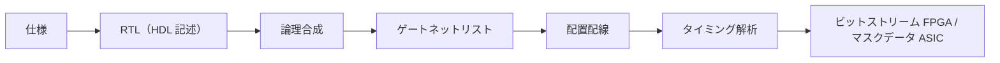

# 01. HDL の役割と設計フロー（Verilog/VHDL・FPGA/ASIC）

> 親: [README](./README.md) ｜ 次: [02 パイプラインとハザード](./02_pipelining-and-hazards.md) ｜ 層: 基礎(Layer 1)

回路図を手で描く代わりに、テキストで「この配線とこの配線を AND でつなぐ」と書けるのが HDL。
前ファイルの組合せ回路・D-FF をコードにし、それがどうチップになるかを追う。

**この1ページで分かること**

- HDL（回路をコードで書く言語）で、組合せ回路は `assign`、順序回路は `always`/`process` と書き分けること
- 仕様から実チップ（FPGA/ASIC）に至る設計フローと、タイミング違反を検出する段階
- FPGA（書き換え可）と ASIC（専用チップ）の使い分け

---

## 最小の例: 1 行の AND ゲート

```verilog
assign y = a & b;   // 配線 a と b を AND ゲートに入れ、出力を y につなぐ
```

ソフトの「代入」ではなく**配線の宣言**。`a` か `b` が変わればいつでも即 `y` が変わる（並行・常時動作）。
これが組合せ回路の書き方で、記憶を持たせたいときだけ次の `always` を使う。

## HDL とは何か

| 観点 | 内容 |
|---|---|
| 目的 | 回路動作をテキスト（コード）で記述・シミュレート・合成する |
| 主要言語 | **Verilog** / **VHDL**（業界標準。どちらも知っておくと良い） |
| SystemVerilog | Verilog の上位互換。検証（テストベンチ）機能が豊富 |

核心は「組合せ回路は `assign`、順序回路は `always`/`process`」の書き分け（前ファイルの分類がそのままコードに対応）。

### Verilog の最小コード例（D フリップフロップ、同期リセット付き）

```verilog
module dff (
    input  clk, rst_n, d,
    output reg q
);
    always @(posedge clk) begin
        if (!rst_n) q <= 1'b0;
        else        q <= d;
    end
endmodule
```

| 構文 | 意味 |
|---|---|
| `always @(posedge clk)` | クロックの立ち上がりごとに中身を実行（同期設計の基本形） |
| `<=`（ノンブロッキング代入） | 全レジスタを一斉に更新。順序回路ではこちらを使い `=` と混ぜない |

### VHDL の特徴（比較）

```vhdl
-- VHDL は型に厳格で、大規模設計の検証に向く
entity dff is
    port (clk, rst_n, d : in  std_logic;
          q             : out std_logic);
end entity;
architecture rtl of dff is
begin
    process(clk)
    begin
        if rising_edge(clk) then
            if rst_n = '0' then q <= '0';
            else                q <= d;
            end if;
        end if;
    end process;
end architecture;
```

VHDL は `entity`（外から見える端子）と `architecture`（中身）を分ける。冗長だが大規模設計での型検証・再利用に効く。

---

## 設計フロー（RTL → 実装）



| 段階 | 何をするか |
|---|---|
| RTL | レジスタ間のデータの流れとして書いた HDL |
| 論理合成 | HDL を標準セル（既製のゲート部品）に割り当てる。Design Compiler / Yosys |
| 配置配線 | セルをチップ上に置き、配線を引く |
| タイミング解析（STA） | セットアップ/ホールド違反を機械的に検出（前ファイルの制約がここで検証される） |

## FPGA vs ASIC

| 観点 | FPGA | ASIC |
|---|---|---|
| 柔軟性 | 高（再プログラム可） | 低（設計固定） |
| 性能 | 中（LUT のオーバーヘッド） | 高 |
| コスト（少量） | 低 | 非常に高（マスク代） |
| コスト（大量） | 高 | 低 |
| セキュリティ用途 | 迅速なプロトタイプ・研究 | 製品（HSM, セキュアエレメント） |

FPGA（書き換え可能なチップ。LUT＝小さな真理値表の集まりで回路を模倣）と ASIC（専用に焼いたチップ）で最適化方針が変わる。
暗号コアを ASIC に焼くなら、電力マスキング等の対策もこの段階で回路に織り込む
（[`../../../04_hardware-security/04_side-channels/README.md`](../../../04_hardware-security/04_side-channels/README.md)）。

---

## 演習（解答つき）

1. D フリップフロップの記述で、ノンブロッキング代入 `<=` ではなくブロッキング代入 `=` を
   使うとなぜ問題になりうるか。
2. 設計フローの中で「セットアップ/ホールド違反」を検出するのはどのステップか。
3. 少量生産の研究用プロトタイプと、量産するセキュアエレメント製品、それぞれに向くのは
   FPGA と ASIC のどちらか。

<details><summary>解答</summary>

1. ブロッキング代入は文が順番に即座に評価されるため、複数の always ブロックや複数信号の
   同時更新を意図した順序回路では意図しない中間値の伝播やシミュレーション/合成結果の不一致を
   招きやすい。ノンブロッキング代入はすべての右辺値を評価してから一斉に代入するため、
   「クロックエッジで全レジスタが同時に更新される」という順序回路の意味論と一致する。
2. **タイミング解析（STA）**。配置配線後のネットリストに対して静的にパス遅延を計算し、
   クロック周期に対する違反を検出する。
3. 研究用プロトタイプは変更が多く量産しないため **FPGA** が向く。量産するセキュアエレメントは
   性能・電力・単価を最適化でき設計も固定してよいため **ASIC** が向く。

</details>

---

## 次への接続

HDL で書けるのは D-FF や加算器といった部品まで。これらを組み合わせて「命令を1つずつ
流れ作業で処理する」パイプラインを作ると CPU になる。
→ [02 パイプラインとハザード](./02_pipelining-and-hazards.md)
