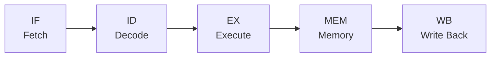

# 02. パイプラインとハザード（ISA・5段パイプライン・Spectre/Meltdown）

> 親: [README](./README.md) ｜ 前: [01 HDL の役割と設計フロー](./01_hdl-basics.md) ｜ 次: [03 メモリ階層とHW/SW協調設計](./03_memory-hierarchy-and-codesign.md) ｜ 層: 基礎(Layer 1)

[01](./01_hdl-basics.md) の D-FF やレジスタを流れ作業（パイプライン）に組み上げると CPU になる。
各ステージが同時並行で動くことでスループットが上がる一方、命令同士の依存関係が
「ハザード」を生む。このハザードの一種（投機実行に伴うもの）が Spectre/Meltdown の根拠になる。

**このページで分かること**

- CPU の5段パイプライン（IF/ID/EX/MEM/WB）が、なぜ毎サイクル1命令ずつ完了できるか
- 命令の依存が生むハザード（データ／制御）と、その回避策（フォワーディング＝結果を配線で先送り、分岐予測）
- 分岐予測に伴う投機実行が Spectre/Meltdown の足がかりになる理由

---

## 命令セットアーキテクチャ（ISA）概観

- CPU の「外から見えるインタフェース」。命令形式・レジスタ・メモリモデルを規定する
- 代表例: x86/x86-64（PC・サーバ）、ARM（スマホ・組込み）、RISC-V（オープン・研究用）
- この実習では 8/16 bit マイコン（AVR 等）への C 実装から始まり、ISA を意識する場面が出てくる

## 5段パイプライン（IF/ID/EX/MEM/WB）



| 略 | ステージ名 | 役割 |
|---|---|---|
| IF | Instruction Fetch | メモリから命令を取ってくる |
| ID | Instruction Decode | 命令を解読しレジスタを読む |
| EX | Execute | ALU 演算（加算・比較・アドレス計算） |
| MEM | Memory Access | ロード/ストアでデータメモリにアクセス |
| WB | Write Back | 結果をレジスタファイルに書き戻す |

各ステージは専用の回路（[01](./01_hdl-basics.md) の組合せ回路＋パイプラインレジスタ）を持ち、
同時に異なる命令を処理できる。

### パイプライン実行トレース（4命令・8サイクル）

```
          1    2    3    4    5    6    7    8
I1 (ADD)  IF   ID   EX   MEM  WB
I2 (SUB)       IF   ID   EX   MEM  WB
I3 (LW)             IF   ID   EX   MEM  WB
I4 (BEQ)                 IF   ID   EX   MEM  WB
```

`I1: ADD R1,R2,R3` → `I2: SUB R4,R1,R5` → `I3: LW R6,0(R4)` → `I4: BEQ R6,R0,L1` の4命令が
同時に流れている。サイクル 4 に注目すると、I1 が MEM・I2 が EX・I3 が ID・I4 が IF を**同時に**占有している。
1 命令の完了には 5 サイクルかかる（レイテンシは変わらない）のに、定常状態では毎サイクル
1 命令ずつ完了する（スループット向上）。これがパイプライン化の核心。

---

## データハザード

上のトレースで I2（`SUB R4,R1,R5`）は I1 が計算する `R1` を使う。I1 が `R1` をレジスタファイルに
書き戻す WB はサイクル 5 だが、I2 が値を読みたい ID はサイクル 3 ── そのままでは古い値を読んでしまう。

- **解決策（フォワーディング）**: I1 の EX 出力（サイクル 3 終了時点の ALU 結果）を、
  レジスタファイルを経由せず直接 I2 の EX 入力（サイクル 4）へ配線で渡す。これで I2 は
  停止（ストール）せずに正しい値を使える。
- フォワーディングでも救えないケース: **ロード直後に同じレジスタを使う命令**
  （上の I3 `LW R6,...` の結果を I4 が使う場合）。`R6` はサイクル 6 の MEM でようやく確定するため、
  I4 の EX（サイクル 6）には間に合わず、1 サイクルの**ストール**が必要になる（ロード-ユース・ハザード）。

## 制御ハザード

I4 が分岐命令 `BEQ` だとすると、分岐が成立するかどうかは EX（サイクル 6）まで分からない。
その間 IF は「分岐しない」前提で次の命令を投機的に取り込み続けている。分岐が成立していれば、
取り込んだ命令は**フラッシュ**（無効化）しなければならない。

- 対策: **分岐予測**（過去の履歴から成立/不成立を予測し、当たれば無駄なストールを避ける）
- 予測が外れた場合はパイプラインをフラッシュして正しい命令列を取り直す

## Spectre/Meltdown への接続

制御ハザード対策としての投機実行は、分岐先を「当たるつもり」で先に実行してしまう。
予測が外れて命令がフラッシュされても、**その投機実行中に触れたキャッシュの状態は元に戻らない**。
Spectre はこの性質を利用し、本来アクセスできないメモリ領域を投機的に読ませてから、
その値に依存するアドレスへのアクセス有無をキャッシュタイミングで観測して値を復元する
（キャッシュの詳細は [03](./03_memory-hierarchy-and-codesign.md)、攻撃の完全な手順は
[`../../../04_hardware-security/02_hardware-attacks.md`](../../../04_hardware-security/02_hardware-attacks.md)で扱う）。

---

## 演習（解答つき）

1. 上のトレース表で、サイクル 5 に IF・ID・EX・MEM・WB のどのステージにどの命令がいるか答えよ。
2. フォワーディングがあってもストールが必要になるハザードの例を1つ挙げ、理由を述べよ。
3. 分岐予測ミスがなぜ Spectre のようなサイドチャネル攻撃の足がかりになるのか、一文で説明せよ。

<details><summary>解答</summary>

1. I1: WB、I2: MEM、I3: EX、I4: ID。
2. ロード-ユース・ハザード（load-use hazard）。ロード命令の結果は MEM ステージが終わるまで
   確定しないため、直後の命令がそれを EX で使おうとしても間に合わず、フォワーディングだけでは
   救えず 1 サイクルのストールが必要になる。
3. 投機実行された命令はアーキテクチャ上の結果（レジスタ・メモリ）は破棄されても、
   実行中にアクセスしたキャッシュの状態は残るため、その残留状態をタイミング測定で読み取れば
   本来見えないはずのデータが間接的に漏れるから。

</details>

---

## 次への接続

パイプラインの MEM ステージが実際にアクセスするのがキャッシュ・DRAM を含む
メモリ階層。そのレイテンシ差が今度は別の種類のサイドチャネルを生む。
→ [03 メモリ階層とHW/SW協調設計](./03_memory-hierarchy-and-codesign.md)
