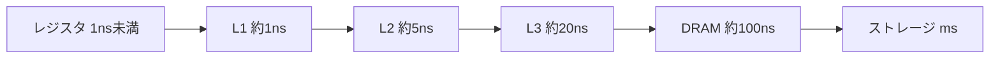

# 03. メモリ階層と HW/SW 協調設計

> 親: [README](./README.md) ｜ 前: [02 パイプラインとハザード](./02_pipelining-and-hazards.md) ｜ 層: 基礎(Layer 1)

机の上（速いが狭い）と本棚（遅いが広い）を使い分けるように、CPU のメモリも速さと容量の階層になっている。
「机にあったか本棚まで行ったか」の時間差が測れてしまうのがキャッシュサイドチャネル。

**この1ページで分かること**

- メモリが「速いが小さい」レジスタから「遅いが大きい」ストレージまで階層をなす理由
- L1 ヒットと DRAM ミスの 2 桁のレイテンシ差が、観測可能なサイドチャネル（Flush+Reload）になること
- HW/SW 協調設計が「どの処理を専用ハードにするか」をどう判断するか

---

## 最小の例: 同じ 1 回の読み込みで 100 倍違う

| 状況 | 所要時間 |
|---|---|
| 欲しいデータが L1 キャッシュにある（ヒット） | 約 1 ns |
| ない。DRAM まで取りに行く（ミス） | 約 100 ns |

たった 1 回の読み込みで 2 桁の差。ストップウォッチで測れば「直前に誰かがそのデータを使ったか」が分かる。

## メモリ階層



| 階層 | 目安レイテンシ | 特徴 |
|---|---|---|
| レジスタ | < 1 ns | CPU 内。容量は数十〜数百個 |
| L1 キャッシュ | ~1 ns | コアごと専有。数十 KB |
| L2 キャッシュ | ~5 ns | コアごと or 共有。数百 KB〜数 MB |
| L3 キャッシュ | ~20 ns | 複数コアで共有。数 MB〜数十 MB |
| DRAM（主記憶） | ~100 ns | GB オーダー |
| ストレージ（SSD/HDD） | ms〜 | GB〜TB オーダー |

下位ほど大容量・低速。**局所性**（最近使ったもの・近くのものは再び使われやすい）を利用して上位に置き、平均時間を下げるのがキャッシュ。

## キャッシュタイミングサイドチャネル

| 手法 | 手順 |
|---|---|
| Flush+Reload | 対象番地をキャッシュから追い出す → 被害者を動かす → 再アクセスの時間を測る。速ければ被害者が触った証拠 |
| Meltdown | 投機的に読んだ禁止領域の内容を、キャッシュの残留状態経由で復元（保護チェック完了前の一瞬をすり抜ける） |

攻撃手順・対策（定数時間アクセス、キャッシュ分割）は [`../../../04_hardware-security/04_side-channels/README.md`](../../../04_hardware-security/04_side-channels/README.md)。
ここでは「レイテンシの差＝観測可能な情報チャネル」という原理だけ押さえる。

## HW/SW 協調設計（HW/SW Co-Design）

HW/SW 協調設計の中心テーマ:

```
アプリケーションのプロファイリング → ホットスポット特定
  → ソフト実行 vs ハード実装 のトレードオフ評価
  → 専用ハードウェアブロック設計 + CPU インタフェース設計
  → FPGA 上で協調シミュレーション・検証
  → 性能・電力・面積の計測と比較
```

ホットスポット（時間を食う箇所）の多くはメモリアクセスが原因。キャッシュミスの多い処理はハード化してもメモリ待ちが残る。
設計指標のトレードオフは `../01_cmos-logic.md` の PPA と直結。

---

## 演習（解答つき）

1. L2 キャッシュがヒットする場合と、L2 でもミスして DRAM まで行く場合とで、
   アクセス時間はおよそ何倍違うか（上の表の目安値で概算せよ）。
2. Flush+Reload 攻撃で「速いアクセス」が観測されたとき、何が起きたと推測できるか。
3. HW/SW 協調設計のフローで、あるソフトウェア関数をハードウェアブロック化すべきかどうかを
   判断するのはどのステップか。

<details><summary>解答</summary>

1. L2 ヒットは ~5 ns、DRAM までのミスは ~100 ns なので、およそ **20 倍**の差になる。
2. 直前（または並行）して被害者プロセスがそのアドレスにアクセスし、データがキャッシュに
   載った状態になっていたと推測できる。
3. 「ソフト実行 vs ハード実装のトレードオフ評価」のステップ。プロファイリングで特定した
   ホットスポットについて、性能・電力・面積の見積もりを比較して判断する。

</details>

---

## 次への接続

サイドチャネルの具体的な攻撃手順（Flush+Reload の実装、Spectre/Meltdown の変種、
DPA との共通点）は、この領域の先にある専用ドメインで扱う。
→ [`../../../04_hardware-security/04_side-channels/README.md`](../../../04_hardware-security/04_side-channels/README.md)
