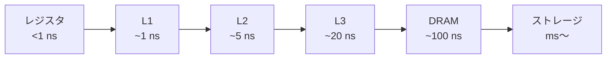

# 03. メモリ階層と HW/SW 協調設計

> 親: [README](./README.md) ｜ 前: [02 パイプラインとハザード](./02_pipelining-and-hazards.md) ｜ 層: 基礎(Layer 1)

[02](./02_pipelining-and-hazards.md) の MEM ステージが実際にアクセスするのは単一の均一なメモリではなく、
速度と容量がトレードオフになった階層構造。このレイテンシ差そのものが攻撃者の観測対象になる
（キャッシュタイミングサイドチャネル）。最後に、ここまでの部品・パイプライン・メモリの知識を
HW/SW 協調設計というシステム設計の枠組みでまとめる。

**このページで分かること**

- メモリが「速いが小さい」レジスタから「遅いが大きい」ストレージまで階層をなす理由
- L1 ヒットと DRAM ミスの 2 桁のレイテンシ差が、観測可能なサイドチャネル（Flush+Reload）になること
- HW/SW 協調設計が「どの処理を専用ハードにするか」をどう判断するか

---

## メモリ階層



| 階層 | 目安レイテンシ | 特徴 |
|---|---|---|
| レジスタ | < 1 ns | CPU 内。容量は数十〜数百個 |
| L1 キャッシュ | ~1 ns | コアごと専有。数十 KB |
| L2 キャッシュ | ~5 ns | コアごと or 共有。数百 KB〜数 MB |
| L3 キャッシュ | ~20 ns | 複数コアで共有。数 MB〜数十 MB |
| DRAM（主記憶） | ~100 ns | GB オーダー |
| ストレージ（SSD/HDD） | ms〜 | GB〜TB オーダー |

下位ほど大容量・低速。**局所性（時間的・空間的）**を利用して上位階層にデータを保持し、
平均アクセス時間を実効的に下げるのがキャッシュの役目。

## キャッシュタイミングサイドチャネル

L1 ヒット（~1 ns）と DRAM までのミス（~100 ns）ではアクセス時間に 2 桁の差がある。
この差は攻撃者から**測定可能**であり、「あるデータがキャッシュに載っているか」を知る手がかりになる。

- **Flush+Reload**: 対象アドレスをキャッシュから追い出し（Flush）、被害者プロセスの実行を挟んで
  再アクセス（Reload）した時間を測る。速ければ被害者がその間にそのアドレスを触った証拠。
- Meltdown はこれを使い、投機的に読んだ禁止領域のメモリ内容をキャッシュの残留状態経由で復元する
  （ページテーブルによるメモリ保護を、例外処理が完了する前に一瞬だけすり抜ける）。

具体的な攻撃手順・対策（定数時間アクセス、キャッシュ分割等）は
[`../../../04_hardware-security/04_side-channels.md`](../../../04_hardware-security/04_side-channels.md)
で扱う。ここでは「レイテンシの差＝観測可能な情報チャネルになる」という原理だけ押さえる。

## HW/SW 協調設計（HW/SW Co-Design）

HW/SW 協調設計の中心テーマ:

```
アプリケーションのプロファイリング → ホットスポット特定
  → ソフト実行 vs ハード実装 のトレードオフ評価
  → 専用ハードウェアブロック設計 + CPU インタフェース設計
  → FPGA 上で協調シミュレーション・検証
  → 性能・電力・面積の計測と比較
```

「ホットスポット」の多くはメモリアクセスパターンに起因する（キャッシュミス率が高い処理は
ハードウェア化してもメモリ待ちがボトルネックのままになりやすい）。設計指標
（遅延・スループット・面積・エネルギー・柔軟性）のトレードオフは `../01_cmos-logic.md` の
PPA モデルと直結する。

---

## 演習（解答つき）

1. L2 キャッシュがヒットする場合と、L2 でもミスして DRAM まで行く場合とで、
   アクセス時間はおよそ何倍違うか（上の表の目安値で概算せよ）。
2. Flush+Reload 攻撃で「速いアクセス」が観測されたとき、何が起きたと推測できるか。
3. HW/SW 協調設計のフローで、あるソフトウェア関数をハードウェアブロック化すべきかどうかを
   判断するのはどのステップか。

<details><summary>解答</summary>

1. L2 ヒットは ~5 ns、DRAM までのミスは ~100 ns なので、およそ **20 倍**の差になる。
2. 直前（または並行）して被害者プロセスがそのアドレスにアクセスし、データがキャッシュに
   載った状態になっていたと推測できる。
3. 「ソフト実行 vs ハード実装のトレードオフ評価」のステップ。プロファイリングで特定した
   ホットスポットについて、性能・電力・面積の見積もりを比較して判断する。

</details>

---

## 次への接続

サイドチャネルの具体的な攻撃手順（Flush+Reload の実装、Spectre/Meltdown の変種、
DPA との共通点）は、この領域の先にある専用ドメインで扱う。
→ [`../../../04_hardware-security/04_side-channels.md`](../../../04_hardware-security/04_side-channels.md)
