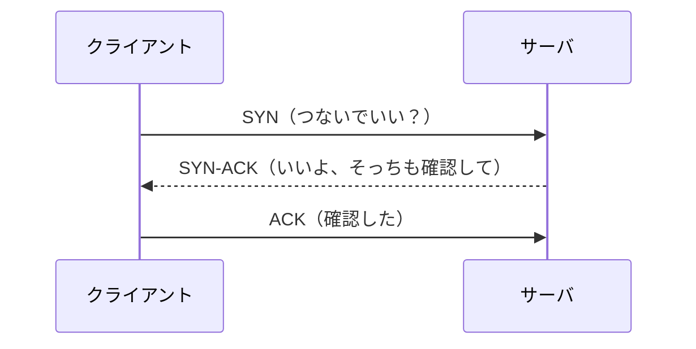

# ネットワークスタック（OSI / TCP/IP）

> 対応科目: Cryptography and Network Security, Development of Secure Software ｜ 次: [02 ネットワークサービス](./02_network-services.md) ｜ 層: 基礎(Layer 1)

## 一言で

手紙を送るとき、本文を書く人・封筒に入れる人・住所を見て運ぶ人は別々でよい。ネットワークも同じで、仕事を「層」に分ける。
攻撃も防御も「どの層の話か」で性質が変わる。

**この1ページで分かること**

- OSI 7層と TCP/IP 4層の対応、各層で動く代表プロトコル
- データが各層のヘッダで包まれていくカプセル化と、TCP の 3-way ハンドシェイク（SYN→SYN-ACK→ACK で接続確立する手順）
- 攻撃（スニッフィング・スプーフィング・SYN Flood 等）がどの層を標的にするか

---

## 押さえる概念

### 最小の例: TCP 接続は 3 行で始まる



これが 3-way ハンドシェイク。以後のデータはこの「合意済みの接続」の上を流れる。SYN だけ大量に送って応答を放置するのが SYN Flood 攻撃。

### OSI 7層モデル（参照モデル）

| 層番号 | 層名 | 役割 | 代表プロトコル |
|---|---|---|---|
| 7 | アプリケーション | ユーザー向けサービス | HTTP, SMTP, DNS |
| 6 | プレゼンテーション | データ形式・暗号化 | TLS（ここに位置づけられることもある） |
| 5 | セッション | 接続管理 | RPC |
| 4 | トランスポート | エンドツーエンド通信 | TCP, UDP |
| 3 | ネットワーク | 経路選択 | IP, ICMP |
| 2 | データリンク | 隣接ノード間通信 | Ethernet, WiFi（802.11） |
| 1 | 物理 | ビット伝送 | 光ファイバー, 電波 |

### TCP/IP 4層モデル（実装モデル）

OSI を実用的に統合したモデル。実際のインターネットはこちらで動く。

| TCP/IP 層 | 対応 OSI 層 | 主プロトコル |
|---|---|---|
| アプリケーション | 5–7 | HTTP, HTTPS, DNS, SMTP, SSH |
| トランスポート | 4 | TCP, UDP |
| インターネット | 3 | IPv4, IPv6, ICMP |
| ネットワークアクセス | 1–2 | Ethernet, WiFi |

### IP（インターネットプロトコル）

| 性質 | 意味 |
|---|---|
| アドレッシング | 送信元/宛先 IP アドレス（ネット上の住所）で識別 |
| ルーティング | ルーター（中継機）が次のホップ（1 区間先）へ転送。経路は変わりうる |
| ベストエフォート | 届く保証も順序の保証もない。重複もある |

### TCP（伝送制御プロトコル）

冒頭の 3-way ハンドシェイクで接続を張り、順序制御・再送・フロー制御（受け手の速度に合わせる）・輻輳制御（網の混雑を避ける）を提供する。
ポート番号（16 bit: 0–65535）で同じホスト上のプロセスを区別。

### UDP（ユーザーデータグラムプロトコル）

接続なし・保証なし。速さ優先の用途（DNS、動画配信、QUIC の土台）に使う。

### カプセル化の構造（ASCII図）

上位層のデータは下位層に渡るたびに**ヘッダ（宛名の付いた封筒）で包まれる**。受信側は逆順に剥がす。

```
[ Ethernet Header [ IP Header [ TCP Header [        データ        ] ] ] ]
   宛先/送信元MAC      TTL等        ポート等

┌────────────────────────────────────────────────────────┐
│ Ethernet Header                                         │
│ ┌──────────────────────────────────────────────────┐   │
│ │ IP Header                                         │   │
│ │ ┌──────────────────────────────────────────────┐ │   │
│ │ │ TCP Header                                    │ │   │
│ │ │ ┌───────────────────────────────────────┐    │ │   │
│ │ │ │      アプリケーション層データ           │    │ │   │
│ │ │ └───────────────────────────────────────┘    │ │   │
│ │ └──────────────────────────────────────────────┘ │   │
│ └──────────────────────────────────────────────────┘   │
└────────────────────────────────────────────────────────┘
     L2                L3            L4          L7
```

ルーターは L3 までしか見ないため、Ethernet ヘッダ（MAC アドレス＝機器固有の番号）は中継のたびに**付け替えられる**。

#### 各層ヘッダの主なフィールド

| 層 | ヘッダ長（目安） | 主なフィールド |
|---|---|---|
| L2 Ethernet | 14 bytes | 宛先 MAC アドレス, 送信元 MAC アドレス, EtherType |
| L3 IP（IPv4） | 20 bytes〜 | 送信元 IP, 宛先 IP, TTL, Protocol 番号, ヘッダチェックサム |
| L4 TCP | 20 bytes〜 | 送信元ポート, 宛先ポート, シーケンス番号, ACK 番号, フラグ（SYN/ACK/FIN/RST）, ウィンドウサイズ |

ファイアウォールの L3 フィルタ（IP のみ）と L4 フィルタ（ポート・フラグまで）の差は、どのヘッダまで見るかの差。

### ルーティングとスイッチング（概要）

| 機能 | 層 | 何を使って転送するか |
|---|---|---|
| スイッチング | L2 | MAC アドレス。同一ネットワーク内 |
| ルーティング | L3 | IP アドレス。ネットワーク間。静的経路か動的（OSPF, BGP） |
| NAT | L3 | 家庭内のプライベート IP と外のグローバル IP を変換 |

---

## なぜ重要か / コースでの位置づけ

| 科目 | ここが効く場面 |
|---|---|
| Cryptography and Network Security | IPSec は L3、TLS は L4 の上（OSI L5–6 相当）。プロトコルがどの層に乗るか |
| Development of Secure Software | ファイアウォール・IDS がどの層を監視するか |

**攻撃面として**

| 攻撃 | 標的層 | 概要 |
|---|---|---|
| スニッフィング（盗聴） | L1–2 | 暗号化されていないトラフィックを傍受 |
| IP スプーフィング | L3 | 送信元 IP アドレスを偽装 |
| TCP SYN Flood | L4 | 半開き接続を大量発生させ DoS |
| ARP スプーフィング | L2 | 各ホストの ARP テーブル（キャッシュ）を汚染し MitM を実現（スイッチの MAC アドレステーブル自体を狙う MAC フラッディングとは別の攻撃）|
| MitM（中間者攻撃） | L2–7 | 経路上でパケットを傍受・改ざん。実装手段で層が変わる（ARP=L2 / BGPハイジャック=L3 / SSLストリッピング=L7）|

TLS や IPSec はこれらを「暗号で防ぐ」ための機構であり、どの層に何の脅威があるかを知ることが設計の出発点。

---

## 演習（解答つき）

1. パケットが 2 台のルーターを経由して届くとき、Ethernet ヘッダと IP ヘッダはそれぞれホップごとに書き換えられるか？
2. ファイアウォールが「送信元ポート 22 番（SSH）宛のパケットを遮断する」設定をするには、L3 ヘッダと L4 ヘッダのどちらまで見る必要があるか。
3. カプセル化と非カプセル化（decapsulation）を、送信側・受信側それぞれの層の順序で書け。

<details><summary>解答</summary>

1. **Ethernet ヘッダはホップごとに付け替えられる**（送信元 MAC＝そのルーターの MAC、宛先 MAC＝次ホップの MAC）。
   **IP ヘッダは（NAT がなければ）送信元/宛先 IP は変わらない**が、TTL は 1 ホップごとに 1 減算され、
   ヘッダチェックサムは TTL 変化に合わせて再計算される。
2. L4（TCP ヘッダ）まで見る必要がある。ポート番号は L4 ヘッダにあり、L3（IP ヘッダ）だけでは
   宛先ホストは分かってもどのアプリ宛かは分からない。
3. 送信側（カプセル化）: アプリ → TCP ヘッダ付与 → IP ヘッダ付与 → Ethernet ヘッダ付与 → 物理層送信。
   受信側（非カプセル化）: 物理層受信 → Ethernet ヘッダ剥離 → IP ヘッダ剥離 → TCP ヘッダ剥離 → アプリへ。

</details>

---

## 次への接続

TCP/UDP の上に乗るアプリケーション層サービス（DNS・HTTP）と、その上でさらに暗号化を担う TLS の位置づけは
次ファイルで扱う。「どの層で何が起きるか」という本ファイルの視点は、TLS がどこに割り込むかを理解する前提になる。
→ [02 ネットワークサービス（DNS・HTTP・TLS・PKI）](./02_network-services.md)

---

## つまずき / 深掘り候補

- [ ] TCP 3-way ハンドシェイクの詳細 → `deep/tcp-handshake/`
- [ ] BGP ルーティングとセキュリティ（BGP ハイジャック） → `deep/bgp-security/`
- [ ] ARP スプーフィングの仕組みと対策 → `deep/arp-spoofing/`
- [ ] NAT と P2P 通信の関係（Tor など匿名通信への影響） → `deep/nat-traversal/`

---

## 参考

- Tanenbaum & Wetherall, *Computer Networks*, 5th ed. (Pearson, 2011) — 標準教科書
- RFC 791 (IPv4), RFC 793 (TCP), RFC 768 (UDP) — IETF 一次資料
