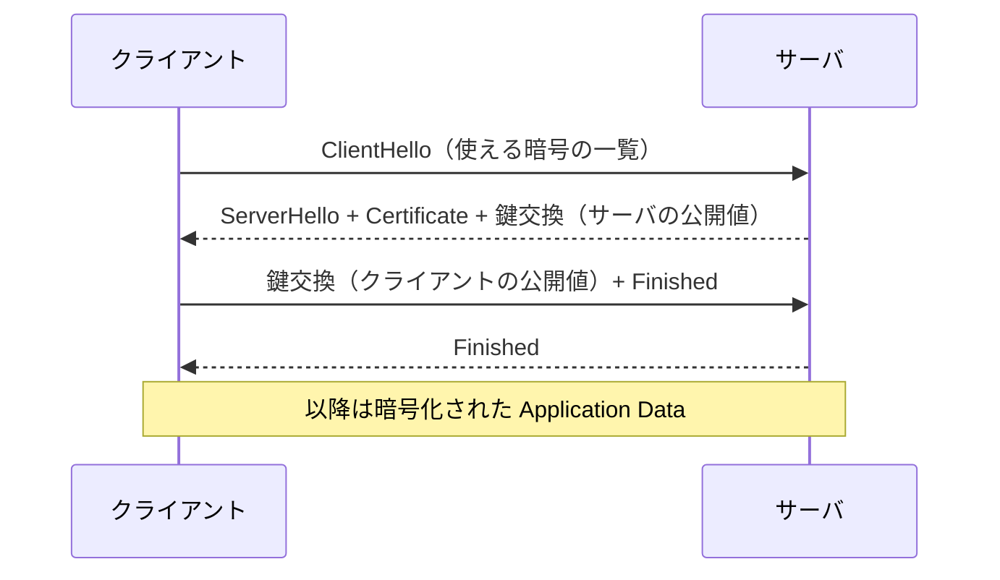

# ネットワークサービス（DNS・HTTP・TLS・PKI）

> 対応科目: Cryptography and Network Security, Cryptographic Protocols ｜ 前: [01 ネットワークスタック](./01_network-stack.md) ｜ 次: [03 確率・統計の基礎](./03_probability-statistics.md) ｜ 層: 基礎(Layer 1)

## 一言で

ブラウザに `example.com` と打つと、電話帳（DNS）で番号を調べ、鍵付きの回線（TLS）を張り、ページ（HTTP）を取る。
その「鍵の持ち主は本物か」を保証する仕組みが PKI。

**この1ページで分かること**

- DNS（ドメイン名→IP 変換）の階層的な名前解決と、平文・認証なしゆえの弱点（キャッシュポイズニング）
- TLS ハンドシェイク（通信開始時に鍵を共有する手順）が TLS 1.2 と 1.3 でどう違うか
- PKI が「この公開鍵は本当にこのドメインのものか」を CA の署名と信頼の連鎖でどう保証するか

---

## 押さえる概念

### 最小の例: 名前を 1 回引く

```
$ dig +short example.com
93.184.216.34
```

「名前 → IP アドレス」の変換 1 回。この応答が平文で認証もない、というのが DNS の弱点の全て。

### DNS（ドメイン名システム）

| 項目 | 内容 |
|---|---|
| 役割 | ドメイン名 → IP の分散データベース |
| 仕組み | クライアント → リゾルバ（代理で調べる係）→ ルート → TLD → 権威サーバの階層問い合わせ |
| プロトコル | UDP 53（小さなクエリ）/ TCP 53（大きな応答、ゾーン転送） |
| 弱点 | 平文・認証なし → キャッシュポイズニング（偽応答を覚えさせる）、Kaminsky 攻撃（2008） |
| 対策 | DNSSEC（応答に署名）、DNS over HTTPS/TLS（通信を暗号化） |

#### 名前解決の流れ（ASCII図）

```
① クライアント ──"example.com のIPは?"────────► リゾルバ
② リゾルバ     ──".com は?"───────────────────► ルートサーバ（.）
③ リゾルバ     ◄─"TLDサーバは a.gtld-servers.net"─ ルートサーバ（.）
④ リゾルバ     ──"example.com は?"─────────────► TLDサーバ（.com）
⑤ リゾルバ     ◄─"権威サーバは ns1.example.com"─── TLDサーバ（.com）
⑥ リゾルバ     ──"example.com の Aレコードは?"──► 権威サーバ（ns1.example.com）
⑦ リゾルバ     ◄─"93.184.216.34"───────────────── 権威サーバ（ns1.example.com）
⑧ クライアント ◄─"93.184.216.34"（TTL付きでキャッシュ）─ リゾルバ
```

②〜⑦がリゾルバの**反復問い合わせ**。DNSSEC は④〜⑦の各応答に署名検証の鎖を足す（暗号化ではなく真正性の保証）。

### HTTP / HTTPS

| | HTTP | HTTPS |
|---|---|---|
| 中身 | テキストの要求/応答。ステートレス（毎回忘れる。Cookie で補う） | TLS ハンドシェイク後に HTTP を流す |
| ポート | 80 | 443 |
| 保護 | なし | 機密性・完全性・サーバ認証 |

バージョンは HTTP/1.1 → HTTP/2 → HTTP/3（QUIC ベース）。

### TLS（Transport Layer Security）

TCP（L4）とアプリ（L7）の間に挟まる暗号化レイヤー。SSL → TLS 1.0/1.1（廃止）→ 1.2（現役）→ **1.3**（推奨）。

#### TLS 1.2 のハンドシェイク（2-RTT）



往復 2 回（2-RTT。RTT＝往復 1 回の時間）で鍵が揃う。TLS 1.3 は鍵交換を ClientHello/ServerHello に前倒しして 1-RTT にした。

- **ハンドシェイクの詳細（TLS 1.3）**:

```
クライアント                     サーバ
  ClientHello            →   （暗号スイート + key_share 拡張）
                         ←   ServerHello（key_share 応答）
                             {EncryptedExtensions}   ← ここから暗号化
                             {Certificate}
                             {CertificateVerify}
                             {Finished}
  （双方が鍵を独立に導出）
  {Finished}             →
  [Application Data]      ↔   [Application Data]
```

`{ }` は暗号化済み。ServerHello 直後から暗号化が始まり、証明書も隠れる。

| 保護 | 手段 |
|---|---|
| 鍵交換 | ECDHE など。前方秘匿性（PFS＝長期鍵が漏れても過去の通信は安全） |
| サーバ認証 | 証明書を PKI で検証 |
| 暗号化 | AES-GCM, ChaCha20-Poly1305（AEAD＝暗号化と改ざん検知を同時に行う方式） |

### PKI（公開鍵基盤）と証明書

- **問題**: Alice の公開鍵が本当に Alice のものかどうかを誰が保証するか？
- **解決**: **認証局（CA）** が「この公開鍵はこのドメインに属する」と署名した **X.509 証明書** を発行。
- **信頼の連鎖（Chain of Trust）**:

```
ルート CA（OSやブラウザに事前インストール）
  └─ 中間 CA
       └─ サーバ証明書（ドメイン名 + 公開鍵 + CA の署名）
```

| 項目 | 内容 |
|---|---|
| 証明書の中身 | Subject（ドメイン名）、公開鍵、発行者 CA、有効期限、署名アルゴリズム |
| 失効確認 | CRL（失効リスト）か OCSP（オンライン照会） |
| 弱点 | CA が侵害されると偽証明書が作れる（DigiNotar 事件 2011） |
| 対策 | Certificate Transparency（発行証明書を公開ログで監査） |

### ポートとソケット

ポート = ホスト内の窓口番号（16 bit）。1024 未満は要権限。SSH 22 / SMTP 25 / DNS 53 / HTTP 80 / HTTPS 443。
ソケット = IP + ポート + プロトコル。TCP 接続は（送信元 IP, 送信元ポート, 宛先 IP, 宛先ポート）の 4 組で一意。開いたポートは攻撃面。

---

## なぜ重要か / コースでの位置づけ

| 科目 / 文脈 | ここが効く場面 |
|---|---|
| Cryptography and Network Security | TLS の層上の位置と、ハンドシェイクで使う暗号部品 |
| Cryptographic Protocols | TLS・IPSec・SSH・Signal・4G ＝「鍵共有＋認証＋対称鍵通信」の組み合わせ |
| 攻撃の理解 | BEAST・POODLE・Heartbleed・CRIME/BREACH はプロトコル詳細の理解が前提 |
| 防御の連鎖 | DNS スプーフィング → フィッシング → PKI で防ぐ |

---

## 演習（解答つき）

1. DNSSEC は DNS の問い合わせ・応答を「盗聴されない」ようにするか？ 保証すること／しないことをそれぞれ答えよ。
2. TLS ハンドシェイクで、クライアントはサーバの証明書をどうやって信頼するか（Chain of Trust の観点で）説明せよ。
3. `https://example.com:443` への接続を識別するソケットの4組（4-tuple）を一般形で書け。

<details><summary>解答</summary>

1. DNSSEC が保証するのは応答の**真正性・完全性**（電子署名により改ざん・なりすましを検知できる）のみ。
   **機密性（盗聴防止）は保証しない**——応答は依然として平文で流れる。盗聴を防ぐには DNS over HTTPS/TLS が別途必要。
2. サーバ証明書に付いた CA の署名を検証し、中間 CA → ルート CA へと**信頼の連鎖**をたどる。
   最終的に OS/ブラウザに事前インストールされたルート CA の公開鍵で検証できれば信頼する。
   加えて証明書の Subject（ドメイン名）が接続先ホスト名と一致するかも確認する。
3. `(送信元 IP, 送信元ポート, 宛先 IP, 宛先ポート)` = `(クライアントIP, エフェメラルポート, example.comのIP, 443)`。
   この4組が変われば別のTCP接続として扱われる。

</details>

---

## 次への接続

TLS の安全性は「鍵長がどれだけの探索コストに耐えるか」「ハッシュの衝突確率がどれだけ小さいか」という
確率論的な議論に帰着する（例: SHA-1 の誕生日攻撃、鍵空間の全数探索コスト）。
次ファイルで確率・統計の基礎を固め、この直感を数式で裏付ける。
→ [03 確率・統計の基礎](./03_probability-statistics.md)

---

## つまずき / 深掘り候補

- [ ] TLS 1.3 ハンドシェイクの全フロー → `deep/tls-handshake/`
- [ ] X.509 証明書フォーマットの詳細 → `deep/x509-cert/`
- [ ] DNSSEC の署名チェーン → `deep/dnssec/`
- [ ] OCSP stapling と Certificate Transparency → `deep/cert-transparency/`
- [ ] IPSec のトンネルモードとトランスポートモード → `deep/ipsec-modes/`

---

## 参考

- RFC 8446: The Transport Layer Security (TLS) Protocol Version 1.3 — IETF 一次資料
- RFC 5280: Internet X.509 Public Key Infrastructure Certificate — IETF 一次資料
- Rescorla, E., *SSL and TLS: Designing and Building Secure Systems* (Addison-Wesley, 2001)
- Let's Encrypt による CA/PKI の平易な解説: https://letsencrypt.org/how-it-works/
