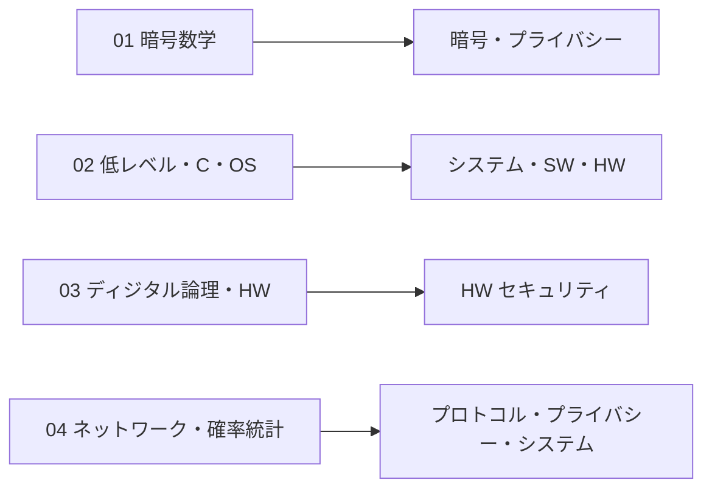

# 01. 前提知識（学部レベル）

> 層: 地図 (Layer 0)

各領域が前提とする学部レベルの知識を 4 サブ領域で復習する。全部読む必要はなく、「主に効く柱」の列から自分の弱い柱に繋がるものを選べばよい。

## 読む順

| # | サブ領域 | 主に効く柱 | 入口 |
|---|---|---|---|
| 01 | 暗号数学（離散数学・数論・有限体・情報理論） | 暗号、プライバシー | [01_math-for-crypto/](01_math-for-crypto/index.md) |
| 02 | 低レベル・C・OS | システム、ソフトウェア、HW | [02_low-level-c-os/](02_low-level-c-os/index.md) |
| 03 | ディジタル論理・HW | HWセキュリティ | [03_hardware-digital-logic/](03_hardware-digital-logic/index.md) |
| 04 | ネットワーク・確率統計 | 暗号（プロトコル）、プライバシー、システム | [04_networks-probability/](04_networks-probability/index.md) |

深掘りキュー（このフォルダ起点）

- （空）

## 参考

- [../00_overview/01_program-structure.md](../00_overview/01_program-structure.md)
