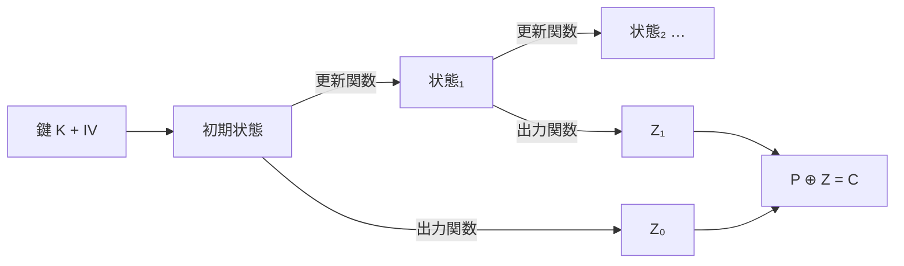

# 01. ストリーム暗号と LFSR

> 親: [README](./README.md) ｜ 次: [02 ブロック暗号の設計思想](./02_block-cipher-architecture.md) ｜ 層: 基礎(Layer 1)

**この1ページで分かること**

- ストリーム暗号を有限状態機械として見る枠組みと、IV が必要になる原理
- LFSR がなぜ「効率的だが線形ゆえに脆い」のか
- A5/1・E0 が非線形性をどう作ったか、RC4 の欠陥がなぜ IV の欠如に行き着くか

ストリーム暗号は「短い鍵から長い乱数列（キーストリーム）を作り、平文に XOR で重ねる」方式。OTP（使い捨ての完全乱数鍵）の鍵配送問題を、鍵を**生成**することで回避する。

## 最小の例: 4 bit を 2 通、同じ鍵ストリームで送ると

```
Z  = 0110           鍵と IV から生成したキーストリーム
P₁ = 1011 → C₁ = P₁ ⊕ Z = 1101
P₂ = 0001 → C₂ = P₂ ⊕ Z = 0111
C₁ ⊕ C₂ = 1010 = P₁ ⊕ P₂   ← Z が消え、平文同士の関係が漏れる
```

「同じ Z を二度使わない」をどう保証するか——それが以下すべての節の主題（IV・状態・nonce）。

---

## ストリーム暗号を状態機械として見る



復号は暗号化と**同一の処理**（XOR は自分自身の逆演算）。ただし**送受信のクロックが完全同期**している必要があり、1 bit ずれると以降すべて復号できない。同じ鍵・同じ IV で 2 回暗号化すると上の最小の例が起きる。

---

## IV の必要性という原理

**安全な暗号には乱数性か状態性のどちらかが必要**という一般原理がここで初めて現れる。IV（Initialization Vector: 同じ鍵で毎回違う Z を作るための公開値）がそれを担う。

| 満たし方 | 具体 | 注意 |
|---|---|---|
| 乱数性 | 毎回ランダムな IV | 衝突しない長さが要る |
| 状態性 | カウンタで必ず異なる値 | 状態の保持と同期が要る |

この原理は [04](./04_modes-and-aead.md) の CBC・CTR でも同じ形で再登場する。
初期化はメッセージごと 1 回なのでコストをかけてよく、以降の出力生成は軽くできる——**初期化を重く、出力を軽く**。

---

## LFSR：効率的だが線形ゆえに脆い

```
状態: n ビットのレジスタ
更新: 特定のタップ位置の XOR を計算し、それを最下位ビットとして押し込みながら全体をシフトする
```

更新は**可逆**。Fibonacci 型（帰還を 1 点に集約）と Galois 型（複数位置に分散）の 2 実装がある。原始多項式を使えば**最大周期** `2^n − 1` が保証される。

**しかし線形性が致命的。** 出力を直接キーストリームにすると、既知の出力から**連立一次方程式**で状態が復元できる（[有限体上の線形代数](../../01_prerequisites/01_math-for-crypto/02_groups-rings-fields/README.md)がそのまま攻撃道具）。**総当たりでなく方程式を解くだけで破れる。**

---

## 非線形性を入れる2つの方法

| 方法 | どこを非線形に | 代償 |
|---|---|---|
| ① filtered LFSR | 出力関数（複数 LFSR の組み合わせ） | — |
| ② NFSR | 帰還そのもの | 周期の理論が使えない |

A5/1・E0 は①: **LFSR は線形のまま、組み合わせ方に非線形性を持たせる**。

---

## A5/1（GSM）

3 本の LFSR（19・22・23 bit、計 64 bit）。出力を XOR するだけなら線形にとどまる。
非線形性は**クロック制御**で入れる: 各 LFSR のクロッキングビットの**多数決**と一致するレジスタだけが動く（毎回 2 or 3 本）。**「動くか動かないか」が非線形演算**で、どれが動いたか外から見えないため連立方程式に落ちない。

---

## E0（Bluetooth）

4 本の LFSR（25・31・33・39 bit）を**4 bit 内部メモリ付きの状態機械**で結合。毎クロック 4 本から 1 bit ずつ足し、内部メモリと XOR し、メモリも非線形更新する。A5/1 より複雑だが**複雑＝安全ではない**——のちに鍵回復攻撃が示された。

---

## RC4：IV が設計に無かったという欠陥

RC4 は KSA（鍵スケジューリング）と PRGA（疑似乱数生成）の2段構成を持つ。

```
KSA:  恒等置換から始め、鍵に依存した256回のスワップで置換 S を作る
PRGA: インデックス i, j を進めながら S をスワップし続け、
      S[(S[i] + S[j]) mod 256] を1バイトずつ出力する
```

破られ方の詳細（弱鍵・出力の統計的偏り）は [Crypto I 講義ノート](../../courses/coursera-crypto1/03_stream-ciphers/04_real-world-stream-ciphers.md)が本体。ここでは構造上の欠陥 1 点——**RC4 には IV が設計に無かった**。
複数メッセージには毎回違う Z が要るのに IV が無いので、運用側は**鍵の一部を IV に流用**した。攻撃者が鍵の一部を知る・選べる状況が生まれ、WEP（無線 LAN 旧規格）の破綻に直結。**設計時の欠落は運用で必ず埋め合わせを強いられる。**

---

## 近代ストリーム暗号：ChaCha20

D. J. Bernstein 設計、Salsa20 の改良版、256 bit 鍵。MAC の Poly1305 と組んだ **ChaCha20-Poly1305** が RFC 8439（2018）で標準化され、AES ハードウェア支援のない環境で TLS の既定候補。
eSTREAM 以降の教訓は「PRG は鍵に加えて nonce（一度きりの公開値）を明示的に取る」——RC4 への反省そのもの。

> 最近では FHE のような特殊な計算環境向けに、ストリーム暗号の設計が再び注目されている。
> 詳細は [06](./06_permutation-based-and-challenges.md) を参照。

---

## 演習（解答つき）

1. 同じ鍵・同じ IV でメッセージを2通暗号化すると何が漏れるか。
2. LFSR の出力を直接キーストリームとして使ってはいけない理由を述べよ。
3. RC4 に IV が無いことが、なぜ WEP の破綻に直結したか説明せよ。

<details><summary>解答</summary>

1. 同じキーストリームが2回使われるため、2つの暗号文の XOR を取るとキーストリームが
   打ち消し合い、**2つの平文の XOR がそのまま得られる**。平文には冗長性があるため、
   ここから元の平文を復元できる。
2. LFSR の更新は線形であり、既知の出力ビットから状態を**連立一次方程式**として
   復元できてしまう。方程式を解くだけで初期状態が確定し、以降の全出力が予測できる。
3. 安全なストリーム暗号には「乱数性か状態性」のどちらかが必要で、通常は IV がそれを担う。
   RC4 の設計に IV が無かったため、運用側は複数メッセージを暗号化するために
   **鍵の一部を IV として流用**するしかなかった。これにより攻撃者が鍵の一部を
   知る・制御できる状況が生まれ、鍵回復に繋がる攻撃を許した。

</details>

---

## 次への接続

ストリーム暗号は「短い鍵から長い出力を作る」設計だった。
次はもう一方の系統——固定長ブロックを変換する**ブロック暗号**を、
その設計思想の系譜からたどる。
→ [02 ブロック暗号の設計思想](./02_block-cipher-architecture.md)

---

## 参考

- Golić, J. (1997). *Cryptanalysis of Alleged A5 Stream Cipher*. EUROCRYPT.
- Bertoni, G. et al. *A Uniform Framework for Cryptanalysis of the Bluetooth E0 Cipher*.
- Bernstein, D.J. (2008). *ChaCha, a variant of Salsa20*.
- RFC 8439 — ChaCha20 and Poly1305 for IETF Protocols: https://www.rfc-editor.org/rfc/rfc8439.html
