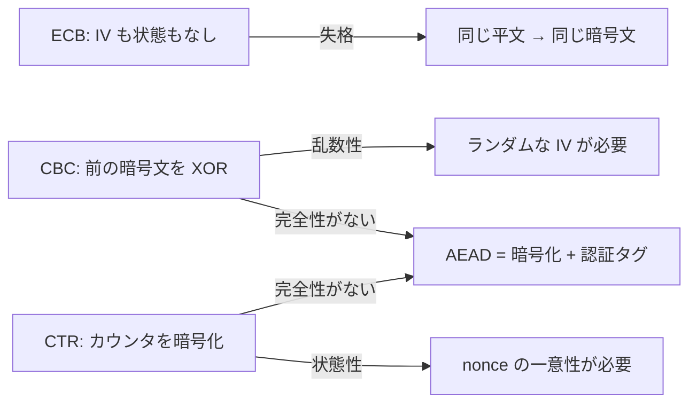

# 04. モードと AEAD

> 親: [README](./README.md) ｜ 前: [03 AES の内部構造](./03_aes-internals.md) ｜ 次: [05 ブロック暗号からハッシュへ](./05_hashing-from-block-ciphers.md) ｜ 層: 基礎(Layer 1)

**この1ページで分かること**

- モードとは「安全性証明の仮定を守るための使い方の規則」であること
- CBC のバースデー境界が「なぜ 2^(n/2) ブロックで危険になるか」の数学的な理由
- CCM/OCB/GCM という3つの AEAD 方式の違い

AES は 1 ブロック（128 bit）しか暗号化できない。長いメッセージを同じ鍵で**安全に**扱う規則が「モード」、機密性に完全性を足したものが AEAD。

## 最小の例: 2 ブロックを ECB で暗号化すると

```
平文   [ HELLO ][ HELLO ]      同じ内容のブロックが 2 つ
ECB    [ 9f3a… ][ 9f3a… ]      同じ暗号文が 2 つ → 「同じ内容だ」と鍵なしで分かる
CBC    [ 9f3a… ][ 41c7… ]      前の暗号文を混ぜるので別物になる
```

ブロック暗号は決定論的（同じ鍵・同じ入力 → 同じ出力）。モードとはこの決定論性を隠すため**毎回異なる入力を与える規則**で、[01](./01_stream-ciphers-and-lfsr.md) の原理がそのまま効く: **乱数性（ランダム IV）か状態性（カウンタ）が必要**。



---

## ECB：モードとして失格

各ブロックを鍵だけで独立に暗号化する決定論的暗号化。[IND-CPA](../03_public-key-crypto/05_security-definitions-and-kem.md)（攻撃者が選んだ 2 平文のどちらの暗号文か見分けられない性質）を即座に破る。ECB で暗号化した画像がシルエットとして読める例が有名。

---

## CBC：連鎖で決定論性を壊す

```
C_0 = IV
C_i = Enc(k, P_i XOR C_{i-1})
```

直前の暗号文と XOR してから暗号化するので、同じ平文ブロックでも文脈が違えば別の暗号文になる。**IV はランダムかつ予測不能**でなければならない——予測できると攻撃者が XOR 差分を仕込める（BEAST 攻撃）。

### バースデー境界の導出

CBC の証明はブロック暗号を PRP（ランダム置換）とみなすが、**置換は関数と違って衝突しない**。この差が長く使うと安全性を崩す。

```
n bit ブロックで q 個の暗号文を作ると、真のランダム関数と区別できる確率 ≈ q² / 2^(n+1)
```

[バースデーパラドックス](../../01_prerequisites/04_networks-probability/03_probability-statistics.md)と同じ数学（ペア数は q の 2 乗で増える）。`C_i = C_j` が起きると `P_i ⊕ C_{i−1} = P_j ⊕ C_{j−1}` から平文同士の関係が漏れる。

| ブロック長 | 危険域 | 実際 |
|---|---|---|
| 64 bit（DES・3DES・Blowfish） | `2^32` ブロック ≈ 32 GB | TLS/VPN で到達しうる → Sweet32 (2016)、3DES 廃止 |
| 128 bit（AES） | `2^64` ブロック | 実務上まず到達しない |

### CBC パディングオラクル

最終ブロックにパディングが要る。**復号時にパディングの正否を外から観測できる**と[復号オラクル](../03_public-key-crypto/05_security-definitions-and-kem.md)が実現し、鍵なしで平文を 1 バイトずつ復元できる（POODLE）。**エラーの有無という 1 bit の漏洩で崩れる**——CCA2 安全性が実務で要る実例。

---

## CTR：ブロック暗号をストリーム暗号に変える

```
Keystream_i = Enc(k, Nonce || Counter_i)
C_i = P_i XOR Keystream_i
```

ブロック暗号を**キーストリーム生成にだけ**使う——[01](./01_stream-ciphers-and-lfsr.md) の構図そのもので、カウンタ（状態性）が要件を満たす。暗号化=復号・並列化可・パディング不要。**ただし nonce 再利用は致命的**（同じキーストリームの再利用 = [01](./01_stream-ciphers-and-lfsr.md) の破局）。

---

## なぜ機密性だけでは足りないのか

CBC も CTR も**機密性**は与えるが**完全性**（改ざんされていない保証）は与えない。CTR では暗号文の 1 バイトを XOR で書き換えれば平文の同じ位置を狙って変えられる——読めなくても意味のある改ざんができる。パディングオラクルも同根（改ざんを検査していない）。**両方が必要**——この認識が AEAD を生んだ。

---

## AEAD という単一概念

AEAD（Authenticated Encryption with Associated Data、関連データ付き認証暗号）は**暗号化と認証を 1 つの操作にまとめる**。

```
Enc(k, N, P, AD) → (C, T)     N: nonce, AD: 平文にしないが認証はしたいデータ, T: 認証タグ
Dec(k, N, C, AD, T) → P か ⊥   タグ検証に失敗すれば ⊥（復号結果を一切返さない）
```

AD はパケットヘッダのように**暗号化はしないが改ざんは検出したい**データ。認証の対象に含めつつ平文のまま送れる。

### CCM / OCB / GCM の比較

| | CCM | OCB | GCM |
|---|---|---|---|
| 構成 | CTR + CBC-MAC（2パス） | 専用の1パス構成 | CTR + GHASH（1.5パス、並列化可） |
| 速度 | 遅い（暗号化と MAC を別々に計算） | 最速（1パス） | 高速（GHASH は並列計算可能） |
| nonce 再利用時の被害 | 深刻（鍵回復につながりうる） | 深刻 | **特に深刻**（認証鍵 H が漏れ、偽造が可能になる） |
| 採用状況 | Wi-Fi (WPA2/3), Bluetooth LE | 特許問題の歴史ありライセンス整理後普及限定的 | **TLS 1.3, IPsec で主流** |
| 標準 | NIST SP 800-38C | RFC 7253 | NIST SP 800-38D |

**GCM が主流**なのは CTR ベースで並列化・AES-NI との相性が良いため。ただし**同じ鍵・nonce を二度使うと認証鍵が計算でき、以降の暗号文を自由に偽造できる**——nonce 管理の重要性がここでも繰り返される。

### タグ長は鍵長より短くてよい

タグは **96 bit や 64 bit** に切り詰めて使う（GCM 既定 96 bit）。鍵の総当たりは `2^鍵長` 回の探索だが、タグ偽造は「1 回の送信が `2^(−タグ長)` で通る」当てずっぽう。**偽造成功確率をどこまで許容するか**という運用上のトレードオフで選ぶ。

---

## 演習（解答つき）

1. ECB が「モードとして失格」とされる理由を、決定論的暗号化の観点から述べよ。
2. 64bit ブロック暗号（3DES）を長時間の TLS 接続で使うと危険な理由を、
   バースデー境界の数式を使って説明せよ。
3. GCM で nonce を再利用した場合の被害が、CTR 単体での nonce 再利用より深刻なのはなぜか。

<details><summary>解答</summary>

1. ECB は IV もカウンタも使わず、鍵だけで各ブロックを独立に暗号化する。
   同じ平文ブロックは常に同じ暗号文ブロックになるため、これは決定論的暗号化そのものであり、
   平文の繰り返しパターン（構造）が暗号文にそのまま透けて見えてしまう。
2. バースデー境界はおおよそ `q^2 / 2^(n+1)` のオーダーで衝突確率が増加する。
   `n=64` の場合、`q ≈ 2^32` ブロック（約32GB）付近で衝突確率が無視できなくなる。
   長時間の TLS 接続はこの量のデータを現実的にやり取りしうるため、
   ブロックの衝突から平文ブロック同士の XOR 関係が漏れる危険域に入る。
3. GCM の認証は GHASH が使う認証鍵 H に依存しており、H は nonce ごとに導出される
   キーストリームの一部から間接的に得られる。同じ鍵・nonce で2回暗号化すると、
   2つの暗号文から H を計算で求められてしまい、以降**任意の暗号文に対して
   正しく検証が通るタグを偽造できる**——機密性の破綻（CTR と同型）に加えて、
   完全性の保証そのものが失われる点が単なる CTR の nonce 再利用より深刻である。

</details>

---

## 次への接続

ここまではブロック暗号を暗号化に使ってきた。同じ構成要素（ブロック暗号）を、
今度はハッシュ関数を作るための道具として使う方法を見る。
→ [05 ブロック暗号からハッシュへ](./05_hashing-from-block-ciphers.md)

---

## 参考

- NIST SP 800-38A — Recommendation for Block Cipher Modes of Operation
- NIST SP 800-38C — Recommendation for Block Cipher Modes of Operation: CCM
- NIST SP 800-38D — Recommendation for Block Cipher Modes of Operation: GCM and GMAC
- RFC 7253 — The OCB Authenticated-Encryption Algorithm
- Sweet32: Birthday attacks on 64-bit block ciphers in TLS and OpenVPN (2016): https://sweet32.info/
- CISA — SSL 3.0 Protocol Vulnerability and POODLE Attack (2014): https://www.cisa.gov/news-events/alerts/2014/10/17/ssl-30-protocol-vulnerability-and-poodle-attack
