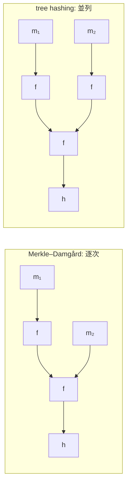

# 05. ブロック暗号からハッシュへ

> 親: [README](./README.md) ｜ 前: [04 モードと AEAD](./04_modes-and-aead.md) ｜ 次: [06 置換ベース暗号と未解決問題](./06_permutation-based-and-challenges.md) ｜ 層: 基礎(Layer 1)

**この1ページで分かること**

- 任意長の入力をどう固定長のブロック処理に落とし込むか（MD パディング）
- ブロック暗号から圧縮関数を作る3つの構成（Davies-Meyer 系）
- 「非標準の仮定を置く」ことがなぜ危険なのか

ハッシュ関数は「どんな長さの入力も固定長に潰す」関数だが、中身は**ブロック暗号の応用**で作れる。MD4・MD5・SHA-1・SHA-2 はこの方式。

## 最小の例: 2 ブロックの文書をハッシュする

```
h₀ = 決められた初期値
h₁ = f(h₀, m₁)        f は「直前の値とブロックを混ぜて固定長を返す」圧縮関数
h₂ = f(h₁, m₂ ‖ pad)  最後のブロックには長さ情報つきの詰め物を足す
ハッシュ値 = h₂
```

「前の出力を次の入力に」の鎖が **Merkle–Damgård**。この `f` をブロック暗号 `E` からどう作るかが本題。

---

## tree hashing vs Merkle–Damgård



MD4 系譜はすべて Merkle–Damgård——当時は並列計算より**実装の単純さと省メモリ**が優先された。tree hashing は並列化に向くが複雑で、BLAKE3 など近年の設計が採用する。

---

## MD パディング：任意長を固定長ブロックに揃える

入力をブロックサイズの倍数に揃える手順。

```
① メッセージの末尾に 1 ビットの "1" を付加する
② 続けて "0" を、次のブロック境界の少し手前まで埋める
③ 最後に、元のメッセージの「長さ」を固定長のフィールドとして書き込む
```

**長さを刻む理由**は長さ拡張攻撃の防止ではなく（それは残る。[04](../04_hash-and-mac.md)）、**パディングの曖昧性を消す**こと。長さがなければ末尾に 0 が並ぶ異なる長さの 2 メッセージが同じブロック列になりうる。長さ情報を含む最終ブロックは実装上も別処理になる。

---

## ブロック暗号を圧縮関数に変える：Davies–Meyer 系

圧縮関数 `f(h, m)`（`h`: 直前のチェイン値、`m`: 現在のブロック）をブロック暗号 `E` から作る 3 標準構成:

| 構成 | 式 | 鍵に使う |
|---|---|---|
| Davies–Meyer | `E_m(h) ⊕ h` | メッセージ |
| Matyas–Meyer–Oseas | `E_h(m) ⊕ m` | チェイン値 |
| Miyaguchi–Preneel | `E_h(m) ⊕ m ⊕ h` | チェイン値（h も混ぜ戻す） |

**共通の仕掛け**——ブロック暗号は鍵を知れば可逆だが、**入力を XOR で混ぜ戻す**ことで可逆性を壊し一方向性を作る。SHA-1・SHA-2 は Davies–Meyer。

---

## 落とし穴：非標準の仮定を置くこと

証明は**内部のブロック暗号が理想的なランダム置換（ideal cipher）**という強い仮定に立つ。だから**汎用ブロック暗号を圧縮関数に流用してよいとは限らない**——鍵スケジュールが弱い・特定の鍵で構造的弱点がある暗号は、暗号化用途では安全でもハッシュでは崩れうる。

| 圧縮関数の寸法 | 決めるもの |
|---|---|
| チェイン値の長さ | ブロック暗号のブロック長 |
| メッセージブロックの長さ | 鍵スケジュールが受け付ける鍵長 |

出力長を伸ばすには専用の大ブロック暗号を設計し直す必要がある——流用の制約がハッシュの設計自由度を縛る。

---

## MD4 の系譜

Rivest の **MD4**（1990、48 ステップ = 3 ラウンド × 16）が起点。MD5 は 4 × 16 = 64 ステップに拡張。

```
MD4 (1990) → MD5 (1992, 廃止) → SHA-1 (1995, 廃止) → SHA-2 (2001, 現行)
```

破られ方は [04](../04_hash-and-mac.md) が本体。要点は**「ブロック暗号から圧縮関数を作る」思想が MD4 から SHA-2 まで一貫**していること。

---

## 演習（解答つき）

1. MD パディングで「メッセージの長さ」を末尾に符号化するのは何を防ぐためか。
2. Davies–Meyer 構成 `f(h,m) = E_m(h) XOR h` が、ブロック暗号の可逆性にもかかわらず
   一方向性を持つのはなぜか。
3. 既存の汎用ブロック暗号ライブラリを、そのままハッシュ関数の圧縮関数に転用することが
   危険な場合があるのはなぜか。

<details><summary>解答</summary>

1. 長さ情報がなければ、末尾に0が続く異なる長さの複数のメッセージが同じパディング後の
   ブロック列に写ってしまう可能性がある。長さを末尾に刻むことで、
   異なるメッセージは必ず異なるブロック列になることが保証され、パディングの曖昧性が消える。
2. ブロック暗号 `E_m` は鍵 `m` を知っていれば可逆だが、圧縮関数の出力には
   入力 `h` がそのまま XOR で混ぜ戻されている。これにより「出力から `h` を復元する」
   ことと「`E_m` を復号する」ことが直接結びつかなくなり、可逆な暗号を使いながら
   全体としては一方向性を持つ関数を構成できる。
3. Davies–Meyer 系の安全性証明は、内部のブロック暗号が理想的なランダム置換
   （ideal cipher）として振る舞うという強い仮定に依存する。汎用暗号は暗号化用途として
   十分安全でも、鍵スケジュールの弱さなど特定の構造的性質を持つことがあり、
   その性質がハッシュの圧縮関数としての安全性証明の前提を壊すことがある。

</details>

---

## 次への接続

Davies–Meyer 系は「ブロック暗号から圧縮関数を作る」という発想だった。
最後に、それとは根本的に異なる第三の設計思想——**置換だけ**から
ハッシュも暗号もまとめて作る Keccak/duplex 構成と、未解決問題を見る。
→ [06 置換ベース暗号と未解決問題](./06_permutation-based-and-challenges.md)

---

## 参考

- Rivest, R. (1990). *The MD4 Message Digest Algorithm*. RFC 1320.
- Preneel, B., Govaerts, R., Vandewalle, J. (1993). *Hash Functions Based on Block Ciphers: A Synthetic Approach*. CRYPTO'93.（Davies–Meyer/MMO/Miyaguchi–Preneel の分類）
- Merkle, R. (1979). *Secrecy, Authentication, and Public Key Systems*. PhD Thesis, Stanford University.
- Damgård, I. (1989). *A Design Principle for Hash Functions*. CRYPTO'89.
