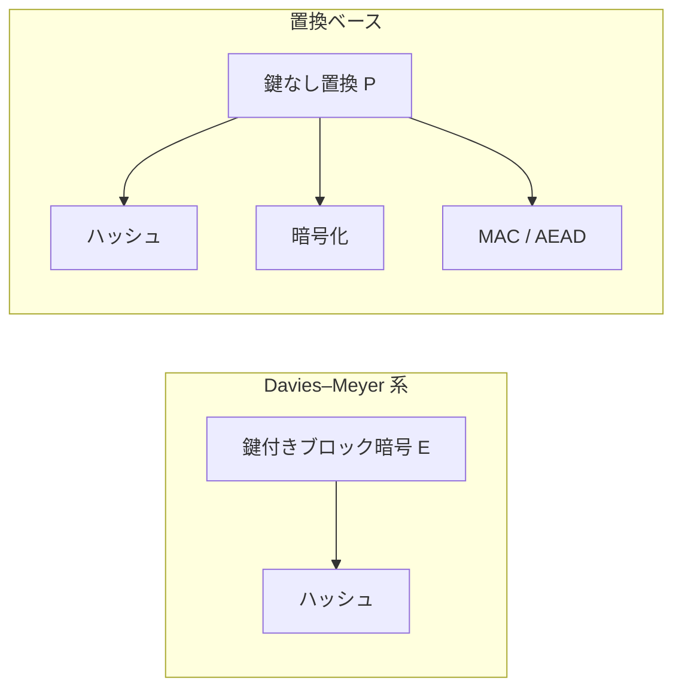

# 06. 置換ベース暗号と未解決問題

> 親: [README](./README.md) ｜ 前: [05 ブロック暗号からハッシュへ](./05_hashing-from-block-ciphers.md) ｜ 層: 基礎(Layer 1)

**この1ページで分かること**

- 置換ベース暗号という設計思想が Davies–Meyer 系と何が違うか
- Keccak の 3D 状態と duplex 構成の仕組み
- 軽量暗号・MPC/FHE 向け暗号という2つの新しい要求

鍵のない「かき混ぜ機」1 台で、ハッシュも暗号も認証も作る——それが置換ベース暗号。[05](./05_hashing-from-block-ciphers.md) の逆向きの発想。

## 最小の例: 同じ置換 P をスポンジとして使う

```
状態 s（例 1600 bit）を 0 で初期化
吸収:   s ← P(s ⊕ 入力ブロック)   ← ブロックごとに繰り返す（ハッシュの入力、暗号の鍵・nonce）
絞り出し: 出力ブロック ← s の先頭 r bit; s ← P(s)   ← 必要なだけ繰り返す（ハッシュ値、キーストリーム）
```

入れるものと取り出すものを変えるだけで、同じ `P` がハッシュ（SHA-3）にもストリーム暗号にも AEAD にもなる。

---

## 置換ベース暗号という設計思想



**鍵を使わない固定の置換 `P`** を唯一の部品とし、使い方（モード）だけで全機能を構成する。**利点は解析対象が `P` 1 つで済むこと。** SHA-3/Keccak が代表。

---

## Keccak の 3D 状態

SHA-3 のスポンジ構成（[04](../04_hash-and-mac.md)）が使う置換 `Keccak-f` は状態を **5×5×w bit の 3 次元配列**として扱う（レーン長 `w=64`、計 1600 bit）。

```
状態 = 5×5 個の「レーン」(lane) の集合
      各レーンは w bit の縦方向のビット列
```

ラウンド関数は 5 ステップ（θ, ρ, π, χ, ι）。行・列・レーン内の**異なる軸に沿った混合**で、[02](./02_block-cipher-architecture.md) の拡散と混同を SPN とは別の幾何で実現する。

---

## duplex 構成：吸収と絞り出しを1つに

**1 回の呼び出しで入力注入と出力取り出しを同時に行う**よう一般化したのが duplex（Bertoni・Daemen・Peeters・Van Assche, 2011）。

| | sponge | duplex |
|---|---|---|
| 手順 | 吸収を全部 → 絞り出し | ブロックを渡すたびに出力も受け取る |
| 向く用途 | ハッシュ | AEAD（関連データを吸収しつつ暗号文を絞り出す） |

追加のブロック暗号もモードも要らず、置換 1 つが「ハッシュ・暗号化・認証」を兼ねる到達点。

---

## 未解決問題：基本部品の安全性証明はない

どちらも**土台の部品（`E` や `P`）自体の安全性は証明されていない**。「十分ランダムに見える」という経験的信頼の上に成り立つ。[03](./03_aes-internals.md) の S-box と同じ構図——**証明ではなく、長年の解析に耐えた実績**が根拠。

---

## 新しい要求①：軽量暗号

IoT・RFID タグ向けに AES より小さい回路・少ない電力で動く暗号。NIST は 2023 年に **Ascon** を選定、2025 年 8 月 13 日に **SP 800-232** を発行。Ascon も置換ベースで、duplex を軽量な置換に適用した AEAD。

---

## 新しい要求②：MPC/FHE 向け暗号

秘密計算（MPC）・準同型暗号（FHE）の中で対称暗号を評価すると、XOR はほぼ無料だが**乗算・S-box が極めて高い**。**乗法深度**（直列に並ぶ乗算の段数）を最小化する専用暗号が研究されている。詳細は [06 上級地図](../06_advanced-topics-map.md)。

---

## 演習（解答つき）

1. 置換ベース暗号が Davies–Meyer 系と比べて「部品が1つで済む」と言えるのはなぜか。
2. duplex 構成が sponge 構成の単純な2段階（吸収→絞り出し）と違い、AEAD に向いているのはなぜか。
3. AES の S-box や Keccak の置換の安全性が「証明」ではなく何によって支えられているか。

<details><summary>解答</summary>

1. Davies–Meyer 系はブロック暗号（鍵つき）を土台にハッシュを構成するため、
   暗号化用途とハッシュ用途で別々に一次プリミティブの安全性解析が必要になりうる。
   置換ベースは鍵を使わない固定の置換1つだけを土台にし、使い方（モード）を変えるだけで
   ハッシュ・暗号化・MAC・AEAD のすべてを構成できるため、解析すべき一次プリミティブが1つで済む。
2. sponge は「全入力を吸収してから出力を絞り出す」という2段階の構成であり、
   入力と出力を交互にやり取りする用途には向かない。duplex は入力ブロックを渡すたびに
   その場で出力ブロックも受け取れる対話的な構成のため、関連データを吸収しながら
   暗号文を絞り出すという AEAD の要件を、追加のモードなしに1つの構成で満たせる。
3. 証明ではなく、長年にわたる暗号解読コミュニティによる集中的な解析に耐えてきたという
   経験的な実績によって支えられている。基本部品自体の安全性は数学的に証明されておらず、
   「十分ランダムに見える」という信頼が実質的な根拠になっている。

</details>

---

## 暗号での出口

対称鍵暗号のフォルダはここで一周した。ハッシュ関数の安全性定義・MAC・長さ拡張攻撃といった
「対称鍵暗号を使う側」の話は [`../04_hash-and-mac.md`](../04_hash-and-mac.md) が、
耐量子・FHE・MPC・サイドチャネルという発展的な話題は
[`../06_advanced-topics-map.md`](../06_advanced-topics-map.md) が引き継ぐ。

---

## 参考

- Bertoni, G., Daemen, J., Peeters, M., Van Assche, G. (2011). *Duplexing the Sponge: Single-Pass Authenticated Encryption and Other Applications*. SAC 2011.
- FIPS 202 — SHA-3 Standard: Permutation-Based Hash and Extendable-Output Functions (2015): https://csrc.nist.gov/pubs/fips/202/final
- NIST SP 800-232 — Ascon-Based Lightweight Cryptography Standards (2025年8月13日発行): https://csrc.nist.gov/pubs/sp/800/232/final
- 本ファイルの構成は COSIC Course 2026 の対称鍵暗号セッション（Tim Beyne, 2026年6月）の整理に基づく。
