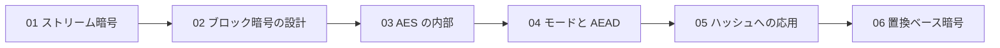

# 対称鍵暗号（Symmetric Cryptography）

> 対応科目: Applied Cryptography and Cryptanalysis ｜ 層: 基礎(Layer 1)
> 親: [../index.md](../index.md)

## 一言で

対称鍵暗号は**暗号化と復号に同じ鍵**を使う方式（家の鍵と同じ: 閉めた鍵で開ける）。[公開鍵暗号](../03_public-key-crypto/01_rsa/README.md)より桁違いに速いので、大量データの暗号化は常に対称鍵の役目。TLS は「鍵共有だけ公開鍵、本体は対称鍵」の**ハイブリッド暗号**。



---

## 概念ファイル（番号順に読む）

| # | ファイル | 内容 |
|---|---|---|
| 01 | [01_stream-ciphers-and-lfsr.md](./01_stream-ciphers-and-lfsr.md) | ストリーム暗号の状態機械・IV の必要性・LFSR と非線形化・A5/1・E0・RC4・ChaCha20 |
| 02 | [02_block-cipher-architecture.md](./02_block-cipher-architecture.md) | 換字→コードブック→Shannon の交互適用・反復暗号・Feistel vs SPN・DES/3DES 廃止 |
| 03 | [03_aes-internals.md](./03_aes-internals.md) | 4×4 状態・S-box の設計根拠・ShiftRows の役割・MixColumns と MDS・鍵長とラウンド数 |
| 04 | [04_modes-and-aead.md](./04_modes-and-aead.md) | ECB/CBC/CTR・バースデー境界の導出・AEAD・CCM/OCB/GCM |
| 05 | [05_hashing-from-block-ciphers.md](./05_hashing-from-block-ciphers.md) | tree hashing と Merkle–Damgård・MD パディング・Davies–Meyer 系・MD4 の系譜 |
| 06 | [06_permutation-based-and-challenges.md](./06_permutation-based-and-challenges.md) | 置換ベース暗号・Keccak の 3D 状態・duplex 構成・軽量暗号・MPC/FHE 向け暗号 |

---

## なぜ重要か / コースでの位置づけ

公開鍵暗号は重い演算（べき乗 mod n）で遅く、対称鍵は速いが鍵共有が課題。実際のプロトコルは両者を組み合わせる:

```
1. 鍵交換: RSA暗号化 or ECDHE で「共通鍵（セッション鍵）」を安全に共有
2. 本体:   共有できた共通鍵で AES-GCM / ChaCha20-Poly1305 を使い、実データを高速に暗号化
```

これが**ハイブリッド暗号**であり、TLS 1.3 のプロトコル全体像は
[`../05_protocols/README.md`](../05_protocols/README.md) で扱う。

---

## このフォルダで「本体」を置かないもの（DRY）

- **GF(2^8) の手計算** →
  [`../../01_prerequisites/01_math-for-crypto/02_groups-rings-fields/06_gf2n-and-aes.md`](../../01_prerequisites/01_math-for-crypto/02_groups-rings-fields/06_gf2n-and-aes.md)
- **OTP と完全秘匿の証明** →
  [`../../01_prerequisites/01_math-for-crypto/05_info-theory/03_perfect-secrecy-otp.md`](../../01_prerequisites/01_math-for-crypto/05_info-theory/03_perfect-secrecy-otp.md)
- **ハッシュの安全性定義・長さ拡張・HMAC・MD5/SHA-1 廃止・スポンジ構成** →
  [`../04_hash-and-mac.md`](../04_hash-and-mac.md)
- **PRF/PRP の形式的定義・MAC の安全性証明・各モードの CPA 安全性証明・DES/RC4 の破られ方の詳細** →
  [Coursera Crypto I 講義ノート](../../courses/coursera-crypto1/README.md)
- **Vernam/OTP → PRG → FSM を動かして追う教材** →
  [`../deep/stream-ciphers/README.md`](../deep/stream-ciphers/README.md)（Layer 2）

---

## つまずき / 深掘り候補（Layer 2）

- [ ] 差分・線形解読の実際の計算（AES の S-box がなぜ「ほぼ最適」なのかの数値的裏付け）→ `deep/differential-linear-cryptanalysis/`
- [ ] LFSR の周期の理論（原始多項式と最大周期）→ `deep/lfsr-period-theory/`
- [ ] ブール ⇄ 算術マスキング変換を小さな例で手で追う → `deep/boolean-arithmetic-masking/`（[`../../04_hardware-security/04_side-channels/04_countermeasures.md`](../../04_hardware-security/04_side-channels/04_countermeasures.md) のキューと統合）

---

## 参考

- FIPS 197 — Advanced Encryption Standard (AES), NIST (2001): https://nvlpubs.nist.gov/nistpubs/fips/nist.fips.197.pdf
- NIST SP 800-38A — Recommendation for Block Cipher Modes of Operation
- NIST SP 800-38D — Galois/Counter Mode (GCM) and GMAC
- RFC 8439 — ChaCha20 and Poly1305 for IETF Protocols (2018): https://www.rfc-editor.org/rfc/rfc8439.html
- Sweet32: Birthday attacks on 64-bit block ciphers in TLS and OpenVPN (2016): https://sweet32.info/
- CISA — SSL 3.0 Protocol Vulnerability and POODLE Attack (2014): https://www.cisa.gov/news-events/alerts/2014/10/17/ssl-30-protocol-vulnerability-and-poodle-attack
- 本フォルダの構成は COSIC Course 2026 の対称鍵暗号セッション（Tim Beyne, 2026年6月）の整理に基づく。
