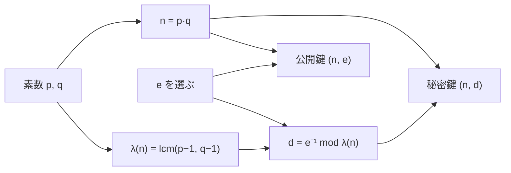

# 01. RSA 鍵生成

> 親: [README](./README.md) ｜ 次: [02 暗号化・復号](./02_encryption-decryption.md) ｜ 層: 基礎(Layer 1)

**この1ページで分かること**

- RSA の鍵ペアを作る 5 ステップと、各パラメータ（n, λ(n), e, d）の公開／秘密の区別
- `e = 65537` が慣習になっている理由と、`d` を拡張ユークリッドで計算すること
- 素数 `p, q` の選び方の落とし穴（`p ≈ q`・smooth な `p−1`）

RSA は「誰でも閉められるが、持ち主しか開けられない南京錠」。鍵生成はその南京錠（公開鍵）と鍵（秘密鍵）を作る、受信者 Bob が 1 回だけ行う工程。

---

## まず最小の例で作ってみる

```
p = 5, q = 11 を選ぶ
n = 5·11 = 55
λ(n) = lcm(5−1, 11−1) = lcm(4, 10) = 20
e = 3        （gcd(3, 20) = 1 ✓ 共通の約数が 1 だけ）
d = 3⁻¹ mod 20 = 7    （3·7 = 21 ≡ 1 (mod 20) ✓）

公開鍵: (n, e) = (55, 3)    秘密鍵: (n, d) = (55, 7)
```

`(55, 3)` は誰に見せてもよい。`7`（と `5, 11`）だけを隠す。これが RSA の鍵ペア。
実際の `n` は 2048 bit 以上で手計算は不可能だが、手順は同じ。

---

## 一般の手順

```
Step 1. 大きな素数 p, q を選ぶ          （秘密。廃棄または厳重保管）
Step 2. n = p · q                        （公開）
Step 3. λ(n) = lcm(p−1, q−1) を計算     （秘密。中間値）
Step 4. gcd(e, λ(n)) = 1 を満たす e を選ぶ  （公開）
Step 5. d ≡ e⁻¹ (mod λ(n)) を計算       （秘密）
```



---

## 各パラメータの意味

| 記号 | 名前 | 公開？ | 役割 |
|---|---|---|---|
| `n` | モジュラス（法） | 公開 | 全演算を `mod n` で行う土台 |
| `λ(n)` | カーマイケル関数 | 秘密 | `d` を計算するときの法 |
| `e` | 公開指数 | 公開 | 暗号化に使う |
| `d` | 秘密指数 | 秘密 | 復号に使う。漏れたら終わり |

- **n**: 素因数分解（`n` を `p×q` に戻す計算）が困難なため `p, q` は漏れない（根拠は [`05_hard-problems.md`](../../../01_prerequisites/01_math-for-crypto/03_number-theory/05_hard-problems.md)）。実用は **2048 bit 以上**（NIST SP 800-57）。約 1024 bit の `p, q` を用意する。
- **λ(n)**: `lcm`（最小公倍数）で作る。gcd と lcm の関係は [`04_gcd-euclidean.md`](../../../01_prerequisites/01_math-for-crypto/01_modular-arithmetic/04_gcd-euclidean.md)。古い教科書は `φ(n) = (p−1)(q−1)`（オイラーの関数、[`03_euler-phi-theorem.md`](../../../01_prerequisites/01_math-for-crypto/03_number-theory/03_euler-phi-theorem.md)）を使う。`λ(n) | φ(n)` なのでどちらでも正しく動く（[03](./03_correctness-proof.md)）。FIPS 186-5（2023）は `λ(n)` を推奨。
- **e**: `gcd(e, λ(n)) = 1`（互いに素）が条件。これがないと `d` が存在しない。慣習値は **65537** `= 2¹⁶ + 1`。2 進で `1` が 2 個しかなくべき乗が速い（[02](./02_encryption-decryption.md)）うえ素数なので互いに素になりやすい。`e = 3` はパディングを誤ると Coppersmith 攻撃で破られる（[04](./04_padding-and-attacks.md)）。
- **d**: `e · d ≡ 1 (mod λ(n))`。拡張ユークリッド（gcd と同時に逆元を求める手順、[`05_extended-euclidean.md`](../../../01_prerequisites/01_math-for-crypto/01_modular-arithmetic/05_extended-euclidean.md)）で計算。

---

## 素数 p, q の選び方（実装上の注意）

| やること／やってはいけないこと | 理由 |
|---|---|
| CSPRNG（暗号用の乱数生成器）で生成し Miller-Rabin（確率的素数判定、[`02_fermat-little-theorem.md`](../../../01_prerequisites/01_math-for-crypto/03_number-theory/02_fermat-little-theorem.md)）で確認 | 偏った乱数は鍵の推測を許す |
| **`p ≈ q` は不可** | `p ≈ √n` となり `√n` 付近を探すだけで分解できる（Fermat 法） |
| **`p−1`, `q−1` に大きな素因数を含める** | smooth（小さな素因数だけの数）だと専用の分解法で破られる |
| `p, q` は廃棄するか厳重保管 | RSA-CRT（[`04_crt.md`](../../../01_prerequisites/01_math-for-crypto/03_number-theory/04_crt.md)）で高速化するなら保管が要る |

---

## 演習（解答つき）

1. `p=7, q=13` として `n` と `λ(n)` を求めよ。
2. 上の `n, λ(n)` に対し `e=5` は使えるか（`gcd(e, λ(n))=1` を確認せよ）。
3. `p ≈ q` にしてはいけない理由を一言で述べよ。

<details><summary>解答</summary>

1. `n = 7×13 = 91`。`λ(n) = lcm(6, 12) = 12`。
2. `gcd(5, 12) = 1` なので使える。
3. `p ≈ q` だと `p ≈ √n` となり `√n` 付近を探索するだけで `p, q` が見つかる（Fermat の因数分解法）。素因数分解の困難性という前提が崩れる。

</details>

---

## 次への接続

鍵が揃ったら暗号化と復号を見る。
→ [02 暗号化・復号](./02_encryption-decryption.md)
