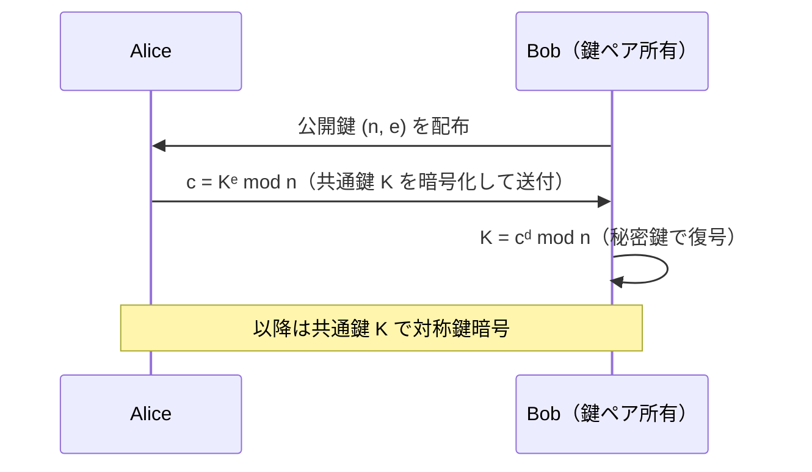

# 02. RSA 暗号化・復号

> 親: [README](./README.md) ｜ 前: [01 鍵生成](./01_key-generation.md) ｜ 次: [03 正しさ証明](./03_correctness-proof.md) ｜ 層: 基礎(Layer 1)

**この1ページで分かること**

- 暗号化 `c = mᵉ mod n`・復号 `m = cᵈ mod n` と、平文を数値化する前処理
- 2 乗繰り返し法により `e = 65537` のような大きな指数でも高速に計算できる理由
- RSA を「共通鍵の受け渡し」に使うイメージ（実際の TLS は ECDH＋署名が主流）

暗号化は「公開鍵で `e` 乗する」、復号は「秘密鍵で `d` 乗する」だけ。難しいのは数学ではなく、平文を整数に変える前処理と、巨大な指数を速く計算する工夫。

---

## まず最小の例で 1 往復

[01](./01_key-generation.md) の鍵 `公開鍵 (n=55, e=3)`、`秘密鍵 (n=55, d=7)` で平文 `m = 2` を送る。

```
暗号化（Alice、公開鍵だけ使う）: c = 2³ mod 55 = 8

復号（Bob、秘密鍵を使う）:      m' = 8⁷ mod 55     7 = 111₂
   8¹=8,  8²=64≡9,  8⁴≡9²=81≡26   (mod 55)
   8⁷ = 8⁴·8²·8¹ ≡ 26·9·8
   26·9 = 234 ≡ 14,   14·8 = 112 ≡ 2   (mod 55)
   = 2 ✓ 元に戻った
```

> 検算: 8⁷ = 2097152 = 55×38130 + 2。

---

## 一般の形

| 操作 | 誰が | 使う鍵 | 式 |
|---|---|---|---|
| 暗号化 | 送信者 Alice | 公開鍵 `(n, e)` | `c = mᵉ mod n` |
| 復号 | 受信者 Bob | 秘密鍵 `(n, d)` | `m = cᵈ mod n` |

暗号化は秘密鍵なしで誰でも実行できる。`m' = m` に戻ることは [03](./03_correctness-proof.md) で証明する。

---

## 平文の数値化

RSA は**整数**に `mod n` の演算をするので、テキストを数値に変える前処理が要る。

| 場面 | やり方 |
|---|---|
| 概念確認 | 文字を ASCII コードや 26 進数で数値化して `m` とする |
| 実用 | **PKCS#1 OAEP** パディング（乱数を詰めて整形する前処理）を施してから数値化（[04](./04_padding-and-attacks.md)） |
| 制約 | `0 ≤ m < n`。超えるなら分割 |

パディングなしの「教科書 RSA」は決定論的（同じ入力→同じ出力）で脆弱。

---

## べき乗の効率的な計算

`e = 65537` でも掛け算 65537 回は不要。**2 乗繰り返し法（square-and-multiply）** なら指数の**桁数**に比例する回数で済む（`O(log e)`）。

```
例: m⁵ mod n     5 = 101₂
m → m² → m⁴ → m⁴·m = m⁵      （掛け算 3 回）
```

上の復号例（`8⁷`）も同じ手法。詳細は `../../../01_prerequisites/01_math-for-crypto/01_modular-arithmetic/deep/fast-exponentiation/`（深掘りキュー）。

---

## RSA による鍵共有のイメージ



実際の TLS は RSA 直接ではなく **ECDH 鍵共有 + RSA/ECDSA 署名** が主流（前方秘匿性＝長期鍵が漏れても過去の通信は守られる性質のため）。地図は [`../../05_protocols/README.md`](../../05_protocols/README.md)。

---

## 演習（解答つき）

[01](./01_key-generation.md) の鍵 `(n=55, e=3, d=7)` を使う。

1. 平文 `m=4` を暗号化せよ。
2. 1 で得た暗号文を復号し、`m=4` に戻ることを確認せよ。
3. `e=65537` のような大きな指数でも 2 乗繰り返し法が有効な理由を一言で述べよ。

<details><summary>解答</summary>

1. `c = 4³ mod 55 = 64 mod 55 = 9`。
2. `9⁷ mod 55`。`9²=81≡26`, `9⁴=26²=676≡16`。`9⁷=9⁴·9²·9=16·26·9`。`16·26=416≡31`、`31·9=279≡4` → `m'=4` ✓。
3. 掛け算の回数が指数の値ではなく**桁数** `log₂(e)` に比例するため。`e=65537` でも 2 乗 16 回＋乗算 1 回で済む。

</details>

---

## 次への接続

「なぜ cᵈ mod n で元に戻るのか」の数学的証明（d の存在 + mᵉᵈ ≡ m）へ。
→ [03 正しさ証明](./03_correctness-proof.md)
